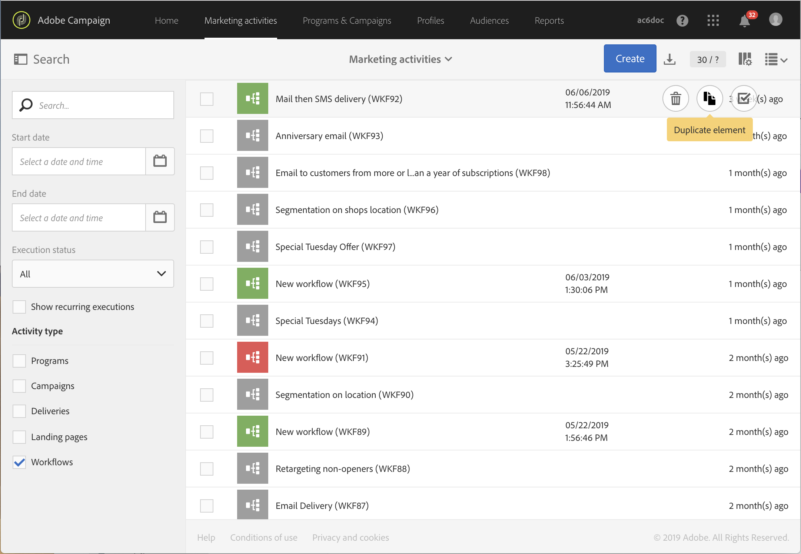
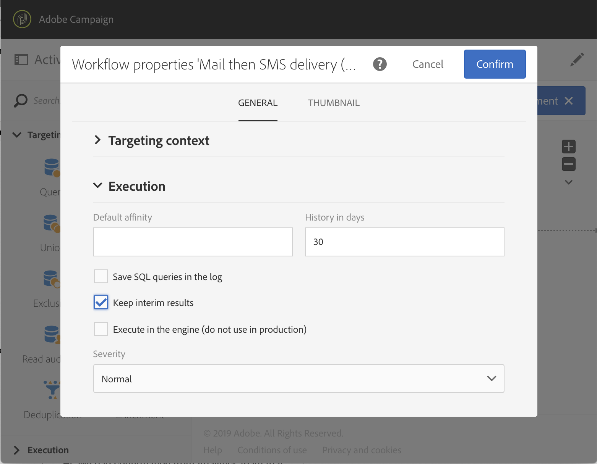
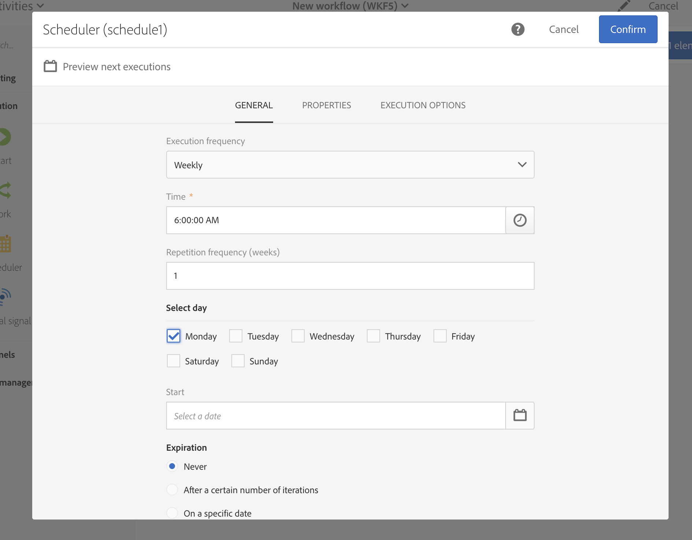

# ワークフローのベストプラクティス{#workflow-best-practices}

Adobe Campaign を使用すると、あらゆる種類のワークフローを設定して、広範なタスクを実行できます。 ただし、ワークフローを設計して実行する際は、実装が不適切な場合、パフォーマンス、エラー、プラットフォームの問題が発生する可能性があるので、十分に注意する必要があります。 ベストプラクティスとトラブルシューティングに関するヒントのリストを以下に示します。

>[!NOTE]
>
>ワークフローの設計と実行は、Adobe Campaign の上級ユーザーが実行する必要があります。

## 命名{#naming}

ワークフローのトラブルシューティングを容易にするために、ワークフローに明示的な名前を付け、ラベルを付けることをお勧めします。 ワークフローの説明フィールドに入力し、実行するプロセスを要約して、オペレーターが理解しやすくします。
ワークフローが複数のワークフローに関連するプロセスに含まれている場合は、ラベルを入力する際に数字を使用して、明確な順序を指定できます。

次に例を示します。

* 001 – インポート - 受信者のインポート
* 002 – インポート - 売上のインポート
* 003 – インポート - 売上詳細のインポート
* 010 – エクスポート – 配信ログのエクスポート
* 011 – エクスポート – トラッキングログのエクスポート

## ワークフローの複製{#duplicating-workflows}

ワークフローを複製できます。 **[!UICONTROL Marketing Activities]**&#x200B;で、ワークフローの上にマウスポインターを置いて、「**[!UICONTROL Duplicate element]**」をクリックします。 複製後は、ワークフローを変更してもワークフローのコピーには変更内容が引き継がれません。 ワークフローのコピーを編集できます。

## 実行{#execution}

### ワークフローの数

デフォルトでは、**20個を超えるアクティブなワークフロー実行を同時に実行しないことをお勧めします** （これは、スケジュールされた実行を待っているワークフローには適用されません）。 この制限に達すると、パフォーマンスに影響を与えないように、ワークフローがキューに入れられます。

特定のコンテキストでは、20 個を上回るワークフローの実行が必要になる場合があります。 その場合は、キャンペーンエキスパートと使用例を確認し、Adobe カスタマーケアに問い合わせて上限を引き上げる必要があります。

>[!IMPORTANT]
>
>ワークフロー数が20のしきい値に達していない場合でも、Adobeでは&#x200B;**ワークフローの実行頻度を時間**&#x200B;にわたって広げることをお勧めします。 ワークフローを驚異的に実行することで、インスタンスのパフォーマンスが向上します。

ワークフローを開始する前に、[!DNL Campaign Standard]は、ワークフローを実行するのに十分なシステム物理メモリがあるかどうかを確認します。 利用可能なメモリが不足している場合は、サーバーの負荷が低下し、システムメモリが増えるまで、ワークフローの実行が遅れることを通知するメッセージが表示されます。

### 頻度

ワークフローは、10 分間に 複数回自動的に実行することはできません。
アクティビティの繰り返し頻度を 10 分未満にすることはできません。 繰り返し頻度を 0（またはデフォルト値）に設定した場合、このオプションは考慮されず、ワークフローは実行頻度に従って実行されます。

### 一時停止されたワークフロー

8 日間以上一時停止または失敗ステータスになっているワークフローは、ディスク容量を減らすために停止されます。 ワークフローログにクレンジングタスクが表示されます。

### トランジション

未終了のトランジションを含んでいても、ワークフローは実行可能です。その場合、ワークフローは警告メッセージを生成し、トランジションに到達すると一時停止しますが、エラーは生成されません。 デザインが未完成のワークフローを開始し、作業を進めながらワークフローを完了させることもできます。

詳しくは、[ワークフローの実行](../../automating/using/about-workflow-execution.md)を参照してください。

### タイムゾーン

ワークフローのプロパティを使用すると、すべてのアクティビティでデフォルトで使用される特定のタイムゾーンを定義できます。 デフォルトでは、現在の Campaign オペレーターに指定されたタイムゾーンがワークフローのタイムゾーンになります。

## アクティビティ{#activity}

### ワークフローあたりのアクティビティ数 {#number-activities}

1つのワークフローに使用できるのは100個までです。 100以上のアクティビティで、ワークフローを設計および設定する際にパフォーマンスの問題が発生する場合があります。

### ワークフローデザイン

ワークフローが適切に終了するように、**[!UICONTROL End activity]**&#x200B;を使用して、ワークフローの最後の移行を単独で残さないようにします。

トランジションの詳細表示にアクセスするには、ワークフロープロパティの「Execution」セクションで「**[!UICONTROL Keep interim results]**」オプションを選択します。

>[!CAUTION]
>
>このオプションは、多くのディスク領域を消費しますが、ワークフローの作成と適切な設定および動作の確保に役立つように設計されています。 実稼働インスタンスでは、このチェックボックスをオフのままにします。

### ラベル活動{#activity-labeling}

ワークフローの開発時には、すべての Adobe Campaign オブジェクトと同様、すべてのアクティビティに対しても名前が生成されます。 アクティビティの名前はツールによって生成され、編集することはできませんが、設定時に明示的な名前を付けることをお勧めします。

### アクティビティの複製{#activity-duplicating}

既存のアクティビティを複製するには、コピー＆ペーストを使用します。 これにより、最初に定義した設定を保持できます。 詳しくは、[ワークフローアクティビティの複製](../../automating/using/workflow-interface.md)を参照してください。

### 「スケジューラー」アクティビティ{#acheduler-activity}

ワークフローを作成する場合、分岐ごとに&#x200B;**[!UICONTROL Scheduler activity]**&#x200B;を 1 つだけ使用します。 ワークフローの同じ分岐に、相互にリンクされた複数のスケジューラーがある場合、実行タスクの数が指数関数的に増大するので、データベースに膨大な負荷がかかりかねません。

「**[!UICONTROL Preview next executions]**」をクリックすると、次の 10 回のワークフロー実行をプレビューできます。

詳しくは、[スケジューラーアクティビティ](../../automating/using/scheduler.md)を参照してください。

複数のアクティビティを含むスケジュール済みワークフローを設計する場合は、ワークフローが完了するまでスケジュールが変更されないようにする必要があります。 これを行うには、以前の実行から1つ以上のタスクがまだ保留中である場合に、その実行を防ぐためにワークフローを設定する必要があります。 詳しくは、[このページ](../../automating/using/scheduled-workflows-execution.md)を参照してください。

## パラメーターを使用した呼び出しワークフロー{#workflow-with-parameters}

パラメーターの名前と数が、ワークフローの呼び出し時に定義されるものと同じであることを確認します（[このページ &#x200B;](../../automating/using/defining-parameters-calling-workflow.md)を参照）。 また、パラメーターのタイプは、想定される値と一致する必要があります。

**[!UICONTROL External signal activity]**&#x200B;内ですべてのパラメーターが宣言されていることを確認します。 それ以外の場合は、アクティビティの実行時にエラーが発生します。

詳しくは、[外部パラメーターを使用したワークフローの 呼び出し](../../automating/using/calling-a-workflow-with-external-parameters.md)を参照してください。

## パッケージのエクスポート{#exporting-packages}

パッケージをエクスポートするには、エクスポートするリソースにデフォルトの ID を含めないでください。 したがって、Adobe Campaign Standard で標準として提供されているテンプレートとは異なる名前を使用して、エクスポート可能なリソースの ID を変更する必要があります。
詳しくは、[パッケージの管理](../../automating/using/managing-packages.md)を参照してください。

## リストのエクスポート{#exporting-lists}

リストエクスポートオプションを使用すると、デフォルトで 100,000 行までエクスポートでき、**Nms_ExportListLimit オプション**&#x200B;で定義できます。 このオプションは、機能管理者により&#x200B;**[!UICONTROL Administration]**／**[!UICONTROL Application settings]**／**[!UICONTROL Options]**&#x200B;で管理できます。
詳しくは、[リストのエクスポート](../../automating/using/exporting-lists.md)を参照してください。

## トラブルシューティング{#workflow-troubleshooting}

Adobe Campaign では、様々なログを使用して、ワークフローの問題をより深く理解できます。

### ワークフローログの使用{#using-workflow-logs}

ワークフローログにアクセスして、アクティビティの実行を監視できます。 実行された操作と実行エラーのインデックスを時系列の順序で作成します。 「Logs」タブは、選択したすべてまたは一部のアクティビティの実行履歴で構成されます。
「Tasks」タブでは、アクティビティの実行順序の詳細が表示されます。 アクティビティの詳細を表示するには、タスクをクリックします。
詳しくは、[ワークフローの実行の監視](../../automating/using/monitoring-workflow-execution.md)を参照してください。

#### データ管理活動のトラブルシューティング{#troubleshooting-data-management-activities}

SQL クエリは「Logs」タブで分析できます。

1. ワークフローのワークスペースで、「**[!UICONTROL Edit properties]**」をクリックします。
1. **[!UICONTROL General]**／**[!UICONTROL Execution]**&#x200B;で、「**[!UICONTROL Save SQL queries in the log]**」および「**[!UICONTROL Execute in the engine]**」オプションをオンにし、「**[!UICONTROL Confirm]**」をクリックします。

**ログに SQL クエリを表示するには：**
1. 「**[!UICONTROL Log and Tasks]**」をクリックします。
1. 「**[!UICONTROL Logs]**」タブで、**[!UICONTROL Search]**&#x200B;パネルを開きます。
1. 「**[!UICONTROL Display SQL logs only]**」にチェックを入れます。

クエリがログの「**[!UICONTROL Message]**」列に表示されます。

### 配信ログの使用{#using-delivery-logs}

配信ログを使用すると、配信の成功を監視できます。 除外ログは、送信の準備中に除外されたメッセージを返します。 送信ログは、各プロファイルの配信ステータスを示します。
詳しくは、[配信エラーについて](../../sending/using/understanding-delivery-failures.md)を参照してください。

### 配信アラートの使用{#delivery-alerting}

配信アラート機能は、配信の実行に関する情報を含んだ通知をユーザーグループが自動的に受信できるようにするアラート管理システムです。
詳しくは、[配信アラート機能](../../sending/using/receiving-alerts-when-failures-happen.md)を参照してください。

**関連トピック：**

* [エラー管理](../../automating/using/monitoring-workflow-execution.md)
