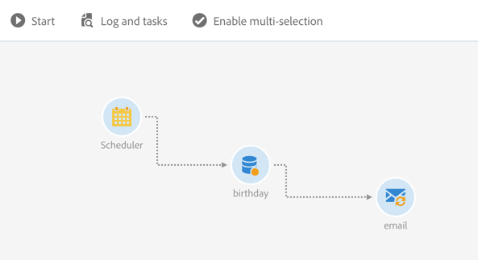
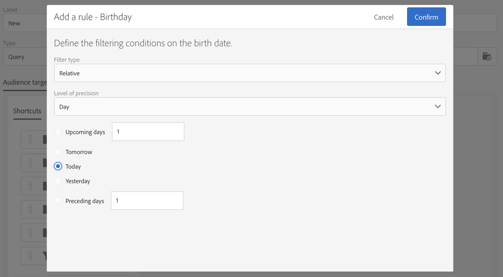

# 誕生日配信 {#birthday-delivery}

この例は、誕生日のワークフローです。 毎日、その日が誕生日のプロファイルにメールが送信されます。

ワークフローを構築するには、次の手順に従います。

* [&#x200B; スケジューラー](../../automating/using/scheduler.md)を使用すると、毎日8時にワークフローを開始できます。

  

* 「[&#x200B; クエリ &#x200B;](../../automating/using/query.md)」アクティビティを使用すると、ワークフローが実行されるたびに、メールを提供し、その誕生日が現在の日付であるプロファイルを計算できます。 誕生日の計算は、クエリ編集ツールのパレットにある定義済みフィルターを使用して実行されます。

  

* [&#x200B; メール配信](../../automating/using/email-delivery.md)は繰り返し行われます。 送信は月単位で集計されます。 そのため、1 ヶ月間に送信されたすべてのメールが 1 つの表示に集計されます。 1 年間では 365 回の配信が実行されますが、Adobe Campaign インターフェイスでは 12 個の表示（**繰り返し実行**&#x200B;とも呼ばれます）に再グループ化されます。 履歴とレポートの詳細は毎月表示され、送信ごとには表示されません。

  
