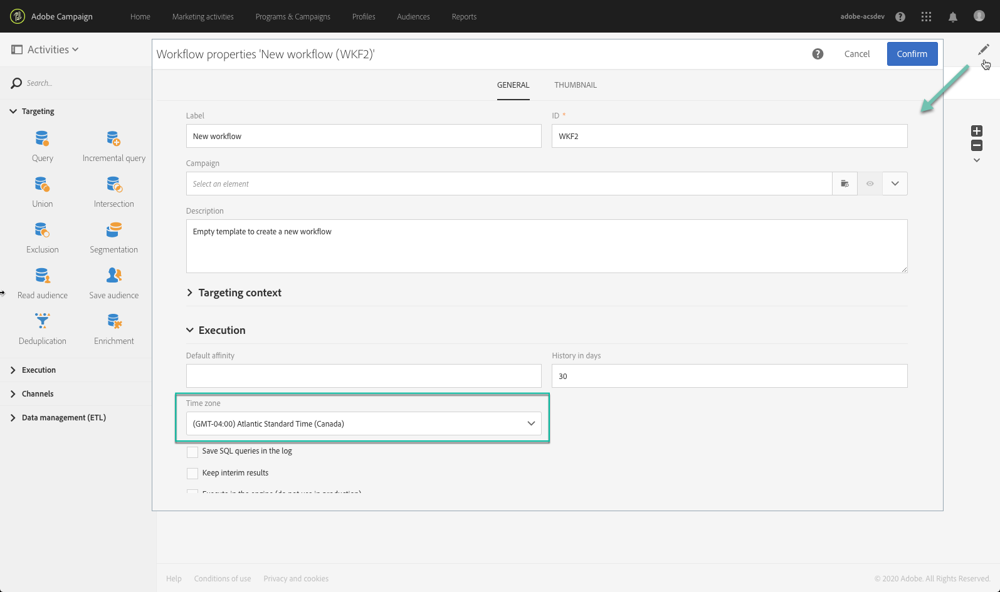

# ワークフローの作成{#building-a-workflow}

ここでは、新しいワークフローの作成に関する主な原則およびベストプラクティスについて説明します。

## ワークフローの運用原則{#workflow-operating-principles}

ワークフローとは、**設定可能な一連のアクティビティ**&#x200B;のことです。個々のアクティビティには、プロセス内で果たすべき特定の役割があります。各アクティビティの結果は、矢印で表される&#x200B;**トランジション**&#x200B;で後続のアクティビティに送られます。

あるアクティビティと次のアクティビティの間でやり取りされるデータのタイプは、後続のアクティビティの設定方法に影響を与えることがあります。例えば、「E メール配信」アクティビティの前に母集団が確定すると、その母集団が、問題になっている E メールのターゲットになる可能性があります。

ワークフローの実行前または実行後にアクティビティを開いて、パラメーターを確認または編集することができます。

ワークフローの実行中または実行後にトランジションを開いて、送信されたデータが正しいかどうかを確認できます。トランジションの詳細表示にアクセスするには、ワークフロープロパティの「**[!UICONTROL Execution]**」セクションで「**[!UICONTROL Keep interim results]**」オプションをオンにする必要があります。

>[!CAUTION]
>
>このオプションは、多くのディスク領域を消費しますが、ワークフローの作成と適切な設定および動作の確保に役立つように設計されています。実稼働インスタンスでは、このチェックボックスをオフのままにします。

## ワークフローの作成 {#creating-a-workflow}

ワークフローは、プログラム、キャンペーン、マーケティングアクティビティリストのいずれかから作成できます。

 [ビデオでワークフローを構築する方法の確認](#video)

マーケティングアクティビティの作成について詳しくは、[マーケティングアクティビティの作成](../../start/using/marketing-activities.md#creating-a-marketing-activity)の節を参照してください。

1. ワークフロータイプのマーケティングアクティビティの作成を開始したら、使用するテンプレートを選択します。

   

   >[!NOTE]
   >
   >マーケティングアクティビティごとに、デフォルトでいくつかのタイプが用意されています。これらのタイプにより、必要に応じて特定のパラメーターを事前設定できます。詳しくは、[テンプレートの管理](../../start/using/marketing-activity-templates.md)の節を参照してください。

1. ワークフローの一般的なプロパティを入力します。

   

   「**Label**」フィールドに名前を入力し、「ID」を変更することができます。アクティビティ名とアクティビティ ID はインターフェイスに表示されますが、メッセージ受信者には表示されません。

   >[!NOTE]
   >
   >マーケティングアクティビティのリストから選んだ親キャンペーンの中にワークフローを作成することができます。作成済みのワークフローを選択して、このワークフローをキャンペーンにリンクすることができます。

   キャンペーンコンテンツに表示される説明を追加できます。

   ワークフローには、適切な名前とラベルを付けることをお勧めします。そうすると、正常に機能していないワークフローを簡単に見つけてトラブルシューティングできるようになります。また、オペレーターが理解しやすいように、実行される処理の概要をワークフローの説明フィールドに記述してください。

1. アクティビティの作成を確認すると、該当するアクティビティのダッシュボードが表示されます。詳しくは、[ワークフローインターフェイス](../../automating/using/workflow-interface.md)の節を参照してください。

1. ワークフローを設定する準備ができたら、[**[!UICONTROL Edit properties]**]ボタンボタンをクリックして、追加のオプションにアクセスできます。

   例えば、ワークフローのすべてのアクティビティでデフォルトで使用する特定のタイムゾーンを定義できます。デフォルトでは、現在の Campaign オペレーターに指定されたタイムゾーンがワークフローのタイムゾーンになります。

   ワークフローのプロパティの詳細については、[このページ](../../automating/using/managing-execution-options.md)を参照してください。

   

## アクティビティの追加とリンク{#adding-and-linking-activities}

ここでは、各種アクティビティを定義し、ダイアグラム内で互いにリンクする必要があります。

>[!NOTE]
>
>パレットが表示されない場合、ツールバーの 1 番目のボタンをクリックして、パレットを表示します。

アクティビティは、パレットのセクションごとに、カテゴリ別にグループ分けされます。

* 最初のセクションには、[ターゲティングアクティビティ](../../automating/using/about-targeting-activities.md)が含まれています。
* 2 番目のセクションには、主に他のアクティビティの調整に使用する[実行アクティビティ](../../automating/using/about-execution-activities.md)が含まれています。
* 3 番目のセクションには、様々な[チャネル](../../automating/using/about-channel-activities.md)でのメッセージ送信に使用できるアクティビティが含まれています。このセクションのアクティビティは、インスタンスで有効になっているチャネルによって異なります。
* 4 番目のセクションには、[ファイル操作とデータ管理のアクティビティ](../../automating/using/about-data-management-activities.md)が含まれています。

ダイアグラムを作成するには、次の手順に従います。

1. パレットからアクティビティをドラッグしダイアグラムにドロップして、アクティビティを追加します。

   例えば、ダイアグラムに「**[Start](../../automating/using/start-and-end.md)**」アクティビティを追加した後、「**[Email delivery](../../automating/using/email-delivery.md)**」アクティビティを追加します。

1. 「**Start**」アクティビティトランジションをドラッグして「**Email delivery**」アクティビティにドロップすることで、2 つのアクティビティをリンクします。

   >[!NOTE]
   >
   >前のトランジションの最後に新しいアクティビティを配置することで、直前のアクティビティと自動的にリンクできます。

1. 必要なアクティビティを追加し、それらをリンクして、ワークフローを完成させます。

   >[!NOTE]
   >
   >既存のアクティビティをコピー＆ペーストして複製することもできます。これにより、最初に定義した設定を保持できます。詳しくは、[ワークフローアクティビティの複製](../../automating/using/workflow-interface.md#duplicating-workflow-activities)を参照してください。

ワークフローアクティビティどうしをリンクしたら、アクティビティ間のトランジションに好みの&#x200B;**ラベル**&#x200B;を付けてパーソナライズできます。それには、トランジションをダブルクリックして、トランジションのプロパティにアクセスします。

さらに、「**[!UICONTROL Targeting]**」および「**[!UICONTROL Data management (ETL)]**」アクティビティを使用すると、アウトバウンドトランジションの&#x200B;**セグメントコード**&#x200B;を定義できます。その結果、これらのセグメントコードに基づいてレポートを作成して、マーケティングキャンペーンの効率を測定できます。詳しくは、[この節](../../reporting/using/creating-a-report-workflow-segment.md)を参照してください。

**ワークフローのユースケース：**

* [ユースケース：週 1 回の E メール配信の作成](../../automating/using/workflow-weekly-offer.md)
* [ユースケース：ロケーション別にセグメント化した配信の作成](../../automating/using/workflow-segmentation-location.md)
* [ユースケース：補集合を使用した配信の作成](../../automating/using/workflow-created-query-with-complement.md)
* [ユースケース：メールを開封していないユーザーに新しい配信を送信する再ターゲティングワークフロー](../../automating/using/workflow-cross-channel-retargeting.md)

## アクティビティの設定 {#configuring-activities}

デフォルトでは、アクティビティは設定されていません。アクティビティが未設定の場合、データは正しく処理されません。各アクティビティには、それぞれに固有の設定とアクティビティの汎用オプション（アウトバウンドトランジションやラベルなど）を管理するためのタブがいくつか含まれています。

1. すべてのアクティビティが正しく接続されていることを確認します。一部のアクティビティでは、正しい設定オプションを提供するために、受信データの構造や特性を検出する必要があります。
1. アクティビティをダブルクリックするか、アクティビティのコンテキストメニューから「**[!UICONTROL Edit]**」アクションを選択して、設定ウィンドウを開きます。
1. アクティビティのラベルを編集します。
1. データの処理に必要な各種オプションをすべて定義します。各アクティビティで使用できるオプションについては、アクティビティごとの説明を参照してください。
1. アクティビティを保存します。ワークフローのアクティビティごとに、以上の操作を繰り返します。
1. ワークフローを保存します。

## チュートリアルビデオ {#video}

このビデオでは、ワークフローの作成方法を紹介します。

>[!VIDEO](https://video.tv.adobe.com/v/23937?quality=12)

追加のCampaign Standardハウツービデオは[こちら](https://experienceleague.adobe.com/docs/campaign-standard-learn/tutorials/overview.html?lang=ja)で参照できます。
