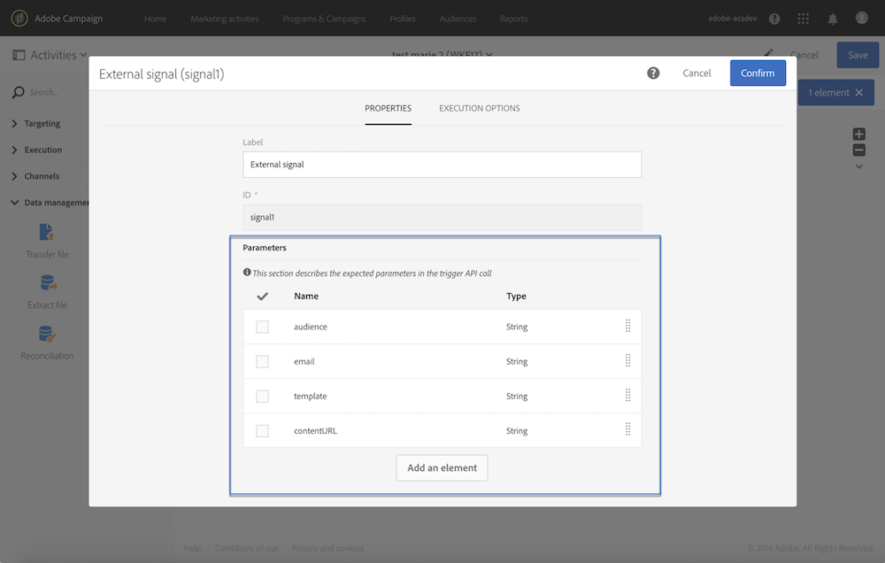

# 外部パラメータを使用したワークフローの呼び出し{#calling-a-workflow-with-external-parameters}

キャンペーン標準では、パラメータ（ターゲットとなる対象ユーザー名、インポートするファイル名、メッセージコンテンツの一部など）を含むワークフローを呼び出すことができます。 この方法で、キャンペーンの自動化を外部システムに簡単に統合できます。

次の例では、CMSから直接Eメールを送信します。 この場合、CMSに対して対象ユーザーと電子メールコンテンツを選択するようにシステムを設定できます。 [送信]をクリックすると、これらのパラメータを含むキャンペーンワークフローが呼び出され、ワークフロー内で使用して配信に使用する対象ユーザーとURLコンテンツを定義できます。

パラメータを指定してワークフローを呼び出すプロセスは、次のとおりです。

1. アクティビティのパラメータを宣言 **[!UICONTROL External signal]** します。 「外部シグ [ナルアクティビティでのパラメータの宣言」を参照してくださ](../../automating/using/calling-a-workflow-with-external-parameters.md#declaring-the-parameters-in-the-external-signal-activity)い。
1. アクティビティま **[!UICONTROL End]** たはAPI呼び出しを構成して、パラメータを定義し、ワークフローアクティビティをトリガ **[!UICONTROL External signal]** ーします。

ワークフローがトリガーされると、パラメータはワークフローのイベント変数に取り込まれ、ワークフロー内で使用できます。 外部パラメ [ータを使用したワークフローのカスタマイズを参照してくださ](../../automating/using/calling-a-workflow-with-external-parameters.md#customizing-a-workflow-with-external-parameters)い。


## 外部シグナルアクティビティでのパラメータの宣言 {#declaring-the-parameters-in-the-external-signal-activity}

パラメータを含むワークフローを呼び出す最初の手順は、アクティビティで宣言すること **[!UICONTROL External signal]** です。

1. アクティビティ **[!UICONTROL External signal]** を開き、タブを選択 **[!UICONTROL Parameters]** します。
1. ボタンをク **[!UICONTROL Create element]** リックし、各パラメータの名前とタイプを指定します。

   >[!CAUTION]
   >
   >パラメータの名前と数が、ワークフローの呼び出し時に定義されたものと同じであることを確認します(「ワークフローの呼び出し時のパラ [メータの定義](../../automating/using/calling-a-workflow-with-external-parameters.md#defining-the-parameters-when-calling-the-workflow)」を参照)。 さらに、パラメータの型は、期待される値と一致する必要があります。

   

1. 宣言されたパラメータが終了したら、ワークフローの構成を完了し、実行します。

## ワークフローの呼び出し時のパラメータの定義 {#defining-the-parameters-when-calling-the-workflow}

このセクションでは、ワークフローを呼び出す際のパラメータの定義方法について説明します。 API呼び出しからこの操作を実行する方法の詳細については、 [REST APIsのマニュアルを参照してください](https://docs.campaign.adobe.com/doc/standard/en/api/ACS_API.html)。

パラメータを定義する前に、次の点を確認します。

* アクティビティでパラメータが宣言され **[!UICONTROL External Signal]** ました。 「外部シグ [ナルアクティビティでのパラメータの宣言」を参照してくださ](../../automating/using/calling-a-workflow-with-external-parameters.md#declaring-the-parameters-in-the-external-signal-activity)い。
* シグナルアクティビティを含むワークフローが実行中です。

アクティビティを構成す **[!UICONTROL End]** るには、次の手順に従います。

1. アクティビティ **[!UICONTROL End]** を開き、タブを選択 **[!UICONTROL External signal]** します。
1. 呼び出すワークフローと外部シグナルアクティビティを選択します。
1. ボタンをク **[!UICONTROL Create element]** リックしてパラメータを追加し、名前と値を入力します。

   * **[!UICONTROL Name]**:アクティビティで宣言された名前(「外部シグナル **[!UICONTROL External signal]** 」アクティビティ [のパラメータの宣言」を参照](../../automating/using/calling-a-workflow-with-external-parameters.md#declaring-the-parameters-in-the-external-signal-activity))。
   * **[!UICONTROL Value]**:パラメータに割り当てる値。 この値は、この節で説明する **Standard構文に従う**&#x200B;必要が [あります](../../automating/using/advanced-expression-editing.md#standard-syntax)。
   

   >[!CAUTION]
   >
   >すべてのパラメータがアクティビティで宣言されていることを確認 **[!UICONTROL External signal]** します。 それ以外の場合は、アクティビティの実行中にエラーが発生します。

1. パラメータが定義されたら、アクティビティを確認し、ワークフローを保存します。

## イベント変数の監視 {#monitoring-the-events-variables}

宣言された外部パラメータを含め、ワークフローで使用可能なイベント変数を監視できます。 これを行うには、次の手順に従います。

1. アクティビティの後に続くアクティビティ **[!UICONTROL External signal]** を選択し、ボタンをクリック **[!UICONTROL Log and tasks]** します。
1. タブで、ボ **[!UICONTROL Tasks]** タンをクリック  します。

   

1. タスクの実行コンテキスト（ID、ステータス、期間など）が表示されます。これには、現在ワークフローで使用できるすべてのイベント変数が含まれます。

   

## 外部パラメータを使用したワークフローのカスタマイズ {#customizing-a-workflow-with-external-parameters}

ワークフローがトリガーされると、パラメータはイベント変数に取り込まれ、ワークフローのアクティビティをカスタマイズするために使用できます。

たとえば、アクティビティ内で読み取る対象ユーザー、アクティビティ内で転送す **[!UICONTROL Read audience]** るファイルの名前などを定義するために使用 **[!UICONTROL Transfer file]** できます。

イベント変数を使用してカスタマイズできるアクティビティの詳細につ [いては、この節](../../automating/using/calling-a-workflow-with-external-parameters.md#customizing-activities-with-events-variables)。

### イベント変数の使用 {#using-events-variables}

イベント変数は、 **[Standard構文を考慮する式内で使用されます](../../automating/using/advanced-expression-editing.md#standard-syntax)**。

イベント変数を使用する構文は、次の形式に従い、アクティビティで定義されたパラメータ名を使用する必要があります(「外部シグナルアクティビティでのパラメータの宣言 **[!UICONTROL External signal]**[](../../automating/using/calling-a-workflow-with-external-parameters.md#declaring-the-parameters-in-the-external-signal-activity)」を参照)。

```
$(vars/@parameterName)
```

この構文では、$関数は **stringデータ型** を返 **します** 。 別のタイプのデータを指定する場合は、次の関数を使用します。

* **長さ($L)**:整数。
* **$float**:10進数。
* **$boolean**:true/false。
* **$datetime**:タイムスタンプ。

アクティビティで変数を使用する場合、インタフェースは変数の呼び出しに役立ちます。


* :ワークフローで使用可能なすべての変数の中からイベント変数を選択します（を参照）。

   

* :変数と関数を組み合わせた式を編集します。 エクスプレッションエディタの詳細については、このセクションを参 [照してくださ](../../automating/using/advanced-expression-editing.md)い。

   

**関連トピック：**

* [式の編集](../../automating/using/advanced-expression-editing.md#edit-an-expression)
* [標準構文](../../automating/using/advanced-expression-editing.md#standard-syntax)
* [関数のリスト](../../automating/using/list-of-functions.md)

### イベント変数を使用したアクティビティのカスタマイズ {#customizing-activities-with-events-variables}

イベント変数を使用して、次のセクションに示す複数のアクティビティをカスタマイズできます。 アクティビティから変数を呼び出す方法の詳細については、このセクションを参照 [してください](../../automating/using/calling-a-workflow-with-external-parameters.md#using-events-variables)。

**[!UICONTROL Read audience]** アクティビティ：イベント変数に基づいてターゲットを定義します。

アクティビティの使用方法の詳細については、専用のセクションを参照し [てください](../../automating/using/read-audience.md)。


**[!UICONTROL Test]** アクティビティ：イベント変数に基づいて条件を構築します。

アクティビティの使用方法の詳細については、専用のセクションを参照し [てください](../../automating/using/test.md)。


**[!UICONTROL Transfer file]** アクティビティ：イベント変数に基づいて転送するファイルをカスタマイズします。

アクティビティの使用方法の詳細については、専用のセクションを参照し [てください](../../automating/using/transfer-file.md)。


**[!UICONTROL Query]** アクティビティ：イベント変数と関数を組み合わせた式を使用して、クエリ内でパラメータを参照できます。 これを行うには、規則を追加し、リンクをクリックして式 **[!UICONTROL Advanced mode]** の編集ウィンドウにアクセスします(式の詳細 [な編集を参照](../../automating/using/advanced-expression-editing.md))。

アクティビティの使用方法の詳細については、専用のセクションを参照し [てください](../../automating/using/query.md)。


**[!UICONTROL Channels]** アクティビティ：イベント変数に基づいて、配信をパーソナライズします。

>[!NOTE]
>
>配送パラメータの値は、配送が準備されるたびに取得されます。
>
>繰り返し配送の準備は、配送集計期間に基 **づきます**。 たとえば、集計期間が「日別」の場合、配信は1日に1回のみ再準備されます。 配信パラメータの値が日中に変更された場合、配信内では既に1回準備されているため、その値は更新されません。
>
>ワークフローを1日に複数回呼び出す場合は、このオプションを使 [!UICONTROL No aggregation] 用して、配信パラメータが毎回更新されるようにします。 繰り返し配信設定の詳細については、このセクションを参 [照してください](/help/automating/using/email-delivery.md#configuration)。

イベント変数に基づいて搬送をパーソナライズするには、まず、使用する変数を搬送アクティビティに宣言する必要があります。

1. アクティビティを選択し、ボタンをク  リックして設定にアクセスします。
1. タブを選 **[!UICONTROL General]** 択し、配信内の個人用設定フィールドとして使用できるイベント変数を追加します。

   

1. ボタンをクリック **[!UICONTROL Confirm]** します。

宣言されたイベント変数は、個人用設定フィールドのリストから使用できるようになりました。 これらを配信時に使用して、次のアクションを実行できます。

* 搬送に使用するテンプレートの名前を定義します。

   >[!NOTE]
   >
   >このアクションは、繰り返し配信に対し **てのみ** 使用できます。

   

* 搬送のパーソナライズ：配信を構成する個人用設定フィールドを選択すると、要素内でイベント変数を使用で **[!UICONTROL Workflow parameters]** きます。 これらを任意の個人用設定フィールドとして使用し、たとえば配信の件名や送信者などを定義できます。

   このセクションでは、配信のパーソナライ [ズの詳細を説明します](../../designing/using/personalization.md)。

   

**セグメントコード**:イベント変数に基づいてセグメントコードを定義します。

>[!NOTE]
>
>このアクションは、アクティビティなどのセグメントコードを定義できる任意のアクティビティから実行 **[!UICONTROL Query]** でき **[!UICONTROL Segmentation]** ます。


**配送ラベル**:イベント変数に基づいて配信ラベルを定義します。


## ユースケース {#use-case}

次の使用例は、ワークフロー内のパラメータを使用してワークフローを呼び出す方法を示します。

目的は、外部パラメータを持つAPI呼び出しからワークフローをトリガすることです。 このワークフローは、ファイルからデータをデータベースに読み込み、関連する対象ユーザーを作成します。 対象ユーザーが作成されると、API呼び出しで定義された外部パラメータで個人用に設定されたメッセージを送信するために、2番目のワークフローがトリガされます。

このユースケースを実行するには、次の操作を実行する必要があります。

1. **外部パラメータを使用して** 、Workflow 1をトリガするAPI呼び出しを行います。 手順1 [を参照してください。API呼び出しの構成](../../automating/using/calling-a-workflow-with-external-parameters.md#step-1--configuring-the-api-call)。
1. **ビルドワークフロー1**:ワークフローは、ファイルを転送してデータベースにロードします。 次に、データが空かどうかをテストし、最終的にプロファイルを対象ユーザーに保存します。 最後に、Workflow 2が起動されます。 手順2 [を参照してください。Workflow 1の構成](../../automating/using/calling-a-workflow-with-external-parameters.md#step-2--configuring-workflow-1)。
1. **ワークフロー2**:ワークフローは、Workflow 1で作成された対象ユーザーを読み取り、次に、パラメータでカスタマイズされたセグメントコードを使用して、プロファイルに個人用メッセージを送信します。 手順3 [を参照してください。Workflow 2の構成](../../automating/using/calling-a-workflow-with-external-parameters.md#step-3--configuring-workflow-2)。


### 前提条件 {#prerequisites}

ワークフローを設定する前に、各ワークフローにアクティビティを含むワークフロー1と2 **[!UICONTROL External signal]** を作成する必要があります。 この方法で、ワークフローを呼び出す際に、これらのシグナルアクティビティをターゲットにすることができます。

### ステップ1:API呼び出しの構成 {#step-1--configuring-the-api-call}

API呼び出しを行い、パラメータを指定してWorkflow 1をトリガします。 API呼び出し構文の詳細については、「 [Campaign Standard REST APIs」ドキュメントを参照してください](https://docs.campaign.adobe.com/doc/standard/en/api/ACS_API.html)。

この場合、次のパラメータを使用してワークフローを呼び出します。

* **fileToTarget**:データベースにインポートするファイルの名前。
* **割引説明**:割引の配送に表示する説明。

```
-X POST https://mc.adobe.io/<ORGANIZATION>/campaign/<TRIGGER_URL>
-H 'Authorization: Bearer <ACCESS_TOKEN>' 
-H 'Cache-Control: no-cache' 
-H 'X-Api-Key: <API_KEY>' 
-H 'Content-Type: application/json;charset=utf-8' 
-H 'Content-Length:79' 
-i
-d {
-d "source:":"API",
-d "parameters":{
-d "fileToTarget":"profile.txt",
-d "discountDesc":"Running shoes"
-d } 
```

### 手順2:ワークフロー1の構成 {#step-2--configuring-workflow-1}

ワークフロー1は次のように構築されます。

* **[!UICONTROL External signal]** アクティビティ：ここでは、ワークフロー内で使用するために外部パラメータを宣言する必要があります。
* **[!UICONTROL Transfer file]** アクティビティ：は、パラメータで定義された名前でファイルを読み込みます。
* **[!UICONTROL Load file]** アクティビティ：読み込まれたファイルからデータをデータベースに読み込みます。
* **[!UICONTROL Update data]** アクティビティ：インポートしたファイルのデータを使用して、データベースを挿入または更新します。
* **[!UICONTROL Test]** アクティビティ：は、インポートされたデータがあるかどうかを確認します。
* **[!UICONTROL Save audience]** アクティビティ：ファイルにデータが含まれている場合は、プロファイルを対象ユーザーに保存します。
* **[!UICONTROL End activity]** アクティビティ：ワークフロー2内で使用するパラメータを呼び出します。


次の手順に従って、ワークフローを構成します。

1. API呼び出しで定義されたパラメータを宣言します。 これを行うには、アクティビティ **[!UICONTROL External signal]** を開き、パラメータの名前と型を追加します。

   

1. データをデー **[!UICONTROL Transfer file]** タベースにインポートするアクティビティを追加します。これを行うには、アクティビティをドラッグ·アンド·ドロップして開き、タブを選択 **[!UICONTROL Protocol]** します。
1. オプションを **[!UICONTROL Use a dynamic file path]** 選択し、転送するファイルと **してfileToTarget** パラメータを使用します。

   ```
   $(vars/@fileToTarget)
   ```

   

1. ファイルからデータをデータベースにロードします。

   これを行うには、アクティビティをワークフ **[!UICONTROL Load file]** ローにドラッグアンドドロップし、必要に応じてアクティビティを構成します。

1. インポートしたファイルのデータをデータベースに挿入し、更新します。

   これを行うには、アクティビティをドラッ **[!UICONTROL Update data]** グ·アンド·ドロップし、タブを選 **[!UICONTROL Identification]** 択して調整条件を追加します(この場合は「電子メール **** 」フィールド)。

   

1. タブを選 **[!UICONTROL Fields to update]** 択し、データベース内で更新するフィールドを指定します(この場合は、名と電子メールのフ **ィールド****** )。

   

1. ファイルからデータが取得されているかどうかを確認します。 この操作を行うには、アクティビティをワークフ **[!UICONTROL Test]** ローにドラッグアンドドロップし、ボタンをク **[!UICONTROL Add an element]** リックして条件を追加します。
1. 条件に名前を付けて定義します。 この例では、送信遷移に次の構文を持つデータが含まれているかどうかをテストします。

   ```
   $long(vars/@recCount)>0
   ```

   

1. データを取得した場合は、対象ユーザーに保存します。 これを行うには、「≪ターゲット| **[!UICONTROL Save audience]** Target|emdw≫」遷移にアクティビティを追加し **** 、そのアクティビティを開きます。
1. オプションを **[!UICONTROL Use a dynamic label]** 選択し、対象ユーザーのラ **ベルとしてfileToTarget** パラメータを使用します。

   ```
   $(vars/@fileToTarget)
   ```

   

1. パラメータを指定してWorkflow 2 **[!UICONTROL End]** を呼び出すアクティビティをドラッグアンドドロップし、開きます。
1. タブを選択 **[!UICONTROL External signal]** し、トリガーするワークフローと関連するシグナル·アクティビティを指定します。
1. Workflow 2内で使用するパラメータと、関連する値を定義します。

   この場合、API呼び出し(**fileToTarget** and **discountDesc**)で最初に定義されたパラメータと、定数値（"20%割引"）を持つ追加の **segmentCode** パラメータを渡します。

   

ワークフロー1が構成され、ワークフロー2を構築できるようになりました。 For more on this, refer to [this section](../../automating/using/calling-a-workflow-with-external-parameters.md#step-3--configuring-workflow-2).

### ステップ3:ワークフロー2の構成 {#step-3--configuring-workflow-2}

ワークフロー2は次のように構築されます。

* **[!UICONTROL External signal]** アクティビティ：ここでは、ワークフロー内で使用するためにパラメータを宣言する必要があります。
* **[!UICONTROL Read audience]** アクティビティ：は、ワークフロー1に保存された対象ユーザーを読み取ります。
* **[!UICONTROL Email delivery]** アクティビティ：ターゲットの対象ユーザーに定期的なメッセージを送信し、パラメータでカスタマイズします。


次の手順に従って、ワークフローを構成します。

1. Workflow 1で定義されたパラメータを宣言します。

   これを行うには、アクティビティ **[!UICONTROL External signal]** を開き、Workflow 1のアクティビティで定義されている各パラメータの名前と **[!UICONTROL End]** タイプを追加します。

   

1. ワークフロー1で保存された対象ユーザーを使用します。 これを行うには、アクティビティをワークフ **[!UICONTROL Read audience]** ローにドラッグアンドドロップし、開きます。
1. オプションを **[!UICONTROL Use a dynamic audience]** 選択し、読み取る対象ユー **ザーの名前としてfileToTarget** パラメータを使用します。

   ```
   $(vars/@fileToTarget)
   ```

   

1. 外部遷移にsegmentCodeパラメータに従って名前を付 **けます** 。

   これを行うには、タブを選択し、 **[!UICONTROL Transition]** 次にオプションを選択 **[!UICONTROL Use a dynamic segment code]** します。

1. 送信遷移の名 **前として** 、segmentCodeパラメータを使用します。

   ```
   $(vars/@segmentCode)
   ```

   

1. アクティビティをドラッ **[!UICONTROL Email delivery]** グ·アンド·ドロップして、対象ユーザーにメッセージを送信します。
1. メッセージで使用するパラメータを識別し、discountDescパラメータを使用してパーソナライズ **します** 。 これを行うには、アクティビティの詳細オプションを開き、パラメータ名と値を追加します。

   

1. これで、メッセージを構成できます。 アクティビティを開き、を選択しま **[!UICONTROL Recurring email]**&#x200B;す。

   

1. 使用するテンプレートを選択し、必要に応じて電子メールのプロパティを定義します。
1. 個人用設定フィールド **としてdiscountDesc** パラメータを使用します。 これを行うには、個人用設定フィールドの一覧から選択します。

   

1. これで、メッセージの設定が完了し、通常通りに送信できます。

   

### ワークフローの実行 {#executing-the-workflows}

ワークフローが構築されたら、それらを実行できます。 API呼び出しを実行する前に、2つのワークフローが開始されていることを確認します。
