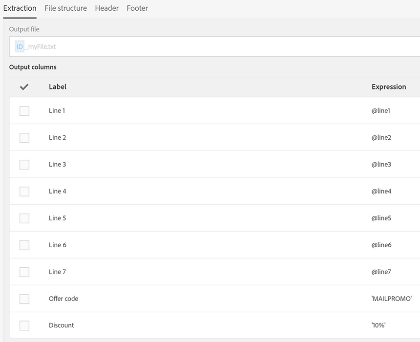
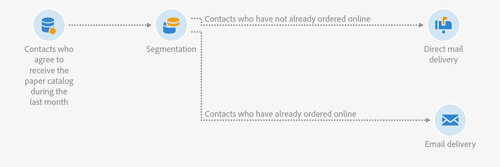

# メールとダイレクトメールの配信の結合 {#coupling-email-direct-mail}

マーケターは、ダイレクトメールでカタログを送信する場合があります。ペーパーカタログでは、特定のページで、Web サイトでの商品購入に使用できるプロモーションコードとリンクを使用した 10％の割引が紹介されています。

オフラインとオンラインの組み合わせは注目すべきものです。一部のクライアントは、注文はオンラインですることが多いですが、商品の紹介を見るのは紙面の方がよいと考えているからです。

使用できるダイレクトメールテンプレートの例を以下に示します。

ダイレクトメールとメールのチャネルを併用するワークフローの例を以下に示します。

**関連トピック：**

* [ダイレクトメール配信アクティビティ](../../automating/using/direct-mail-delivery.md)
* [ダイレクトメールについて](../../channels/using/about-direct-mail.md)
