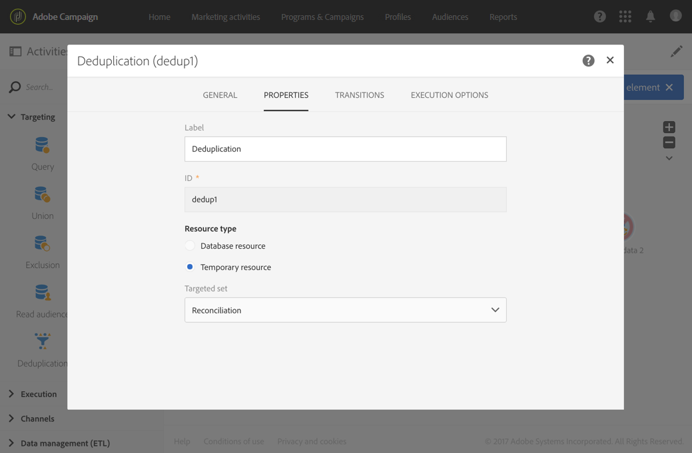

# データを読み込むためのワークフローテンプレートの作成 {#import-workflow-template}

同じ構造のファイルを頻繁にインポートする必要がある場合、インポートテンプレートを使用することをお勧めします。

この例では、Adobe Campaign データベースの CRM からのプロファイルのインポートに再利用できるワークフローを事前設定する方法を示します。

1. **[!UICONTROL Resources > Templates > Workflow templates]**&#x200B;から新しいワークフローテンプレートを作成します。
1. 次のアクティビティを追加します。

   * **[!UICONTROL Load file]**:読み込むデータを含むファイルの構造を定義します。

      >[!NOTE]
      >
      >読み込めるのは、1つのファイルからのみです。 ワークフローに複数の&#x200B;**[!UICONTROL Load file]**&#x200B;アクティビティがある場合は、毎回同じファイルが使用されます。

   * **[!UICONTROL Reconciliation]**:インポートしたデータをデータベースデータと調整します。
   * **[!UICONTROL Segmentation]**:レコードを処理するフィルターは、調整が可能かどうかに応じて異なります。
   * **[!UICONTROL Deduplication]**:受信ファイルをデータベースに挿入する前に、受信ファイルのデータを重複除外します。
   * **[!UICONTROL Update data]**:読み込んだプロファイルでデータベースを更新します。

   

1. **[!UICONTROL Load file]**&#x200B;アクティビティを構成します。

   * サンプルファイルをアップロードすることで、求められる構造を定義します。サンプルファイルには、インポートに必要なすべての列と、いくつかの行のみが含まれている必要があります。ファイルフォーマットをチェックおよび編集して、各列のタイプが正しく設定されていることを確認します（テキスト、日付、整数など）。次に例を示します。

      ```
      lastname;firstname;birthdate;email;crmID
      Smith;Hayden;23/05/1989;hayden.smith@mailtest.com;123456
      ```

   * 「**[!UICONTROL File to load]**」セクションで「**[!UICONTROL Upload a new file from the local machine]**」を選択し、フィールドは空白のままにします。 このテンプレートから新しいワークフローを作成するたびに、ここで、定義された構造に対応するファイルを指定できます。

      任意のオプションを使用できますが、それに応じてテンプレートを修正する必要があります。例えば、**[!UICONTROL Use the file specified in the inbound transition]**&#x200B;を選択した場合、FTP/SFTPサーバーからインポートするファイルを取得する前に、**[!UICONTROL Transfer file]**&#x200B;アクティビティを追加できます。

      読み込み中に発生したエラーを含むファイルをユーザーがダウンロードできるようにするには、**[!UICONTROL Keep the rejects in a file]**&#x200B;オプションをチェックし、**[!UICONTROL File name]**&#x200B;を指定します。

      

1. **[!UICONTROL Reconciliation]**&#x200B;アクティビティを設定します。 ここでのこのアクティビティの目的は、受信データを識別することです。

   * 「**[!UICONTROL Relations]**」タブで、「**[!UICONTROL Create element]**」を選択し、読み込んだデータと受信者ターゲティングディメンションー間のリンクを定義します(「[ターゲティングディメンションーとリソース](../../automating/using/query.md#targeting-dimensions-and-resources)」を参照)。 この例では、結合条件の作成に **CRM ID** カスタムフィールドが使用されています。一意のレコードを識別できる限り、必要なフィールドまたはフィールドの組み合わせを使用します。
   * 「**[!UICONTROL Identification]**」タブで、「**[!UICONTROL Identify the document from the working data]**」オプションをオフのままにします。

   

1. 1つのトランジションの調整済み受信者と、2つ目のトランジションで十分なデータを持つ受信者を取得するように&#x200B;**[!UICONTROL Segmentation]**&#x200B;アクティビティを設定します。

   紐付けされた受信者を含むトランジションは、データベースを更新するために使用できます。不明な受信者を含むトランジションは、ファイルで最小限の情報が利用できる場合、データベースに新しい受信者エントリを作成するために使用できます。

   紐付けできず、十分なデータを持たない受信者は、補集合アウトバウンドトランジションで選択され、別のファイルにエクスポートしたり、単純に無視したりできます。

   * アクティビティの「**[!UICONTROL General]**」タブで、**[!UICONTROL Resource type]**&#x200B;を&#x200B;**[!UICONTROL Temporary resource]**&#x200B;に設定し、ターゲットセットとして&#x200B;**[!UICONTROL Reconciliation]**&#x200B;を選択します。
   * 「**[!UICONTROL Advanced options]**」タブで、**[!UICONTROL Generate complement]**&#x200B;オプションを選択して、データベースにレコードが挿入できないかどうかを確認します。 必要に応じて、補完データのさらなる処理（ファイルエクスポート、リスト更新など）を適用できます。
   * 「**[!UICONTROL Segments]**」タブの最初のセグメントで、受信母集団にフィルター条件を追加して、プロファイルのCRM IDが0以外のレコードのみを選択します。 これにより、データベースのプロファイルと一致したファイルのデータが、そのサブセット内で選択されます。

      

   * データベ追加ースに挿入するのに十分なデータを持つ一時レコードを選択する2番目のセグメント。 （例：E メールアドレス、姓名）。調整されていないレコードのプロファイルのCRM IDの値は0です。

      

   * 最初の2つのサブセットで選択されていないレコードはすべて&#x200B;**[!UICONTROL Complement]**&#x200B;で選択されます。

1. **[!UICONTROL Update data]**&#x200B;アクティビティを、以前に設定した&#x200B;**[!UICONTROL Segmentation]**&#x200B;アクティビティの最初の送信トランジションの後に配置するように設定します。

   * 受信トランジションには、既にデータベースに存在する受信者のみが含まれるので、**[!UICONTROL Update]**&#x200B;を&#x200B;**[!UICONTROL Operation type]**&#x200B;として選択します。
   * 「**[!UICONTROL Identification]**」タブで「**[!UICONTROL Using reconciliation criteria]**」を選択し、「**[!UICONTROL Dimension to update]** -プロファイル（この場合）」と&#x200B;**[!UICONTROL Reconciliation]**&#x200B;アクティビティーで作成されたリンクの間にキーを定義します。 この例では、**CRM ID** カスタムフィールドが使用されています。

      

   * 「**[!UICONTROL Fields to update]**」タブで、ファイルの対応する列の値で更新するプロファイルディメンションのフィールドを指定します。 ファイル列の名前が受信者ディメンションフィールドの名前と同一またはほとんど同じ場合、自動選択ボタンを使用して、異なるフィールドを自動的に一致させることができます。

      

      >[!NOTE]
      >
      >これらのプロファイルにダイレクトメールを送信する場合は、ダイレクトメールプロバイダにとって必須の住所を含めてください。 また、プロファイルの情報の&#x200B;**[!UICONTROL Address specified]**&#x200B;ボックスがチェック済みであることも確認してください。 ワークフローからこのオプションを更新するには、更新するフィールドに要素を追加し、**1**&#x200B;を&#x200B;**[!UICONTROL Source]**&#x200B;と指定し、`postalAddress/@addrDefined`フィールドを&#x200B;**[!UICONTROL Destination]**&#x200B;として選択します。 ダイレクトメールと&#x200B;**[!UICONTROL Address specified]**&#x200B;オプションの使い方について詳しくは、[このドキュメント](../../channels/using/about-direct-mail.md#recommendations)を参照してください。

1. 一時プロファイルを含むトランジションの後にある&#x200B;**[!UICONTROL Deduplication]**&#x200B;アクティビティを構成します。

   * **[!UICONTROL Properties]**&#x200B;タブで、**[!UICONTROL Resource type]**&#x200B;をワークフローの&#x200B;**[!UICONTROL Reconciliation]**&#x200B;アクティビティから生成された一時リソースに設定します。

      

   * この例では、一意のプロファイルを見つけるために、E メールフィールドが使用されています。入力されていることがわかっており、一意の組み合わせを構成する任意のフィールドを使用できます。
   * **[!UICONTROL Deduplication method]**&#x200B;を選択します。 この場合、重複の場合にどのレコードを保持するかは、アプリケーションが自動的に決定します。

   

1. **[!UICONTROL Update data]**&#x200B;アクティビティは、以前に設定した&#x200B;**[!UICONTROL Deduplication]**&#x200B;アクティビティの後に置いて設定します。

   * 受信トランジションには、データベースに存在しないプロファイルのみが含まれているので、**[!UICONTROL Insert only]**&#x200B;を&#x200B;**[!UICONTROL Operation type]**&#x200B;として選択します。
   * 「**[!UICONTROL Identification]**」タブで「**[!UICONTROL Using reconciliation criteria]**」を選択し、「**[!UICONTROL Dimension to update]** -プロファイル（この場合）」と&#x200B;**[!UICONTROL Reconciliation]**&#x200B;アクティビティーで作成されたリンクの間にキーを定義します。 この例では、**CRM ID** カスタムフィールドが使用されています。

      

   * 「**[!UICONTROL Fields to update]**」タブで、ファイルの対応する列の値で更新するプロファイルディメンションのフィールドを指定します。 ファイル列の名前が受信者ディメンションフィールドの名前と同一またはほとんど同じ場合、自動選択ボタンを使用して、異なるフィールドを自動的に一致させることができます。

      

      >[!NOTE]
      >
      >これらのプロファイルにダイレクトメールを送信する場合は、ダイレクトメールプロバイダにとって必須の住所を含めてください。 また、プロファイルの情報の&#x200B;**[!UICONTROL Address specified]**&#x200B;ボックスがチェック済みであることも確認してください。 ワークフローからこのオプションを更新するには、更新するフィールドに要素を追加し、**1**&#x200B;を&#x200B;**[!UICONTROL Source]**&#x200B;と指定し、**[postalAddress/@addrDefined]**&#x200B;フィールドを&#x200B;**[!UICONTROL Destination]**&#x200B;として選択します。 ダイレクトメールと&#x200B;**[!UICONTROL Address specified]**&#x200B;オプションの使い方について詳しくは、[このドキュメント](../../channels/using/about-direct-mail.md#recommendations)を参照してください。

1. データベースに挿入されていないデータを追跡する場合は、**[!UICONTROL Segmentation]**&#x200B;アクティビティの3番目のトランジションの後に&#x200B;**[!UICONTROL Extract file]**&#x200B;アクティビティと&#x200B;**[!UICONTROL Transfer file]**&#x200B;アクティビティを追加します。 これらのアクティビティを設定して、必要な列をエクスポートし、ファイルを取得可能な FTP または SFTP サーバーにファイルを転送します。
1. 追加&#x200B;**[!UICONTROL End]**&#x200B;アクティビティを作成し、ワークフローテンプレートを保存します。

これで、テンプレートが使用できるようになり、すべての新規ワークフローに利用できます。次に、**[!UICONTROL Load file]**&#x200B;アクティビティーにインポートするデータを含むファイルを指定する必要があります。


