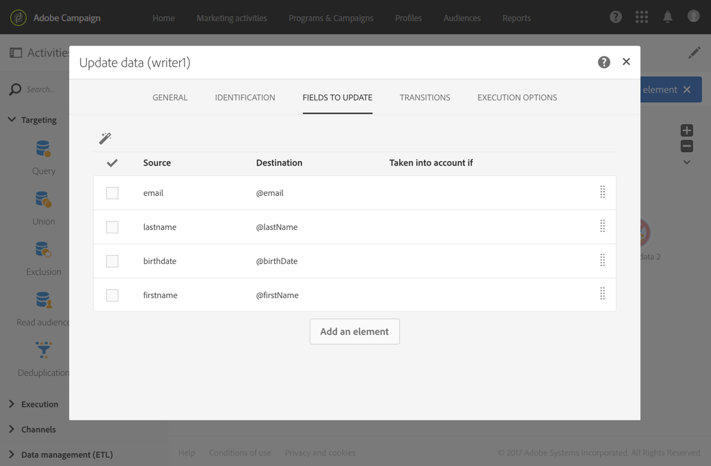

# データを読み込むためのワークフローテンプレートの作成 {#import-workflow-template}

同じ構造のファイルを頻繁にインポートする必要がある場合、インポートテンプレートを使用することをお勧めします。

この例では、Adobe Campaign データベースの CRM からのプロファイルのインポートに再利用できるワークフローを事前設定する方法を示します。

1. Create a new workflow template from **[!UICONTROL Resources > Templates > Workflow templates]**.
1. 次のアクティビティを追加します。

   * **[!UICONTROL Load file]**:読み込むデータを含むファイルの構造を定義します。

      >[!NOTE]
      >
      >読み込めるのは、1つのファイルからのみです。 ワークフローに複数の **[!UICONTROL Load file]** アクティビティがある場合は、毎回同じファイルが使用されます。

   * **[!UICONTROL Reconciliation]**:インポートしたデータをデータベースデータと調整します。
   * **[!UICONTROL Segmentation]**:レコードを処理するフィルターは、調整が可能かどうかに応じて異なります。
   * **[!UICONTROL Deduplication]**:受信ファイルをデータベースに挿入する前に、受信ファイルのデータを重複除外します。
   * **[!UICONTROL Update data]**:読み込んだプロファイルでデータベースを更新します。

   

1. アクティビティの設定 **[!UICONTROL Load file]** :

   * サンプルファイルをアップロードすることで、求められる構造を定義します。サンプルファイルには、インポートに必要なすべての列と、いくつかの行のみが含まれている必要があります。ファイルフォーマットをチェックおよび編集して、各列のタイプが正しく設定されていることを確認します（テキスト、日付、整数など）。次に例を示します。

      ```
      lastname;firstname;birthdate;email;crmID
      Smith;Hayden;23/05/1989;hayden.smith@mailtest.com;123456
      ```

   * セクションで、フィールドを選択 **[!UICONTROL File to load]****[!UICONTROL Upload a new file from the local machine]** して空白のままにします。 このテンプレートから新しいワークフローを作成するたびに、ここで、定義された構造に対応するファイルを指定できます。

      任意のオプションを使用できますが、それに応じてテンプレートを修正する必要があります。For example, if you select **[!UICONTROL Use the file specified in the inbound transition]**, you can add a **[!UICONTROL Transfer file]** activity before to retrieve the file to import from a FTP/SFTP server.

      読み込み中に発生したエラーを含むファイルをユーザーがダウンロードできるようにするには、 **[!UICONTROL Keep the rejects in a file]** オプションをチェックし、を指定し **[!UICONTROL File name]**&#x200B;ます。

      

1. **[!UICONTROL Reconciliation]** アクティビティを設定します ここでのこのアクティビティの目的は、受信データを識別することです。

   * 「 **[!UICONTROL Relations]** 」タブで、読み込んだデータと受信者ターゲティングディメンション間のリンクを選択して定義します( **[!UICONTROL Create element]** ターゲティングディメンションとリソースを参照 [](../../automating/using/query.md#targeting-dimensions-and-resources))。 この例では、結合条件の作成に **CRM ID** カスタムフィールドが使用されています。一意のレコードを識別できる限り、必要なフィールドまたはフィールドの組み合わせを使用します。
   * タブで、このオ **[!UICONTROL Identification]** プションをオフのままにし **[!UICONTROL Identify the document from the working data]** ます。

   

1. Configure the **[!UICONTROL Segmentation]** activity to retrieve reconciled recipients in one transition and recipients that could not be reconciled but who have enough data in a second transition.

   紐付けされた受信者を含むトランジションは、データベースを更新するために使用できます。不明な受信者を含むトランジションは、ファイルで最小限の情報が利用できる場合、データベースに新しい受信者エントリを作成するために使用できます。

   紐付けできず、十分なデータを持たない受信者は、補集合アウトバウンドトランジションで選択され、別のファイルにエクスポートしたり、単純に無視したりできます。

   * アクティビティの **[!UICONTROL General]** タブで、をに設定し、対象セット **[!UICONTROL Resource type]** として **[!UICONTROL Temporary resource]** 選択 **[!UICONTROL Reconciliation]** します。
   * In the **[!UICONTROL Advanced options]** tab, check the **[!UICONTROL Generate complement]** option to be able to see if any record cannot be inserted in the database. 必要に応じて、補完データのさらなる処理（ファイルエクスポート、リスト更新など）を適用できます。
   * In the first segment of the **[!UICONTROL Segments]** tab, add a filtering condition on the inbound population to select only records for which the profile&#39;s CRM ID is not equal to 0. これにより、データベースのプロファイルと一致したファイルのデータが、そのサブセット内で選択されます。

      

   * データベ追加ースに挿入するのに十分なデータを持つ一時レコードを選択する2番目のセグメント。 （例：E メールアドレス、姓名）。調整されていないレコードのプロファイルのCRM IDの値は0です。

      

   * All records that are not selected in the first two subsets are selected in the **[!UICONTROL Complement]**.

1. Configure the **[!UICONTROL Update data]** activity located after the first outbound transition of the **[!UICONTROL Segmentation]** activity configured previously.

   * Select **[!UICONTROL Update]** as **[!UICONTROL Operation type]** since the inbound transition only contains recipients already present in the database.
   * タブで、 **[!UICONTROL Identification]** を選択 **[!UICONTROL Using reconciliation criteria]** し、この場合は **[!UICONTROL Dimension to update]** -プロファイルと **[!UICONTROL Reconciliation]** アクティビティで作成されたリンクの間のキーを定義します。 この例では、**CRM ID** カスタムフィールドが使用されています。

      

   * In the **[!UICONTROL Fields to update]** tab, indicate the fields from the Profiles dimension to update with the value of the corresponding column from the file. ファイル列の名前が受信者ディメンションフィールドの名前と同一またはほとんど同じ場合、自動選択ボタンを使用して、異なるフィールドを自動的に一致させることができます。

      

      >[!NOTE]
      >
      >これらのプロファイルにダイレクトメールを送信する場合は、ダイレクトメールプロバイダにとって必須の住所を含めてください。 また、プロファイルの情報の **[!UICONTROL Address specified]** ボックスがチェック済みであることも確認します。 ワークフローからこのオプションを更新するには、更新するフィールドに要素を追加し、「 **1** 」を指定し **[!UICONTROL Source]** てフィールドを「 `postalAddress/@addrDefined` 」として選択 **[!UICONTROL Destination]**&#x200B;します。 ダイレクトメールの詳細と **[!UICONTROL Address specified]** オプションの使用方法については、 [このドキュメントを参照してください](../../channels/using/about-direct-mail.md#recommendations)。

1. Configure the **[!UICONTROL Deduplication]** activity located after the transition containing unreconciled profiles:

   * タブで、ワークフローの **[!UICONTROL Properties]** アクティビティ **[!UICONTROL Resource type]** から生成された一時リソースにを設定し **[!UICONTROL Reconciliation]** ます。

      

   * この例では、一意のプロファイルを見つけるために、E メールフィールドが使用されています。入力されていることがわかっており、一意の組み合わせを構成する任意のフィールドを使用できます。
   * を選択し **[!UICONTROL Deduplication method]**&#x200B;ます。 この場合、重複の場合にどのレコードを保持するかは、アプリケーションが自動的に決定します。

   

1. 前に設定した **[!UICONTROL Update data]****[!UICONTROL Deduplication]** アクティビティの後にあるアクティビティを設定します。

   * Select **[!UICONTROL Insert only]** as **[!UICONTROL Operation type]** since the inbound transition only contains profiles not present in the database.
   * タブで、 **[!UICONTROL Identification]** を選択 **[!UICONTROL Using reconciliation criteria]** し、この場合は **[!UICONTROL Dimension to update]** -プロファイルと **[!UICONTROL Reconciliation]** アクティビティで作成されたリンクの間のキーを定義します。 この例では、**CRM ID** カスタムフィールドが使用されています。

      

   * In the **[!UICONTROL Fields to update]** tab, indicate the fields from the Profiles dimension to update with the value of the corresponding column from the file. ファイル列の名前が受信者ディメンションフィールドの名前と同一またはほとんど同じ場合、自動選択ボタンを使用して、異なるフィールドを自動的に一致させることができます。

      

      >[!NOTE]
      >
      >これらのプロファイルにダイレクトメールを送信する場合は、ダイレクトメールプロバイダにとって必須の住所を含めてください。 また、プロファイルの情報の **[!UICONTROL Address specified]** ボックスがチェック済みであることも確認します。 ワークフローからこのオプションを更新するには、更新するフィールドに要素を追加し、「 **1** 」を指定し **[!UICONTROL Source]** て、「postalAddress/@addrDefined **[」フィールドを「a」として選択]****[!UICONTROL Destination]**&#x200B;します。 ダイレクトメールの詳細と **[!UICONTROL Address specified]** オプションの使用方法については、 [このドキュメントを参照してください](../../channels/using/about-direct-mail.md#recommendations)。

1. After the third transition of the **[!UICONTROL Segmentation]** activity, add a **[!UICONTROL Extract file]** activity and a **[!UICONTROL Transfer file]** activity if you want to keep track of data not inserted in the database. これらのアクティビティを設定して、必要な列をエクスポートし、ファイルを取得可能な FTP または SFTP サーバーにファイルを転送します。
1. Add an **[!UICONTROL End]** activity and save the workflow template.

これで、テンプレートが使用できるようになり、すべての新規ワークフローに利用できます。All is needed is then to specify the file containing the data to import in the **[!UICONTROL Load file]** activity.


