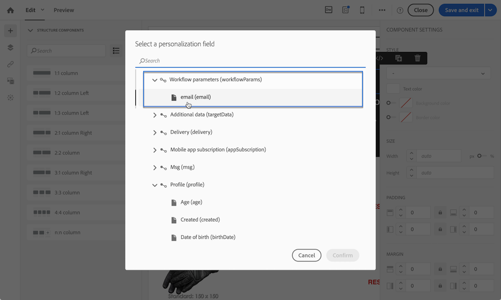

# 外部パラメーターを使用したワークフローのカスタマイズ {#customizing-a-workflow-with-external-parameters}

ワークフローがトリガーされると、パラメーターがイベント変数に取り込まれ、それを使用してワークフローのアクティビティをカスタマイズできます。

これらを使用して、例えば、 **[!UICONTROL Read audience]** 「 」アクティビティ： **[!UICONTROL Transfer file]** 活動等 ( [このページ](../../automating/using/customizing-workflow-external-parameters.md)) をクリックします。

## イベント変数の使用 {#using-events-variables}

イベント変数は、 [標準構文](../../automating/using/advanced-expression-editing.md#standard-syntax).

イベント変数を使用する構文は、次の形式に従い、 **[!UICONTROL External signal]** アクティビティ ( [外部シグナルアクティビティでのパラメーターの宣言](../../automating/using/declaring-parameters-external-signal.md)):

```
$(vars/@parameterName)
```

この構文では、 **$** 関数の戻り値 **文字列** データタイプ。 別のタイプのデータを指定する場合は、次の関数を使用します。

* **$long**：整数。
* **$float**:10 進数。
* **$boolean**:true/false。
* **$datetime**：タイムスタンプ。

アクティビティで変数を使用する場合、インターフェイスで変数を呼び出すのに役立ちます。


* ：ワークフローで使用可能なすべての変数の中からイベント変数を選択します。

  

* ：変数と関数を組み合わせた式の編集 ( [このページ](../../automating/using/advanced-expression-editing.md)) をクリックします。

  

  このリストでは、複雑なフィルタリングを実行できる関数を提供します。 これらの関数について詳しくは、 [この節](../../automating/using/list-of-functions.md).

  さらに、外部パラメーターを使用してワークフローを呼び出した後にイベント変数を使用できるすべてのアクティビティで使用できる、以下の関数を使用できます ( [この節](../../automating/using/customizing-workflow-external-parameters.md#customizing-activities-with-events-variables)):

  | 名前 | 説明 | 構文 |
  | ---------|----------|---------|
  | EndWith | 文字列（第 1 のパラメーター）が特定の文字列（第 2 のパラメーター）で終わるかどうかを示します。 | EndWith(&lt;string>,&lt;string>) |
  | startWith | 文字列（第 1 のパラメーター）が特定の文字列（第 2 のパラメーター）で始まるかどうかを示します。 | startWith(&lt;string>,&lt;string>) |
  | 抽出 | 区切り文字を使用して、文字列の最初の文字を返します。 | Extract(&lt;string>,&lt;separator>) |
  | ExtractRight | 区切り文字を使用して、文字列の最後の文字を返します。 | ExtractRight(&lt;string>,&lt;separator>) |
  | DateFormat | 2 番目のパラメータで指定された形式を使用して日付を書式設定します（例： &#39;%4Y%2M%2D&#39;） | DateFormat(&lt;date>,&lt;format>) |
  | FileName | ファイルパスの名前を返します。 | FileName(&lt;string>) |
  | FileExt | ファイルパスの拡張子を返します。 | FileExt(&lt;string>) |
  | GetOption | 指定した関数の値を返します。 | GetOption(&lt;optionname>) |
  | IsNull | 文字列または日付が null かどうかを示します。 | IsNull(&lt;string date=&quot;&quot;>) |
  | UrlUtf8Encode | URL を UTF8 でエンコードします。 | UrlUtf8Encode(&lt;string>) |

## イベント変数を使用したアクティビティのカスタマイズ {#customizing-activities-with-events-variables}

イベント変数は、次の節に示すように、複数のアクティビティをカスタマイズするために使用できます。 アクティビティから変数を呼び出す方法について詳しくは、 [この節](../../automating/using/customizing-workflow-external-parameters.md#using-events-variables).

**[!UICONTROL Read audience]** アクティビティ：イベント変数に基づいてターゲットにするオーディエンスを定義します。 アクティビティの使用方法について詳しくは、 [この節](../../automating/using/read-audience.md).


**[!UICONTROL Test]** アクティビティ：イベント変数に基づいて条件を作成します。 アクティビティの使用方法について詳しくは、 [この節](../../automating/using/test.md).


**[!UICONTROL Transfer file]** アクティビティ：イベント変数に基づいて転送するファイルをカスタマイズします。 アクティビティの使用方法について詳しくは、 [この節](../../automating/using/transfer-file.md).


**[!UICONTROL Query]** アクティビティ：イベント変数と関数を組み合わせた式を使用して、クエリでパラメーターを参照できます。 これをおこなうには、ルールを追加し、 **[!UICONTROL Advanced mode]** リンクをクリックして式の編集ウィンドウにアクセスします ( [高度な式の編集](../../automating/using/advanced-expression-editing.md)) をクリックします。

アクティビティの使用方法について詳しくは、 [この節](../../automating/using/query.md).


**[!UICONTROL Channels]** アクティビティ：イベント変数に基づいて配信をパーソナライズします。

>[!NOTE]
>
>配信パラメーターの値は、配信が準備されるたびに取得されます。
>
>繰り返し配信の準備は、配信に基づいておこなわれます **集計期間**. 例えば、集計期間が「日別」の場合、配信は 1 日に 1 回だけ再準備されます。 配信パラメーターの値が日中に変更された場合は、既に 1 回準備されているので、配信内で更新されません。
>
>ワークフローを 1 日に複数回呼び出す予定がある場合は、 [!UICONTROL No aggregation] 」オプションも使用します。これにより、配信パラメーターが毎回更新されます。 繰り返し配信の設定について詳しくは、 [この節](/help/automating/using/email-delivery.md#configuration).

イベント変数に基づいて配信をパーソナライズするには、まず、使用する変数を配信アクティビティ内で宣言する必要があります。

1. アクティビティを選択し、  ボタンをクリックして設定にアクセスします。
1. を選択します。 **[!UICONTROL General]** 「 」タブで、次に、配信のパーソナライゼーションフィールドとして使用できるイベント変数を追加します。

   

1. 「**[!UICONTROL Confirm]**」ボタンをクリックします。

宣言されたイベント変数をパーソナライゼーションフィールドのリストから使用できるようになりました。 配信内で使用して、次のアクションを実行できます。

* 配信に使用するテンプレートの名前を定義します。

  >[!NOTE]
  >
  >このアクションは、次の場合に使用できます。 **繰り返し** 配信のみ。

  

* 配信のパーソナライズ：配信を設定するためにパーソナライゼーションフィールドを選択する場合、 **[!UICONTROL Workflow parameters]** 要素を選択します。 これらを任意のパーソナライゼーションフィールドとして使用できます。例えば、配信の件名や送信者を定義できます。

  配信のパーソナライゼーションについて詳しくは、 [この節](../../designing/using/personalization.md).

  

**セグメントコード**：イベント変数に基づいてセグメントコードを定義します。

>[!NOTE]
>
>このアクションは、例えば、次のようなセグメントコードを定義できる任意のアクティビティから実行できます。 **[!UICONTROL Query]** または **[!UICONTROL Segmentation]** アクティビティ。


**配信ラベル**：イベント変数に基づいて配信ラベルを定義します。


