# 外部パラメーターを使用したワークフローのカスタマイズ {#customizing-a-workflow-with-external-parameters}

ワークフローがトリガーされると、パラメーターはイベント変数に取り込まれ、ワークフローのアクティビティのカスタマイズに使用できます。

例えば、**[!UICONTROL Read audience]** アクティビティで読み取るオーディエンス、**[!UICONTROL Transfer file]** アクティビティで転送するファイルの名前などを定義するために使用できます（[このページ ](../../automating/using/customizing-workflow-external-parameters.md)を参照）。

## イベント変数の使用 {#using-events-variables}

イベント変数は、[標準の構文](../../automating/using/advanced-expression-editing.md#standard-syntax)を尊重する必要がある式の中で使用されます。

イベント変数を使用する構文は、以下の形式に従い、**[!UICONTROL External signal]** アクティビティで定義されたパラメーターの名前を使用する必要があります（[外部信号アクティビティでのパラメーターの宣言](../../automating/using/declaring-parameters-external-signal.md)を参照）。

```
$(vars/@parameterName)
```

この構文では、**$**&#x200B;関数は&#x200B;**文字列** データ型を返します。 別のタイプのデータを指定する場合は、次の関数を使用します。

* **$long**：整数。
* **$float**: 10進数
* **$boolean**: true/false。
* **$datetime**: タイムスタンプ。

アクティビティで変数を使用する場合、インターフェイスはそれを呼び出すためのヘルプを提供します。

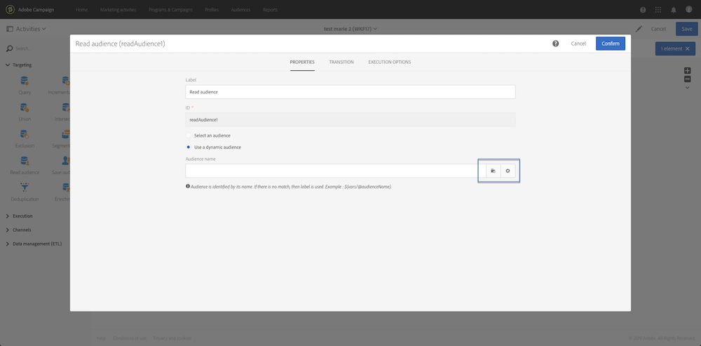

* : ワークフローで使用可能なすべての変数の中からイベント変数を選択します。

  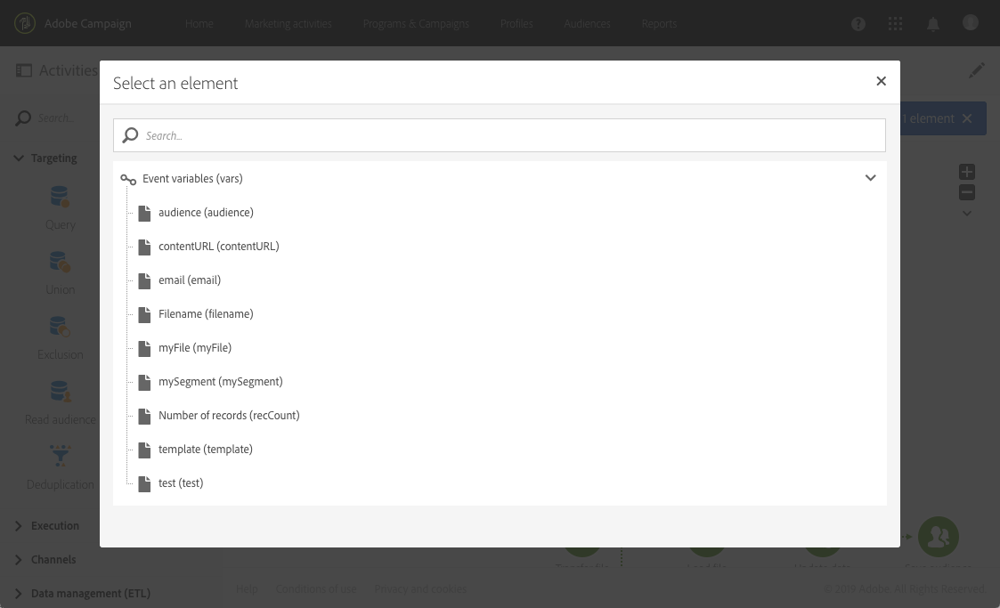

* ：変数と関数を組み合わせた式を編集します（[このページ ](../../automating/using/advanced-expression-editing.md)を参照）。

  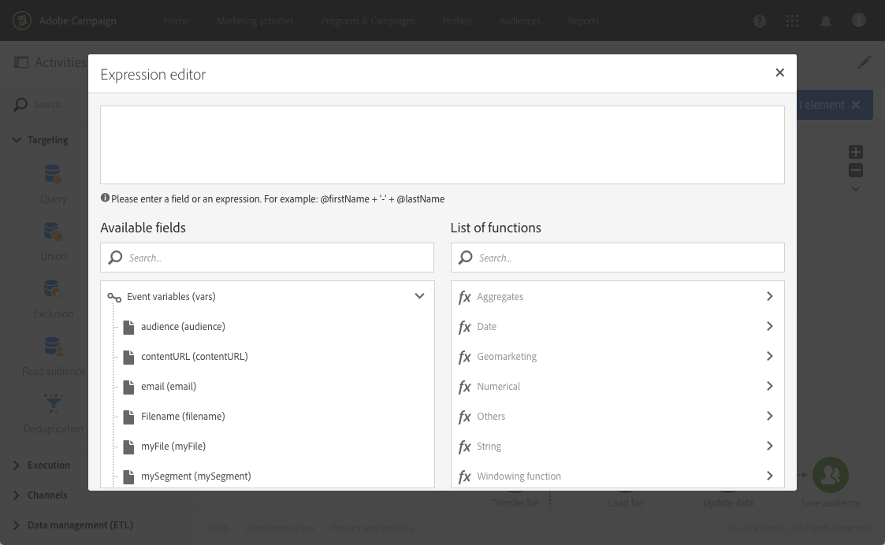

  このリストには、複雑なフィルタリングを実行できる関数が用意されています。 これらの関数について詳しくは、[このセクション ](../../automating/using/list-of-functions.md)を参照してください。

  さらに、以下の関数を使用できます。この関数は、外部パラメーターを使用してワークフローを呼び出した後にイベント変数を使用できるすべてのアクティビティで使用できます（[このセクション ](../../automating/using/customizing-workflow-external-parameters.md#customizing-activities-with-events-variables)を参照）。

  | 名前 | 説明 | 構文 |
  | ---------|----------|---------|
  | EndWith | 文字列（1番目のパラメーター）が特定の文字列（2番目のパラメーター）で終わるかどうかを示します。 | EndWith （&lt;String>,&lt;String>） |
  | startWith | 文字列（1番目のパラメーター）が特定の文字列（2番目のパラメーター）で始まるかどうかを示します。 | startWith （&lt;String>,&lt;String>） |
  | Extract | 区切り記号を使用して、文字列の最初の文字を返します。 | Extract （&lt;String>,&lt;Separator>） |
  | ExtractRight | 区切り記号を使用して、文字列の最後の文字を返します。 | ExtractRight （&lt;String>,&lt;Separator>） |
  | DateFormat | 2番目のパラメーターで指定された形式を使用して日付を書式設定します（例：&#39;%4Y%2M%2D&#39;） | DateFormat （&lt;Date>,&lt;Format>） |
  | FileName | ファイルパスの名前を返します。 | FileName （&lt;String>） |
  | FileExt | ファイルパスの拡張子を返します。 | FileExt （&lt;String>） |
  | GetOption | 指定した関数の値を返します。 | GetOption （&lt;optionName>） |
  | IsNull | 文字列または日付がnullかどうかを示します。 | IsNull （&lt;String/date>） |
  | UrlUtf8Encode | UTF8でURLをエンコードします。 | UrlUtf8Encode （&lt;String>） |

## イベント変数を使用したアクティビティのカスタマイズ {#customizing-activities-with-events-variables}

イベント変数を使用して、以下の節に示す複数のアクティビティをカスタマイズできます。 アクティビティから変数を呼び出す方法について詳しくは、[この節](../../automating/using/customizing-workflow-external-parameters.md#using-events-variables)を参照してください。

**[!UICONTROL Read audience]** アクティビティ：イベント変数に基づいて、ターゲットとするオーディエンスを定義します。 アクティビティの使用方法について詳しくは、[この節](../../automating/using/read-audience.md)を参照してください。

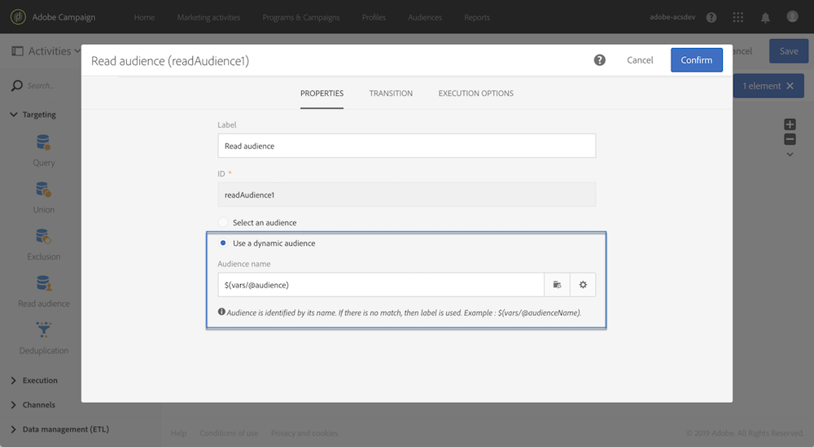

**[!UICONTROL Test]** アクティビティ：イベント変数に基づいて条件を構築します。 アクティビティの使用方法について詳しくは、[この節](../../automating/using/test.md)を参照してください。

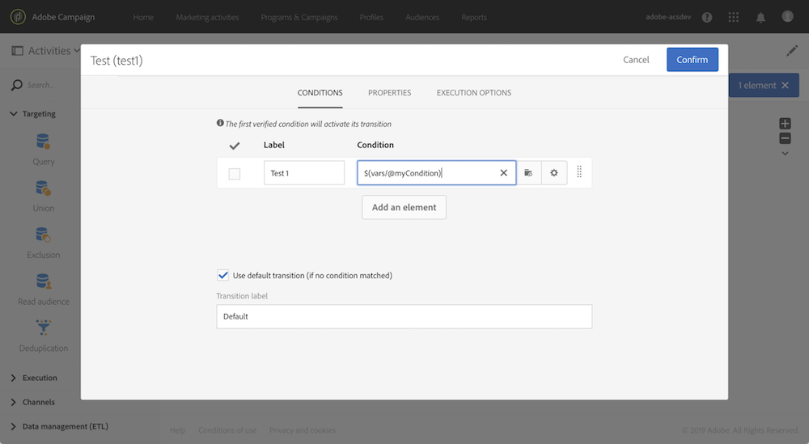

**[!UICONTROL Transfer file]** アクティビティ：イベント変数に基づいて転送するファイルをカスタマイズします。 アクティビティの使用方法について詳しくは、[この節](../../automating/using/transfer-file.md)を参照してください。

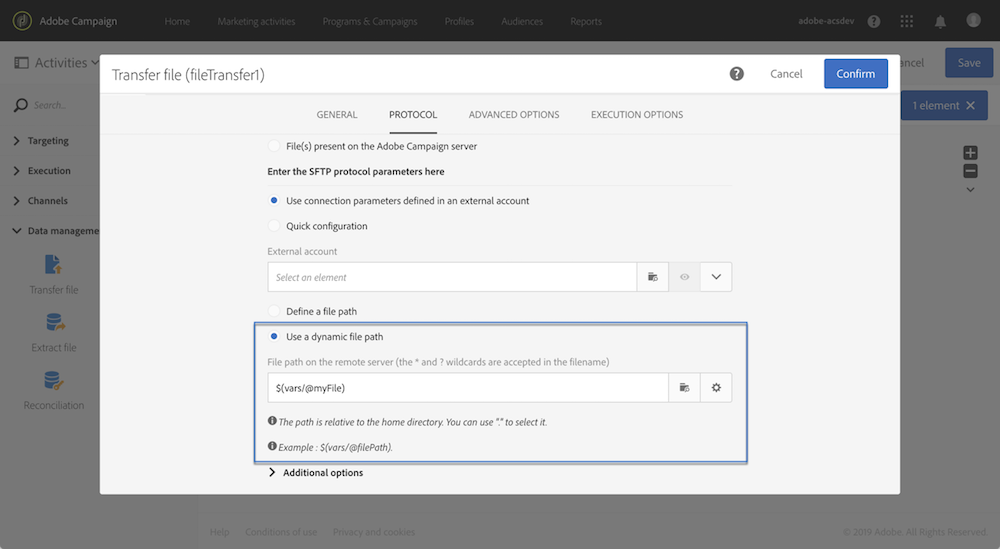

**[!UICONTROL Query]** アクティビティ：イベント変数と関数を組み合わせた式を使用して、クエリでパラメーターを参照できます。 これを行うには、ルールを追加し、**[!UICONTROL Advanced mode]** リンクをクリックして式の編集ウィンドウにアクセスします（[高度な式の編集](../../automating/using/advanced-expression-editing.md)を参照）。

アクティビティの使用方法について詳しくは、[この節](../../automating/using/query.md)を参照してください。

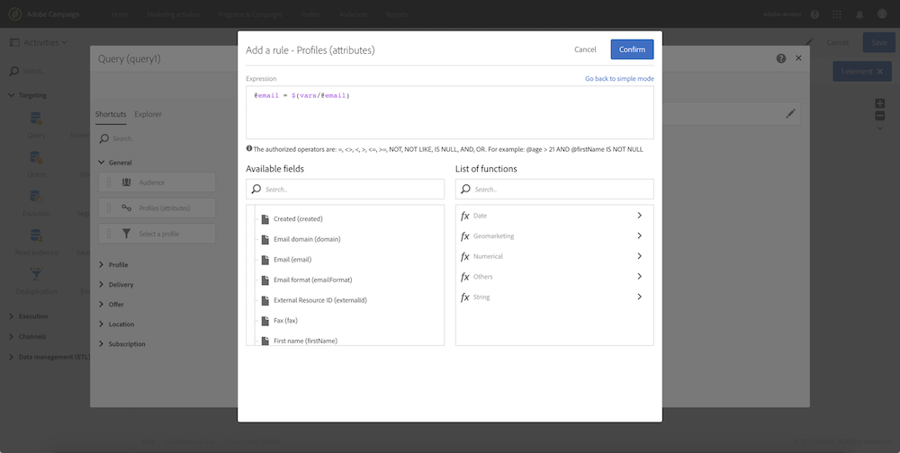

**[!UICONTROL Channels]**&#x200B;件のアクティビティ：イベント変数に基づいて配信をパーソナライズします。

>[!NOTE]
>
>配信パラメーターの値は、配信が準備されるたびに取得されます。
>
>繰り返し配信の準備は、配信&#x200B;**集計期間**&#x200B;に基づいています。 例えば、集計期間が「日別」の場合、配信は1日1回のみ再準備されます。 配信パラメーターの値が日中に変更された場合、配信では既に1回準備されているため、更新されません。
>
>ワークフローを1日に複数回呼び出す場合は、[!UICONTROL No aggregation] オプションを使用して、配信パラメーターが毎回更新されるようにします。 定期的な配信の設定について詳しくは、[この節](/help/automating/using/email-delivery.md#configuration)を参照してください。

イベント変数に基づいて配信をパーソナライズするには、まず、使用する変数を配信アクティビティに宣言する必要があります。

1. アクティビティを選択し、 ボタンをクリックして設定にアクセスします。
1. 「**[!UICONTROL General]**」タブを選択し、配信でパーソナライゼーションフィールドとして使用できるイベント変数を追加します。

   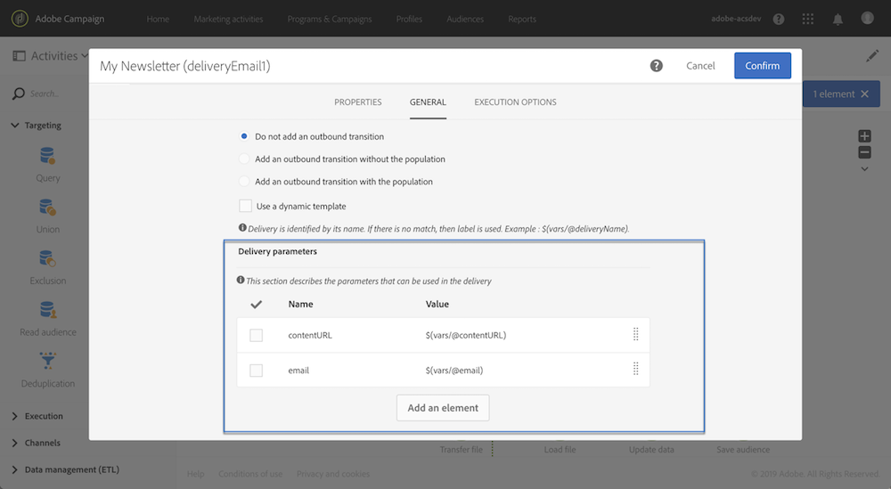

1. 「**[!UICONTROL Confirm]**」ボタンをクリックします。

宣言されたイベント変数が、パーソナライゼーションフィールドのリストから使用できるようになりました。 配信でそれらを使用して、次のアクションを実行できます。

* 配信に使用するテンプレートの名前を定義します。

  >[!NOTE]
  >
  >このアクションは、**繰り返し**&#x200B;配信でのみ使用できます。

  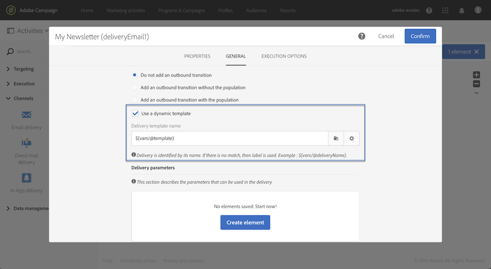

* 配信のパーソナライズ：パーソナライゼーションフィールドを選択して配信を設定する場合、イベント変数は&#x200B;**[!UICONTROL Workflow parameters]**&#x200B;要素で使用できます。 パーソナライゼーションフィールドとして使用できます。例えば、配信の件名や送信者などを定義できます。

  配信のパーソナライゼーションについて詳しくは、[このセクション ](../../designing/using/personalization.md)を参照してください。

  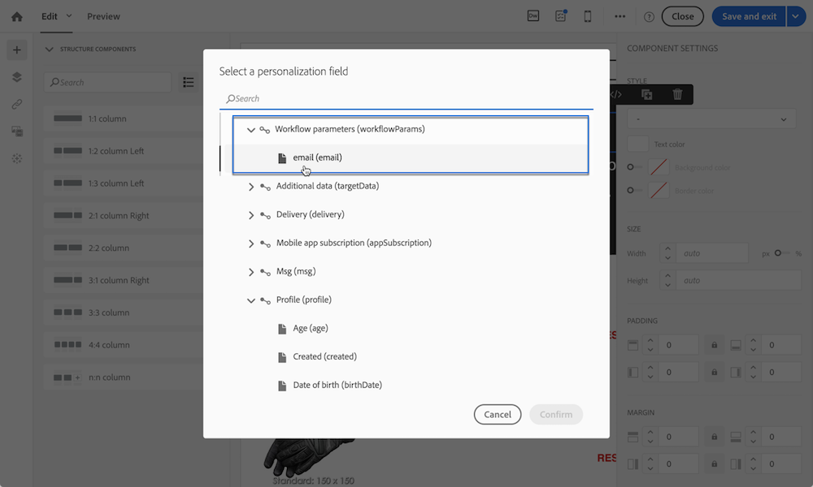

**セグメント コード**: イベント変数に基づいてセグメント コードを定義します。

>[!NOTE]
>
>このアクションは、**[!UICONTROL Query]**&#x200B;や&#x200B;**[!UICONTROL Segmentation]**&#x200B;などのセグメントコードを定義できる任意のアクティビティから実行できます。

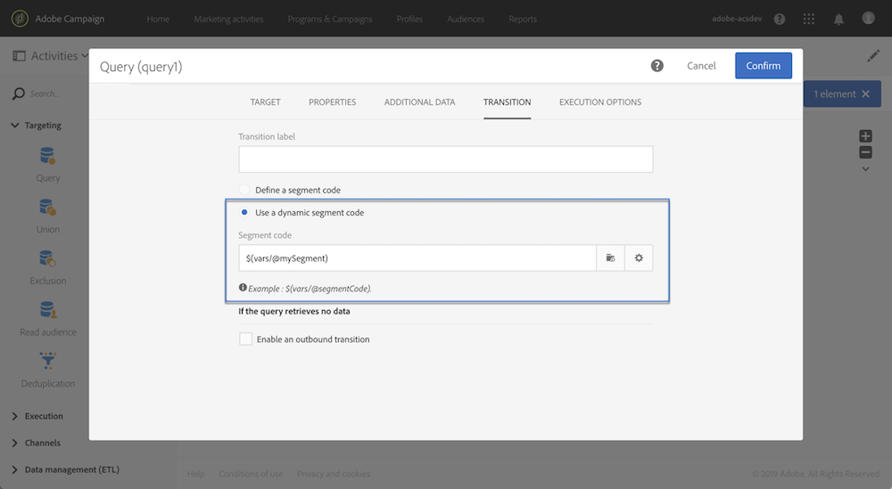

**配信ラベル**: イベント変数に基づいて配信ラベルを定義します。

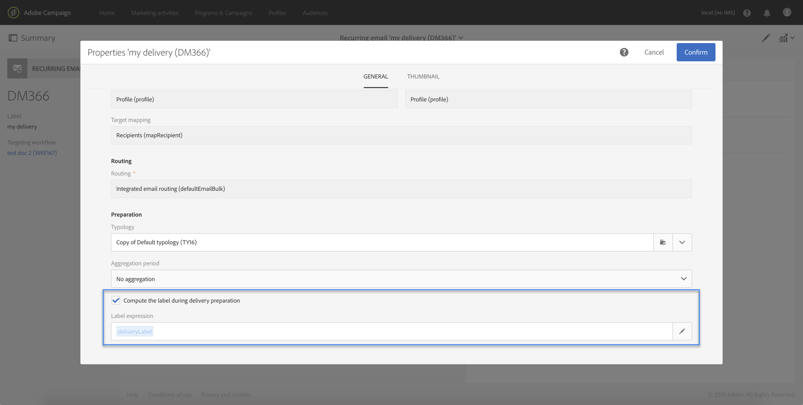
