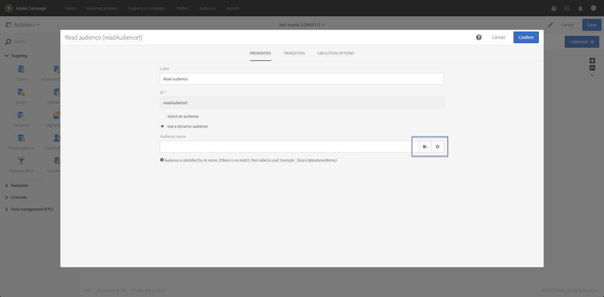

# 外部パラメーターを使用したワークフローのカスタマイズ {#customizing-a-workflow-with-external-parameters}

ワークフローがトリガーされると、パラメーターがイベント変数に取り込まれ、を使用してワークフローのアクティビティをカスタマイズできます。

例えば、**[!UICONTROL Read audience]**&#x200B;アクティビティで読み取るオーディエンス、**[!UICONTROL Transfer file]**&#x200B;アクティビティで転送するファイルの名前などを定義するために使用できます。 （[このページ](../../automating/using/customizing-workflow-external-parameters.md)を参照）。

## イベント変数の使用 {#using-events-variables}

イベント変数は、[標準構文](../../automating/using/advanced-expression-editing.md#standard-syntax)に従う式の中で使用されます。

イベント変数を使用する構文は、次の形式に従い、**[!UICONTROL External signal]**&#x200B;アクティビティで定義されたパラメーター名を使用する必要があります（[外部シグナルアクティビティでのパラメーターの宣言](../../automating/using/declaring-parameters-external-signal.md)を参照）。

```
$(vars/@parameterName)
```

この構文では、 **$**&#x200B;関数は&#x200B;**string**&#x200B;データ型を返します。 別のタイプのデータを指定する場合は、次の関数を使用します。

* **$long**:整数。
* **$float**:10進数
* **$boolean**:true/false。
* **$datetime**:タイムスタンプ。

アクティビティで変数を使用する場合、インターフェイスで変数を呼び出すのに役立ちます。



* :ワークフローで使用可能なすべての変数の中からイベント変数を選択します。

   

* :変数と関数を組み合わせた式を編集します(この [ページを参照](../../automating/using/advanced-expression-editing.md))。

   

   このリストには、複雑なフィルタリングを実行できる関数が含まれています。 これらの関数については、[この節](../../automating/using/list-of-functions.md)で詳しく説明します。

   さらに、以下の関数を使用できます。これは、外部パラメーターを使用してワークフローを呼び出した後にイベント変数を使用できるすべてのアクティビティで使用できます（[この節](../../automating/using/customizing-workflow-external-parameters.md#customizing-activities-with-events-variables)を参照）。

   | 名前 | 説明 | 構文 |
   | ---------|----------|---------|
   | EndWith | 文字列（第1パラメーター）が特定の文字列（第2パラメーター）で終わるかどうかを示します。 | EndWith（&lt;文字列>,&lt;文字列>） |
   | startWith | 文字列（第1パラメーター）が特定の文字列（第2パラメーター）で始まるかどうかを示します。 | startWith（&lt;文字列>,&lt;文字列>） |
   | 抽出 | 区切り文字を使用して、文字列の最初の文字を返します。 | Extract（&lt;文字列>,&lt;区切り文字>） |
   | ExtractRight | 区切り文字を使用して、文字列の最後の文字を返します。 | ExtractRight（&lt;文字列>,&lt;区切り文字>） |
   | DateFormat | 2番目のパラメーターで指定された形式を使用して日付を書式設定します(例： &#39;%4Y%2M%2D&#39;) | DateFormat（&lt;日付>,&lt;形式>） |
   | FileName | ファイルパスの名前を返します。 | FileName（&lt;文字列>） |
   | FileExt | ファイルパスの拡張子を返します。 | FileExt（&lt;文字列>） |
   | GetOption | 指定した関数の値を返します。 | GetOption（&lt;オプション名>） |
   | IsNull | 文字列または日付がnullかどうかを示します。 | IsNull（&lt;文字列/日付>） |
   | UrlUtf8Encode | URLをUTF8でエンコードします。 | UrlUtf8Encode（&lt;文字列>） |

## イベント変数を使用したアクティビティのカスタマイズ {#customizing-activities-with-events-variables}

イベント変数は、次の節に示すように、複数のアクティビティをカスタマイズするために使用できます。 アクティビティから変数を呼び出す方法について詳しくは、[この節](../../automating/using/customizing-workflow-external-parameters.md#using-events-variables)を参照してください。

**[!UICONTROL Read audience]** アクティビティ：イベント変数に基づいて、ターゲットにするオーディエンスを定義します。このアクティビティの使用方法について詳しくは、[この節](../../automating/using/read-audience.md)を参照してください。


**[!UICONTROL Test]** アクティビティ：イベント変数に基づいて条件を作成します。このアクティビティの使用方法について詳しくは、[この節](../../automating/using/test.md)を参照してください。


**[!UICONTROL Transfer file]** アクティビティ：イベント変数に基づいて転送するファイルをカスタマイズします。このアクティビティの使用方法について詳しくは、[この節](../../automating/using/transfer-file.md)を参照してください。


**[!UICONTROL Query]** アクティビティ：パラメーターは、イベント変数と関数を組み合わせた式を使用して、クエリで参照できます。それには、ルールを追加し、**[!UICONTROL Advanced mode]**&#x200B;リンクをクリックして、式の編集ウィンドウにアクセスします（[高度な式の編集](../../automating/using/advanced-expression-editing.md)を参照）。

このアクティビティの使用方法について詳しくは、[この節](../../automating/using/query.md)を参照してください。


**[!UICONTROL Channels]** アクティビティ：イベント変数に基づいて配信をパーソナライズする。

>[!NOTE]
>
>配信パラメーターの値は、配信が準備されるたびに取得されます。
>
>繰り返し配信の準備は、配信&#x200B;**集計期間**&#x200B;に基づいておこなわれます。 例えば、集計期間が「日別」の場合、配信は1日に1回だけ再準備されます。 1日の間に配信パラメーターの値が変更された場合、配信内では更新されません。配信パラメーターは既に1回準備されているからです。
>
>ワークフローを1日に複数回呼び出す予定がある場合は、[!UICONTROL No aggregation]オプションを使用して、配信パラメーターが毎回更新されるようにします。 繰り返し配信の設定について詳しくは、[この節](/help/automating/using/email-delivery.md#configuration)を参照してください。

イベント変数に基づいて配信をパーソナライズするには、まず、使用する変数を配信アクティビティ内で宣言する必要があります。

1. アクティビティを選択し、「」ボタンをクリックして設定を表示します。
1. 「**[!UICONTROL General]**」タブを選択し、配信のパーソナライゼーションフィールドとして使用できるイベント変数を追加します。

   

1. 「**[!UICONTROL Confirm]**」ボタンをクリックします。

宣言済みイベント変数をパーソナライゼーションフィールドのリストから使用できるようになりました。 配信内でこれらを使用して、次のアクションを実行できます。

* 配信に使用するテンプレートの名前を定義します。

   >[!NOTE]
   >
   >このアクションは、**繰り返し**&#x200B;配信でのみ使用できます。

   

* 配信のパーソナライズ：配信を設定するパーソナライゼーションフィールドを選択する場合、**[!UICONTROL Workflow parameters]**&#x200B;要素でイベント変数を使用できます。 これらを任意のパーソナライゼーションフィールドとして使用できます。例えば、配信の件名や送信者を定義できます。

   配信のパーソナライゼーションについて詳しくは、[この節](../../designing/using/personalization.md)を参照してください。

   

**セグメントコード**:イベント変数に基づいてセグメントコードを定義します。

>[!NOTE]
>
>このアクションは、**[!UICONTROL Query]**&#x200B;や&#x200B;**[!UICONTROL Segmentation]**&#x200B;アクティビティなど、セグメントコードを定義できる任意のアクティビティから実行できます。


**配信ラベル**:イベント変数に基づいて配信ラベルを定義します。


