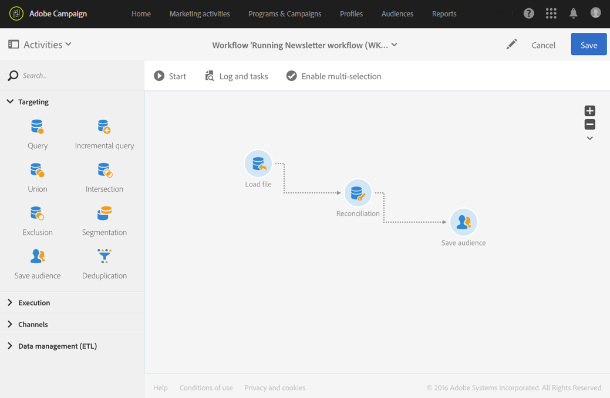

# 紐付けを使用したデータの更新 {#data-update-reconciliation}

次の例は、新しいクライアントを含むインポート済みのファイルから直接プロファイルのオーディエンスを作成するワークフローを示しています。このワークフローは、次のアクティビティで構成されています。



* [ ファイルを読み込み ](../../automating/using/load-file.md) アクティビティ。読み込むファイルの tshe データを読み込んで検出します。 インポートされたファイルには、次のデータが含まれています。

  ```
  lastname;firstname;email;dateofbirth
  jackman;megan;megan.jackman@testmail.com;07/08/1975
  phillips;edward;phillips@testmail.com;09/03/1986
  weaver;justin;justin_w@testmail.com;11/15/1990
  martin;babeth;babeth_martin@testmail.net;11/25/1964
  reese;richard;rreese@testmail.com;02/08/1987
  cage;nathalie;cage.nathalie227@testmail.com;07/03/1989
  xiuxiu;andrea;andrea.xiuxiu@testmail.com;09/12/1992
  grimes;daryl;daryl_890@testmail.com;12/06/1979
  tycoon;tyreese;tyreese_t@testmail.net;10/08/1971
  ```

* [ 紐付け ](../../automating/using/reconciliation.md) アクティビティ。読み込まれたファイルの各列をプロファイルディメンション列にリンクします。 識別できないファイルレコード（データが見つからない、互換性のないデータタイプなど）は無視され、最終的なオーディエンスデータの整合性が維持されます。

  

* プロファイルのオーディエンスを保存する [ オーディエンスを保存 ](../../automating/using/save-audience.md) アクティビティ。

  
