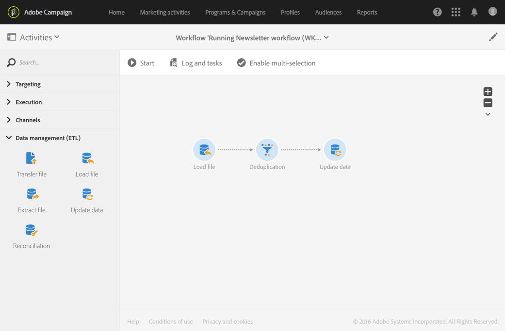
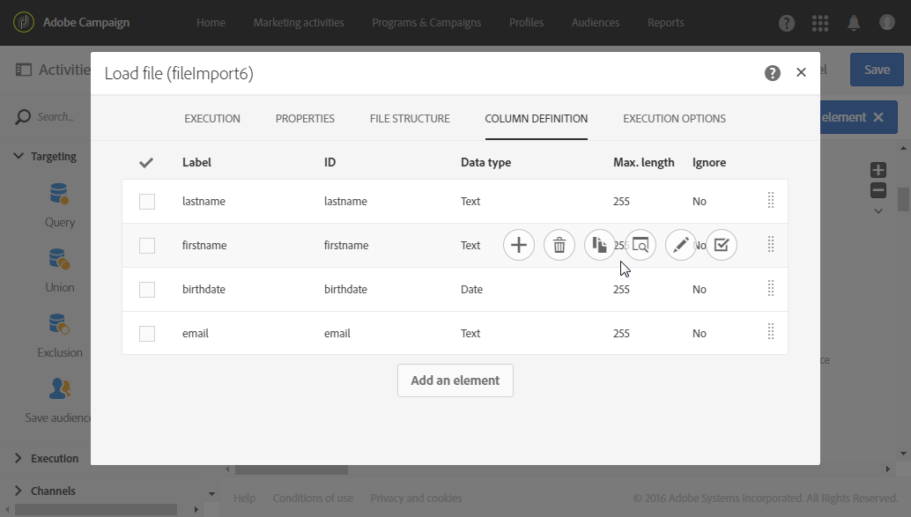
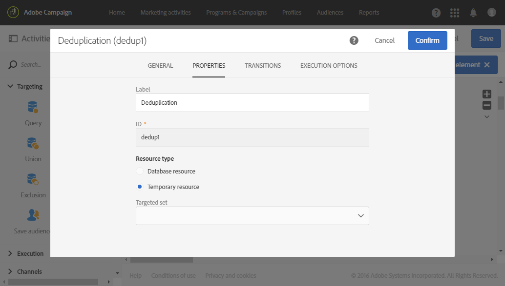
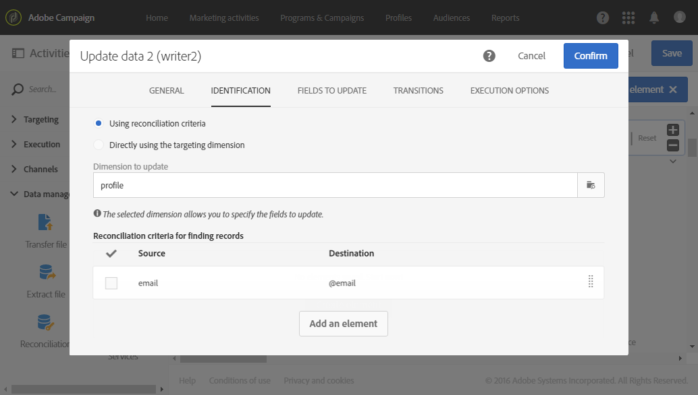
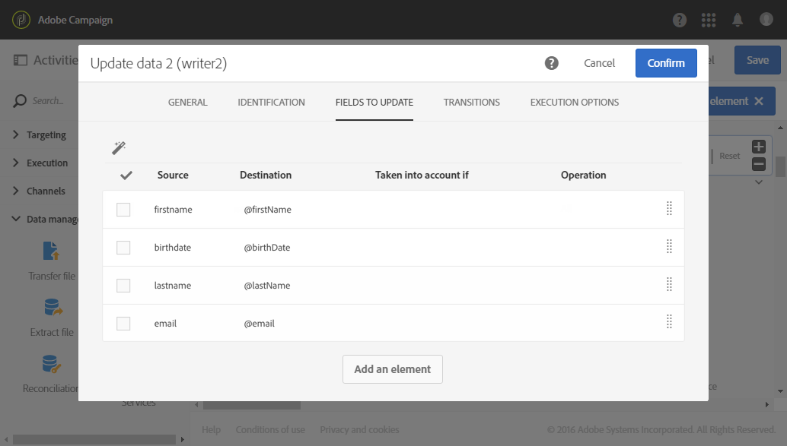

# インポートされたファイルからのデータの重複排除 {#deduplicating-the-data-from-an-imported-file}

この例は、データをデータベースに読み込む前に、インポートしたファイルからデータの重複を除外する方法を示します。 このプロセスにより、データベースに読み込まれたデータの品質が向上します。

このワークフローは次の要素で構成されます。



* プロファイルのリストを含むファイルは、[&#x200B; ファイルを読み込み](../../automating/using/load-file.md) アクティビティを使用して読み込まれます。 この例では、インポートされるファイルは .csv 形式で、10 個のプロファイルを含んでいます。

  ```
  lastname;firstname;dateofbirth;email
  Smith;Hayden;23/05/1989;hayden.smith@example.com
  Mars;Daniel;17/11/1987;dannymars@example.com
  Smith;Clara;08/02/1989;hayden.smith@example.com
  Durance;Allison;15/12/1978;allison.durance@example.com
  Lucassen;Jody;28/03/1988;jody.lucassen@example.com
  Binder;Tom;19/01/1982;tombinder@example.com
  Binder;Tommy;19/01/1915;tombinder@example.com
  Connor;Jade;10/10/1979;connor.jade@example.com
  Mack;Clarke;02/03/1985;clarke.mack@example.com
  Ross;Timothy;04/07/1986;timross@example.com
  ```

  このファイルは、列の形式を検出および定義するためのサンプルファイルとしても使用できます。 「**[!UICONTROL Column definition]**」タブで、インポートしたファイルの各列が正しく設定されていることを確認します。

  

* [重複排除](../../automating/using/deduplication.md) アクティビティ。 ファイルをインポートした後、データベースにデータを挿入する前に重複排除が直接実行されます。 したがって、「**[!UICONTROL Load file]**」アクティビティの「**[!UICONTROL Temporary resource]**」に基づいている必要があります。

  この例では、ファイルに含まれている一意のメールアドレスごとに 1 つのエントリを保持します。 そのため、重複の識別は一時リソースの **email** 列に対しておこなわれます。 ただし、2 つのメールアドレスがファイルに 2 回出現します。 したがって、2 行が重複と見なされます。

  

* [&#x200B; データを更新](../../automating/using/update-data.md) アクティビティを使用すると、重複排除プロセスから保持されているデータをデータベースに挿入できます。 インポートされたデータがプロファイルディメンションに属していると識別されるのは、データの更新時のみです。

  ここでは、「**[!UICONTROL Insert only]**」を指定して、データベースにまだ存在しないプロファイルだけを挿入します。 それには、ファイルの email 列と&#x200B;**プロファイル**&#x200B;ディメンションのメールフィールドを紐付けキーとして使用します。

  

  データの挿入元となるファイル列と「**[!UICONTROL Fields to update]**」タブのデータベースフィールドとのマッピングを指定します。

  

そのあと、ワークフローを開始します。 重複排除プロセスで保存されたレコードがデータベース内のプロファイルに追加されます。
