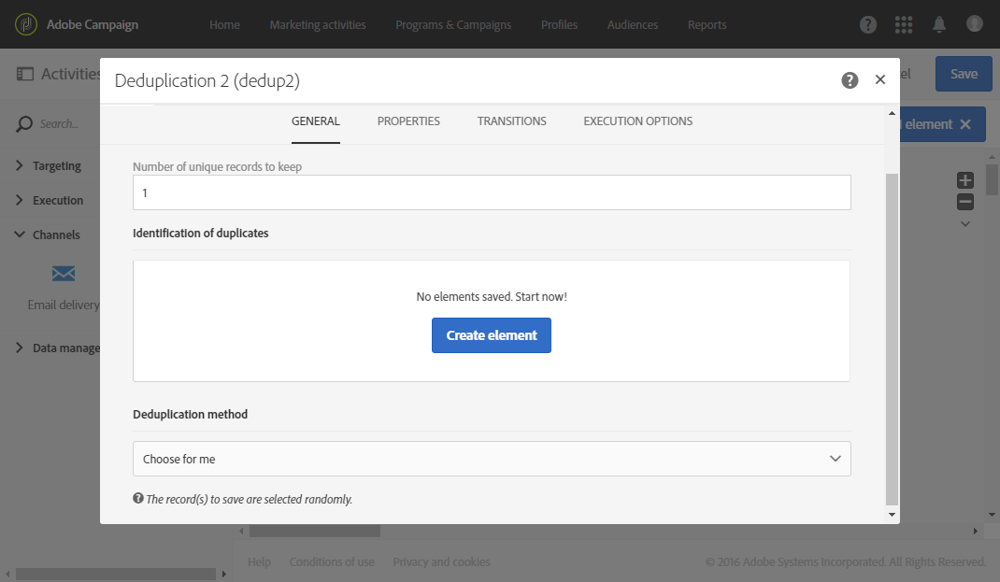
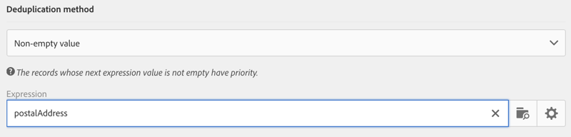
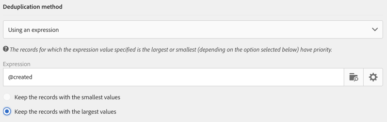

# 重複排除{#deduplication}

## 説明 {#description}

「**[!UICONTROL Deduplication]**」アクティビティでは、インバウンドアクティビティの結果から重複を削除できます。

## 使用状況 {#context-of-use}

「**[!UICONTROL Deduplication]**」アクティビティは、通常、ターゲティングアクティビティの後またはファイルをインポートした後、およびターゲットデータを使用できるアクティビティの前に使用されます。

重複排除の実行中、インバウンドトランジションは個別に処理されます。例えば、プロファイル A がクエリ 1 とクエリ 2 の結果に見つかった場合、重複排除はおこなわれません。

したがって、重複排除ではインバウンドトランジションを 1 つに絞ることをお勧めします。それには、「和集合」アクティビティや「積集合」アクティビティなど、ターゲティングのニーズに対応したアクティビティを使用して、様々なクエリを組み合わせます。次に例を示します。

**関連トピック**

* [使用例：配信前の重複の識別](../../automating/using/identifying-duplicated-before-delivery.md)
* [使用例：読み込んだファイルからのデータの重複を除外する](../../automating/using/deduplicating-data-imported-file.md)

## 設定 {#configuration}

「重複排除 - 重複」アクティビティを設定するには、ラベル、重複排除の方法と条件、結果に関連するオプションを入力する必要があります。

1. ワークフローに「**[!UICONTROL Deduplication]**」アクティビティをドラッグ＆ドロップします。
1. アクティビティを選択し、表示されるクイックアクションの  ボタンを使用して開きます。

   

1. 重複排除の実行対象となる「**[!UICONTROL Resource type]**」を以下から選択します。

   * **[!UICONTROL Database resource]**：データベースに既に存在するデータに対して実行する場合。重複排除の対象となるデータに応じて、「**[!UICONTROL Filtering dimension]**」と「**[!UICONTROL Targeting dimension]**」を選択します。デフォルトでは、**プロファイル**&#x200B;に対して重複排除が実行されます。
   * **[!UICONTROL Temporary resource]**：ワークフローの一時データに対して実行する場合。重複排除の対象となるデータを含んだ「**[!UICONTROL Targeted set]**」を選択します。これは、ファイルのインポート後、またはデータベース内のデータが（セグメントコードなどで）エンリッチされた場合に起こり得るユースケースです。

1. 「**[!UICONTROL Number of unique records to keep]**」を選択します。このフィールドのデフォルト値は 1 です。値 0 を指定すると、すべての重複を保持できます。

   例えば、レコード A と B がレコード Y の重複と見なされ、レコード C がレコード Z の重複と見なされる場合：

   * このフィールドの値が 1 の場合：Y レコードと Z レコードのみが保持されます。
   * このフィールドの値が 0 の場合：すべてのレコードが保持されます。
   * このフィールドの値が 2 の場合：C レコードと Z レコードが保持されます。さらに、偶然に、またはその後選択した重複排除方法によっては、A、B、Y のレコードのうち、2 つのレコードが保持されます。

1. 提供されるリストに条件を追加して、「**[!UICONTROL Duplicate identification]**」条件を定義します。E メールアドレス、名、姓など、同一の値が存在することで重複を識別できるフィールドや式を指定します。条件の順序によって、最初に処理する条件を指定できます。
1. ドロップダウンリストで、使用する「**[!UICONTROL Deduplication method]**」を選択します。

   * **[!UICONTROL Choose for me]**：重複に含めないレコードがランダムに選択されます。
   * **[!UICONTROL Following a list of values]**：1 つまたは複数のフィールドに値の優先度を定義できます。優先度の値を定義するには、フィールドを選択するか式を作成し、適切なフィールドに値を追加します。新しいフィールドを定義するには、値のリストの上の「**[!UICONTROL Add]**」ボタンをクリックします。

      

   * **[!UICONTROL Non-empty value]**：選択した式の値が空でないレコードを優先して保持できます。

      

   * **[!UICONTROL Using an expression]**：入力した式の値が最小または最大のレコードを保持できます。

      

1. 必要に応じて、アクティビティの[トランジション](../../automating/using/activity-properties.md)を管理して、アウトバウンド母集団の詳細設定オプションにアクセスします。
1. アクティビティの設定を確認し、ワークフローを保存します。
