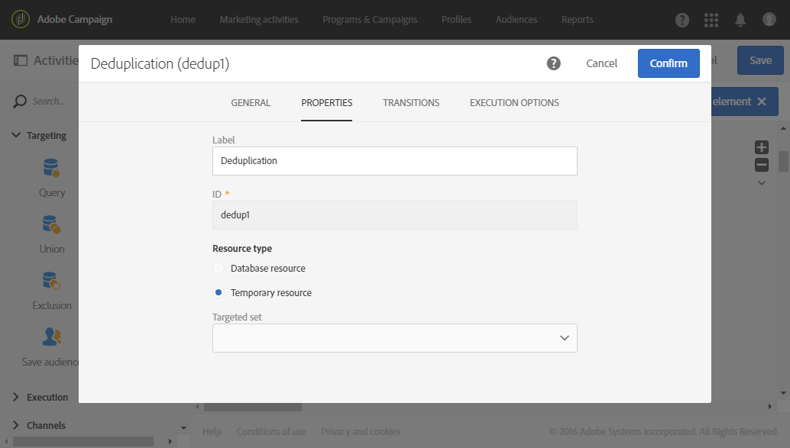

# 重複排除{#deduplication}

## 説明 {#description}


アクテ **[!UICONTROL Deduplication]** ィビティを使用すると、受信アクティビティの結果の重複を削除できます。

## 使用状況 {#context-of-use}

通常、ア **[!UICONTROL Deduplication]** クティビティは、ターゲット設定アクティビティの後、またはファイルをインポートした後、ターゲット設定されたデータを使用できるアクティビティの前に使用されます。

重複除外の間、受信移行は別々に処理されます。 例えば、クエリ1の結果にプロファイル'A'が存在し、クエリ2の結果にもプロファイル'A'が存在する場合、重複は除外されません。

したがって、重複除外には1つの受信移行しか含まれないことをお勧めします。 これを行うには、ユニオンアクティビティ、交差アクティビティなど、ターゲット設定のニーズに対応するアクティビティを使用して、様々なクエリを組み合わせます。 次に例を示します。


## 設定 {#configuration}

重複除外アクティビティを構成するには、ラベル、方法、重複除外条件、および結果に関連するオプションを入力する必要があります。

1. アクティビティをワークフロー **[!UICONTROL Deduplication]** にドラッグ&amp;ドロップします。
1. アクティビティを選択し、表示されるクイックアクシ  ョンのボタンを使用して開きます。

   

1. 重複除外 **[!UICONTROL Resource type]** を実行する対象を選択します。

   * **[!UICONTROL Database resource]** データベースに既に存在するデータに対して重複除外が実行される場合。 重複除 **[!UICONTROL Filtering dimension]** 外するデ **[!UICONTROL Targeting dimension]**&#x200B;ータに応じて、とを選択します。 デフォルトでは、重複除外はプロファイルで実行さ **れます**。
   * **[!UICONTROL Temporary resource]** ワークフローの一時データで重複除外が実行される場合：重複除外する **[!UICONTROL Targeted set]** データを含むデータを選択します。 この使用例は、ファイルのインポート後、またはデータベース内のデータが強化された（例えば、セグメントコードを含む）場合に発生する可能性があります。

1. を選択しま **[!UICONTROL Number of unique records to keep]**&#x200B;す。 このフィールドのデフォルト値は1です。 値0を指定すると、すべての複製を保持できます。

   例えば、レコードAとBがレコードYの複製と見なされ、レコードCがレコードZの複製と見なされる場合、次のように指定します。

   * フィールドの値が1の場合：YとZのレコードのみが保持されます。
   * フィールドの値が0の場合：すべての記録が保存されます。
   * フィールドの値が2の場合：レコードCとZが保持され、A、B、Yの2つのレコードが、偶然、または、それ以降に選択した重複除外方法に応じて保持される。

1. 条件を指定 **[!UICONTROL Duplicate identification]** したリストに追加して、条件を定義します。 同じ値を使用して重複を識別できるフィールドや式を指定します。電子メールアドレス、名、姓など 条件の順序によって、最初に処理する条件を指定できます。
1. ドロップダウンリストで、使用するを選 **[!UICONTROL Deduplication method]** 択します。

   * **[!UICONTROL Choose for me]**:重複を除外するレコードをランダムに選択します。
   * **[!UICONTROL Following a list of values]**:1つ以上のフィールドの値の優先順位を定義できます。 優先度の値を定義するには、フィールドを選択するか式を作成し、適切なフィールドに値を追加します。To define a new field, click the **[!UICONTROL Add]** button located above the list of values.

      

   * **[!UICONTROL Non-empty value]**:これにより、選択した式の値が空でないレコードを優先度として保持できます。

      

   * **[!UICONTROL Using an expression]**:これにより、入力した式の値が最も小さいか大きいかを記録できます。

      

1. 必要に応じて、アクティビティの遷移を管理し [て](../../automating/using/executing-a-workflow.md#managing-an-activity-s-outbound-transitions) 、アウトバウンド母集団のアドバンスオプションにアクセスします。
1. アクティビティの設定を確認し、ワークフローを保存します。

## 例1:配信前の重複の識別 {#example-1--identifying-duplicates-before-a-delivery}

次の例は、電子メールを送信する前にターゲットの重複を除外できる重複除外を示しています。 つまり、同じプロファイルに対して複数回の通信を送信するのを避けます。

ワークフローは次の要素で構成されます。


* 電子 **[!UICONTROL Query]** メールのターゲットを定義できる。 ここでは、18 ～ 25才のプロファイルのうち、1年以上クライアントデータベースに存在するプロファイルをすべてターゲットにします。

   

* 前の **[!UICONTROL Deduplication]** クエリーからの重複を識別できるアクティビティ。 この例では、複製ごとに保存されるレコードは1つだけです。 重複は電子メールアドレスを使用して識別されます。 つまり、電子メール配信は、ターゲティングに存在する各電子メールアドレスに対して1回のみ送信できます。

   選択した重複除外方法はで **[!UICONTROL Non-empty value]**&#x200B;す。 これにより、重複した場合に保存されるレコードの中で、 **First nameが指定されたレコードを優先** する。 これにより、電子メールコンテンツのパーソナライゼーションフィールドで名を使用した場合に、より一貫性のある情報が得られます。

   さらに、複製を保持し、リストに表示できるようにするためのトランジションが追加されました。

   

* 重複除 **[!UICONTROL Email delivery]** 外のメインの外部への移行の後に配置される。 電子メール配信の設定については、「電子メール配信」セクシ [ョンで詳しく](../../automating/using/email-delivery.md) 説明します。
* 重複除 **[!UICONTROL Save audience]** 外の移行の後に行われたアクティビティ。重複オーディエンスに重複を保存 **します** 。 このオーディエンスを再利用して、すべての電子メール配信からメンバーを直接除外できます。

## 例2:読み込んだファイルからのデータの重複除外 {#example-2--deduplicating-the-data-from-an-imported-file}

次の例は、データをデータベースにロードする前にインポートしたファイルのデータの重複を除外する方法を示しています。 この手順により、データベースにロードされるデータの品質が向上します。

ワークフローは次の要素で構成されます。


* プロファイルのリストを含むファイルは、アクティビティを使用してインポート **[!UICONTROL Load file]** されます。 この例では、読み込まれたファイルは.csv形式で、10個のプロファイルが含まれています。

   ```
   lastname;firstname;dateofbirth;email
   Smith;Hayden;23/05/1989;hayden.smith@example.com
   Mars;Daniel;17/11/1987;dannymars@example.com
   Smith;Clara;08/02/1989;hayden.smith@example.com
   Durance;Allison;15/12/1978;allison.durance@example.com
   Lucassen;Jody;28/03/1988;jody.lucassen@example.com
   Binder;Tom;19/01/1982;tombinder@example.com
   Binder;Tommy;19/01/1915;tombinder@example.com
   Connor;Jade;10/10/1979;connor.jade@example.com
   Mack;Clarke;02/03/1985;clarke.mack@example.com
   Ross;Timothy;04/07/1986;timross@example.com
   ```

   このファイルは、列の形式を検出および定義するサンプルファイルとしても使用できます。 タブから、 **[!UICONTROL Column definition]** 読み込んだファイルの各列が正しく設定されていることを確認します。

   

* アクテ **[!UICONTROL Deduplication]** ィビティ。 重複除外は、ファイルのインポート後、およびデータベースにデータを挿入する前に、直接実行されます。 したがって、アクティビティからの値に基づ **[!UICONTROL Temporary resource]** く必要があ **[!UICONTROL Load file]** ります。

   この例では、ファイルに含まれる一意の電子メールアドレスごとに1つのエントリを保持します。 したがって、一時リソースのemail列で **重複した** IDが実行されます。 ただし、2つの電子メールアドレスがファイル内で2回表示されます。 したがって、2つの行が重複と見なされます。

   

* アクティビテ **[!UICONTROL Update data]** ィを使用すると、重複除外プロセスから保持されたデータをデータベースに挿入できます。 インポートされたデータがプロファイルディメンションに属していると識別されるのは、データが更新された場合のみです。

   ここでは、データベースに **[!UICONTROL Insert only]** まだ存在しないプロファイルを作成します。 これを行うには、ファイルの電子メール列と **Profile** ディメンションの電子メールフィールドを調整キーとして使用します。

   

   データを挿入するファイルの列と、タブからデータベースフィールドとの間のマッピングを指定し **[!UICONTROL Fields to update]** ます。

   

次に、ワークフローを開始します。 その後、重複除外プロセスで保存されたレコードが、データベース内のプロファイルに追加されます。
