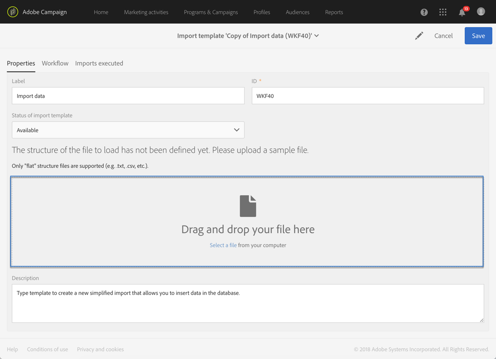

# Defining import templates{#defining-import-templates}

テンプレートをインポートすると、管理者は特定の数の技術的なインポート設定を事前定義できます。これらのテンプレートは、標準ユーザーがファイルを実行してアップロードするために使用できます。

An import template is defined by the functional administrator and can be managed under the **[!UICONTROL Resources]** &gt; **[!UICONTROL Templates]** &gt; **[!UICONTROL Import templates]** menu.

デフォルトの読み取り専用テンプレートは3つあります。

* **[!UICONTROL Update Direct mail quarantines and delivery logs]**:このテンプレートは、ダイレクトメールの隔離および配信ログを更新するための新しいインポートの基本として機能できます。テンプレートのワークフローには、次のアクティビティが含まれています。
* **[!UICONTROL Import data]**:このテンプレートは、ファイルからデータベースにデータを挿入するための新しいインポートの基盤として機能できます。このテンプレートのワークフローには、次のアクティビティが含まれています。

   * **[!UICONTROL Load file]**:このアクティビティにより、Adobe Campaignサーバー上にファイルをアップロードできます。
   * **[!UICONTROL Update data]**:このアクティビティを使用すると、ファイルからデータをデータベースに挿入できます。

* **[!UICONTROL Import list]**:このテンプレートは、ファイル内のデータから **List** タイプのオーディエンスを作成するための新しいインポートの基盤として機能できます。このテンプレートのワークフローには、次のアクティビティが含まれています。

   * **[!UICONTROL Load file]**:このアクティビティにより、Adobe Campaignサーバー上にファイルをアップロードできます。
   * **[!UICONTROL Reconciliation]**:このアクティビティを使用すると、ターゲットディメンションをインポートしたデータにリンクできます。This then allows you to create a **List** type audience. If the targeting dimension of the imported data is not known, the audience is **File** type. See [Targeting dimensions and resources](../../automating/using/query.md#targeting-dimensions-and-resources).
   * **[!UICONTROL Save audience]**:このアクティビティで **は、List** タイプのオーディエンスの形式でインポートされたデータを保存できます。保存されたオーディエンスの名前は、ユーザーによってインポートされたファイルの名前に対応し、インポートの日時を指定するサフィックスが追加されます。次に例を示します。"profiles_20150406_151448".

これらのデフォルトテンプレートは読み取り専用で、標準ユーザーには表示されません。ユーザーが使用できるテンプレートを作成するには、次の手順に従います。

1. デフォルトテンプレートの複製複製されたテンプレートには3つのタブがあります。

   * **[!UICONTROL Properties]**:インポートテンプレートの一般的なパラメーター。このタブでは、テンプレートを有効にしたり、サンプルファイルをアップロードしたりできます。
   * **[!UICONTROL Workflow]**:インポートワークフローを参照してください。このタブでは、ワークフローアクティビティを定義できます。これらのアクティビティは、ユーザーが実行したシンプルなインポート中には表示されません。
   * **[!UICONTROL Executed imports]**:インポートのリストは、このテンプレートを使用して実行します。このテンプレートを使用して実行された各インポートのステータス、詳細および結果を表示できます。このリストから、ワークフローに直接アクセス（ユーザーに対して透明な方法で実行）できます。

1. **[!UICONTROL Properties]** タブから、テンプレートの名前を変更して説明を追加します。テンプレートが使用可能な場合、ユーザーは説明を表示できます。

   

1. Go to the **[!UICONTROL Workflow]** tab. ここから、ニーズに応じて新しいアクティビティを追加することで、デフォルトで提供されるワークフローを強化できます。

   For more on how to configure the workflow activities, refer to the use case describe in this section: [Example: Import workflow template](../../automating/using/importing-data.md#example--import-workflow-template). この使用例は、Adobe Campaignデータベース内のCRMからのプロファイルをインポートするために再利用できるワークフローの設定に役立ちます。

1. ワークフローの設定が正しく考慮されるようにテンプレートを保存します。
1. **[!UICONTROL Properties]** タブからサンプルファイルをアップロードします。アップロードされるファイルには、将来のインポートまたはサンプルデータに必要な列のみが含まれています。サンプルファイルのデータを使用すると、ワークフローが定義された後でシンプルなインポートをテストできます。

   

   このサンプルファイルは、テンプレートを使用してインポートを実行するために使用できます。例えば、データをインポートして読み込むなど、コンピューターにダウンロードできます。サンプルファイルを追加する際には、これを考慮してください。

1. テンプレートを保存します。これで、サンプルファイルが考慮されます。At any moment you can download it to your computer to check the content, or modify it by checking the **[!UICONTROL Drop a new sample file]** option.

   

1. **[!UICONTROL Workflow]** タブに戻り、アクティビティを **[!UICONTROL Load file]** 開き、前の手順でアップロードしたサンプルファイルの列設定を確認して調整します。
1. ワークフローを開始してインポートをテストします。The sample file uploaded at step **5** has to contain data.

   サンプルファイルのデータが純粋に読み込まれます。データベースが侵害されないように、使用するデータが小規模で架空であることを確認してください。

1. アクションバーにあるワークフロー実行ログに移動します。エラーが発生した場合は、アクティビティが正しく設定されていることを確認してください。

   

1. **[!UICONTROL Properties]** タブで **[!UICONTROL Import template status]** 、"to **[!UICONTROL Available]**」を設定し、テンプレートを保存します。To stop using this template, you can set the **[!UICONTROL Import template status]** to **[!UICONTROL Archived]**.

The template workflow can be modified by re-uploading the sample file and checking the **[!UICONTROL Load file]** configuration.

これで、インポートテンプレートがユーザーに提供され、ファイルのアップロードに使用できます。

**関連トピック:**

* [ワークフロー](../../automating/using/discovering-workflows.md)
* [データの読み込み](../../automating/using/importing-data.md)
* [例:読み込みワークフローテンプレート](../../automating/using/importing-data.md#example--import-workflow-template)

