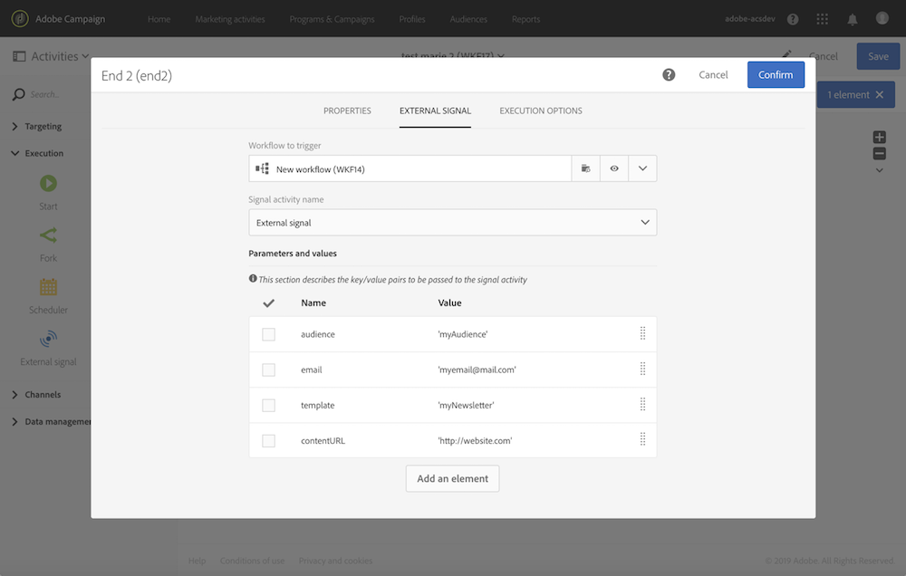

# ワークフロー呼び出し時のパラメーターの定義 {#defining-the-parameters-when-calling-the-workflow}

この節では、ワークフローを呼び出す際にパラメーターを定義する方法について詳しく説明します。 API 呼び出しからこの操作を実行する方法について詳しくは、 [REST API ドキュメント](../../api/using/triggering-a-signal-activity.md).

パラメーターを定義する前に、次の点を確認します。

* パラメーターが **[!UICONTROL External Signal]** アクティビティ。 [このページ](../../automating/using/declaring-parameters-external-signal.md)を参照してください。
* シグナルアクティビティを含むワークフローが実行中です。

次の手順で **[!UICONTROL End]** 「 」アクティビティの場合は、次の手順に従います。

1. を開きます。 **[!UICONTROL End]** 「 」アクティビティで、「 」 **[!UICONTROL External signal]** タブをクリックします。
1. 呼び出すワークフローと外部シグナルアクティビティを選択します。
1. 次をクリック： **[!UICONTROL Create element]** ボタンをクリックしてパラメーターを追加し、その名前と値を入力します。

   * **[!UICONTROL Name]**: **[!UICONTROL External signal]** アクティビティ ( [このページ](../../automating/using/declaring-parameters-external-signal.md)) をクリックします。
   * **[!UICONTROL Value]**：パラメーターに割り当てる値。 値は **標準構文**（説明： ） [この節](../../automating/using/advanced-expression-editing.md#standard-syntax).

   

   >[!CAUTION]
   >
   >すべてのパラメーターが **[!UICONTROL External signal]** アクティビティ。 それ以外の場合は、アクティビティの実行時にエラーが発生します。

1. パラメーターを定義したら、アクティビティを確認し、ワークフローを保存します。
