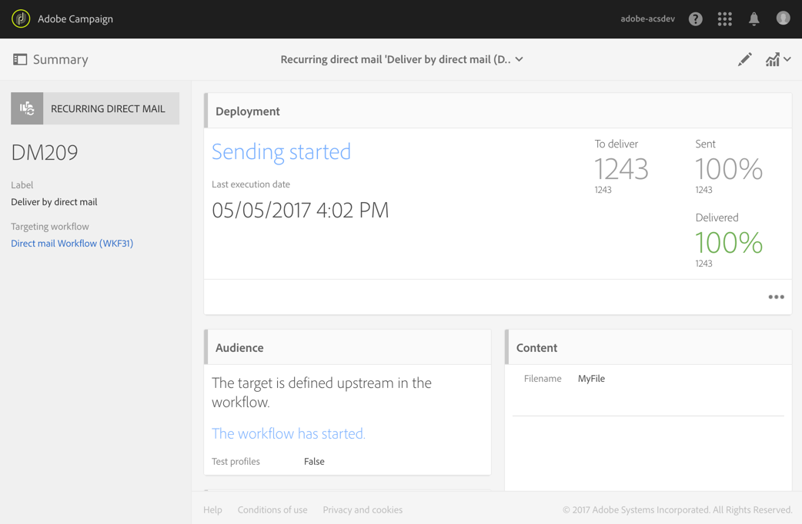
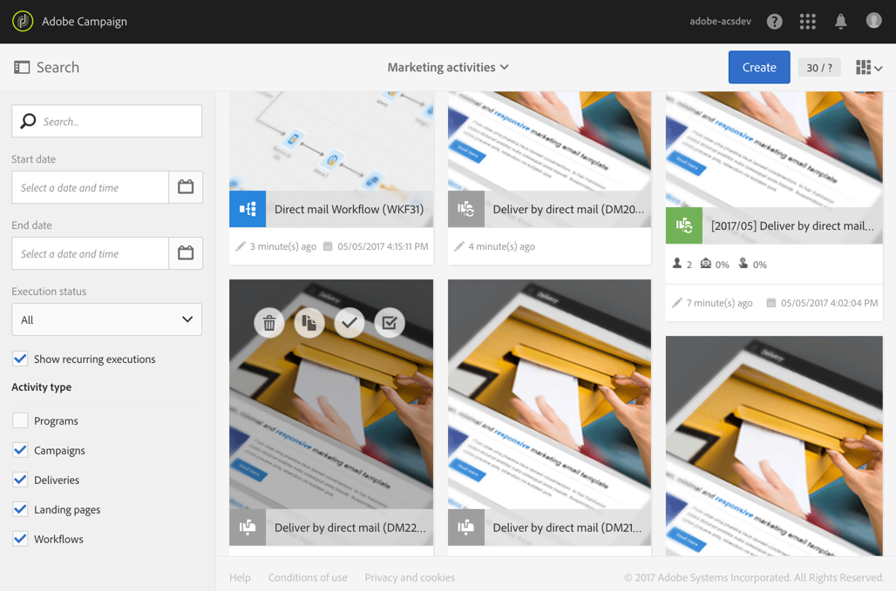
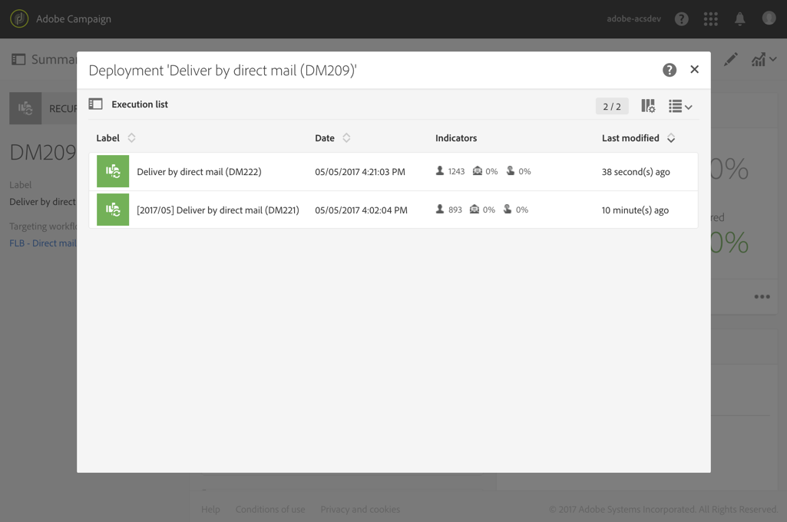

# ダイレクトメール配信{#direct-mail-delivery}

## 説明 {#description}

「**[!UICONTROL Direct mail delivery]**」アクティビティでは、ダイレクトメールキャンペーンに使用するプロファイルデータを含んだファイルを設定および準備することができます。 これは、1回だけ使用されるダイレクトメールでも、定期的なダイレクトメールでもかまいません。

* **Standard**&#x200B;のダイレクトメールは1回送信されます。
* **定期的な** メールを使用すると、定義された期間にわたって同じダイレクトメールを異なるターゲットに複数回送信できます。 期間ごとの配信を集計して、ニーズに応じたレポートを取得できます。

## Context of use {#context-of-use}

「**[!UICONTROL Direct mail delivery]**」アクティビティは、通常、プロファイルデータを含んだファイルの準備を自動化するために使用されます。 このファイルを準備できたら、メール送信担当のパートナーやプロバイダーに送信できます。

スケジューラーにリンクすれば、繰り返しダイレクトメールを定義できます。

ダイレクトメール受信者は、クエリ、積集合などのターゲティングアクティビティを使用して、同じワークフローのアクティビティの上流で定義されます。郵送先住所が指定されていないプロファイルは、ダイレクトメールの作成時に自動的に除外されます。

メッセージの準備は、ワークフロー実行パラメーターに従ってトリガーされます。 メッセージを送信するために手動確認を要求するかどうかをメッセージダッシュボードで選択できます（デフォルトでは必須）。 ワークフローは、手動で開始するか、ワークフロー内に「スケジューラー」アクティビティを配置して自動的に実行することができます。

**関連トピック：**

* [ユースケース：メールとダイレクトメール配信の結合](../../automating/using/coupling-email-direct-mail.md)
* [ダイレクトメールについて](../../channels/using/about-direct-mail.md)

## 設定 {#configuration}

1. ワークフローに「**[!UICONTROL Direct mail delivery]**」アクティビティをドラッグ＆ドロップします。
1. アクティビティを選択し、表示されるクイックアクションの  ボタンを使用して開きます。

   >[!NOTE]
   >
   >アクティビティのクイックアクションの  ボタンを使用して、（配信自体のオプションではなく）アクティビティの一般的なプロパティや詳細設定オプションにアクセスできます。 このボタンは、チャネルアクティビティに固有の機能です。 ダイレクトメールのプロパティにアクセスするには、ダイレクトメールダッシュボードのアクションバーを使用します。

1. ダイレクトメールの送信モードを次の中から選択します。

   * **[!UICONTROL Direct mail]**：ダイレクトメールが 1 回だけ送信されます。 アウトバウンドトランジションをアクティビティに追加するかどうかをここで指定できます。 トランジションタイプについては、この手順のステップ 7 で詳しく説明します。
   * **[!UICONTROL Recurring direct mail]**：「**[!UICONTROL Scheduler]**」アクティビティで定義されている頻度に従って、ダイレクトメールが繰り返し送信されます。 送信の集計期間を選択します。 これにより、定義済みの期間中に発生したすべての送信を 1 つのダイレクトメールに再グループ化することができます。このダイレクトメールは&#x200B;**繰り返し実行**&#x200B;とも呼ばれ、アプリケーションのマーケティングアクティビティリストからアクセス可能です。

     例えば、毎日処理する反復的な誕生日のメールの場合、送信を 1 ヶ月ごとに集計するように選択できます。 これにより、毎日処理されるメールでも、配信のレポートを月単位で受け取ることができます。

     >[!NOTE]
     >
     >繰り返しダイレクトメールの場合は、ワークフローを実行するたびに新しいファイルが生成されます。 選択した集計期間が、この動作に影響を与えることはありません。

1. ダイレクトメールのタイプを選択します。 ダイレクトメールのタイプは、**[!UICONTROL Resources]**／**[!UICONTROL Templates]**／**[!UICONTROL Delivery templates]**&#x200B;メニューに定義されているテンプレートから選択できます。
1. ダイレクトメールの一般的なプロパティを入力します。 既存のキャンペーンにダイレクトメールを添付することもできます。 ワークフローの配信アクティビティのラベルが、ダイレクトメールのラベルに更新されます。
1. ダイレクトメールのコンテンツを定義します。 [コンテンツ編集](../../designing/using/personalization.md)に関する節を参照してください。
1. デフォルトでは、「**[!UICONTROL Direct mail delivery]**」アクティビティにアウトバウンドトランジションは含まれていません。 アウトバウンドトランジションを「**[!UICONTROL Direct mail delivery]**」アクティビティに追加する場合は、アクティビティの詳細設定オプション（アクティビティのクイックアクションにある  ボタンで開く）の「**[!UICONTROL General]**」タブに移動し、次のいずれかのオプションをオンにします。

   * **[!UICONTROL Add outbound transition without the population]**：インバウンドトランジションとまったく同じ母集団を含んだアウトバウンドトランジションを生成できます。 このトランジションには、「ダイレクトメール」アクティビティで生成されたファイルと、「ダイレクトメール」アクティビティで受信された生の母集団が含まれています。
   * **[!UICONTROL Add outbound transition with the population]**：ダイレクトメールの送信先となる母集団を含んだアウトバウンドトランジションが生成できます。 ダイレクトメール作成中に除外されたターゲットのメンバー（強制隔離、無効なアドレスなど） この移行から除外されます。 トランジションには、ダイレクトメールで生成されたファイルも含まれています。

1. アクティビティの設定を確認し、ワークフローを保存します。

アクティビティを再度開くと、ダイレクトメールダッシュボードに直接に移動します。 そのコンテンツのみ編集可能です。

デフォルトでは、配信ワークフローを開始すると、メッセージの準備のみトリガーされます。 ワークフローで作成したメッセージでも、ワークフローを開始した後で送信の確認をおこなう必要があります。 ただし、メッセージダッシュボードから操作している場合と、メッセージをワークフローから作成した場合に限り、「**[!UICONTROL Request confirmation before sending messages]**」オプションを無効にできます。 このオプションをオフにした場合は、準備が完了したら、追加の通知なしでそのままメッセージが送信されます。

## 備考 {#remarks}

ワークフロー内で作成された配信には、アプリケーションのマーケティングアクティビティリストからアクセスできます。 ダッシュボードを使用して、ワークフローの実行ステータスを確認できます。 ダイレクトメールの概要パネルのリンクを使用すると、リンクされた要素（ワークフロー、キャンペーン、繰り返しダイレクトメールの場合はさらに親配信）に直接アクセスできます。

繰り返し配信の実行は、デフォルトでマスクされます。 この配信を表示する場合は、マーケティングアクティビティの検索パネルで「**[!UICONTROL Show recurring executions]**」オプションをオンにします。

親配信では、「**[!UICONTROL Direct mail delivery]**」アクティビティの設定時に指定した集計期間に従って、処理済みメールの合計数が表示されます（親配信には、マーケティングアクティビティリストからアクセスすることも、関連する繰り返し実行から直接アクセスすることもできます）。 この合計数を表示するには、 ボタンをクリックして、親配信の「**[!UICONTROL Deployment]**」ブロックの詳細表示を開きます。

