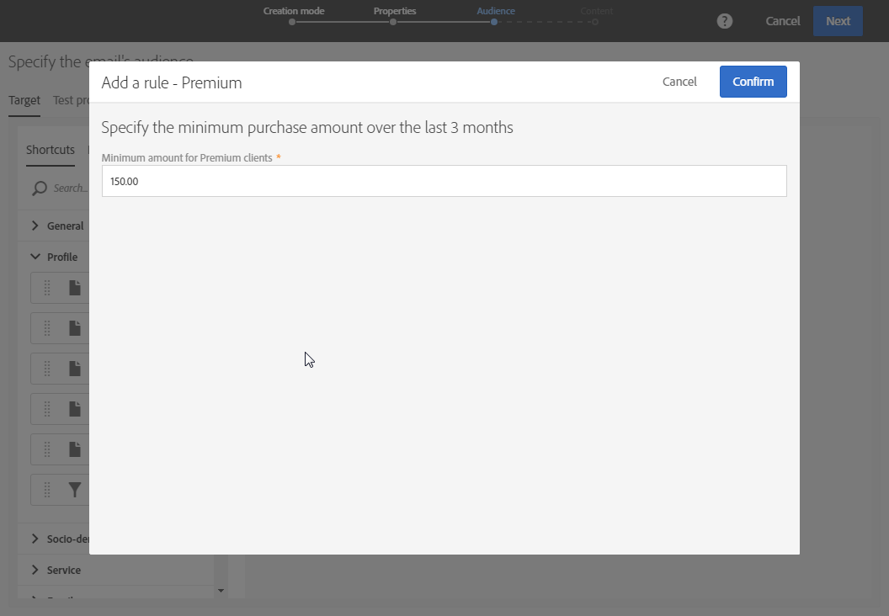

# クエリの編集{#editing-queries}

## クエリエディターについて {#about-query-editor}

クエリエディターは、Adobe Campaignデータベースに含まれるデータをフィルター処理できるウィザードです。

この機能を使用すると、事前定義済みのフィルタおよびルールにより、受信者をより適切にターゲットにするための人口を構築できます。

いくつかのアプリケーション機能は、次のように使用します。

* **クエリ** の種類 **のユーザーの作成**
* **電子メール** ターゲットの定義
* **ワークフロー** 活動での人口の定義

## クエリエディターインターフェイス {#query-editor-interface}

クエリエディターは、 **パレット** とワークス **ペースで構成**&#x200B;されます。

### パレット {#palette}

エディタの左側にあるパレットは、主題ブロックに分割された要素を含む2つのタブに分かれています。これらのタブは次のとおりです。

* 既定 **で使用可能なショートカット**、またはインスタンス管理者によって作成されたショートカット。ここには、フィールド、ノード、グループ化、1-1リンク、1- Nリンク、およびその他の定義済みフィルタがあります。
* ターゲット・リソース内の使用可能なすべてのフィールドにアクセスできる **Explorer** :ノード、グループ化要素、リンク（1-1および1- N）。

タブに含まれる要素は、クエリに対して構成および考慮するために、ワークスペースに移動する必要があります。選択したターゲット次元に応じて（次元およびリソース のターゲットを参照）、次のことができます。

* 対象者またはプロファイルを1つずつ選択
* 定義済みフィルターの使用
* 選択したフィールドの単純なルールを定義する
* 特定のフィールドに関数を適用できる高度な規則の定義

### ワークスペース {#workspace}

ワークスペースは、ルール、対象者、およびパレットから追加された定義済みフィルタを構成および結合できる中央ゾーンです。

パレットからワークスペースに要素を移動すると、新しいウィンドウが開き、「クエリーの作成」を開始 できます。

## クエリの作成 {#creating-queries}

クエリエディターを使用すると、メッセージ内の対象者またはテストプロファイルを定義したり、ワークフロー内の母集団を作成したり、クエリ型の対象者を作成したりできます。

クエリは、 **[!UICONTROL Audience]** 配信の作成中、またはワークフローの作成中にクエリ **** アクティビティで定義できます。

1. パレットからワークスペースに要素を移動します。ルールを編集するためのウィンドウが開きます。

   * 文字列または数値 **フィールド**&#x200B;の場合は、比較演算子と値を指定します。

      

   * 日付または日付と時刻 **のフィールド**&#x200B;では、特定の日付、2つの日付間の範囲、またはクエリの実行日に対して相対的な期間を指定できます。

      

   * ブール型 **フィールド**&#x200B;の場合は、フィールドの可能な値にリンクされたボックスをチェックします。
   * **グループ化** フィールドの場合は、ルールを作成するグループ化フィールドを選択し、その他のフィールドと同じ方法で条件を定義します。

      

   * 別のデータベースリソースと **** の1-1リンクの場合は、対象のテーブルから直接値を選択します。

      

   * 別のデータベースリソースを持つ **1- N** リンクの場合は、この2番目のリソースのフィールドにサブクエリを定義できます。

      サブ条件を指定する必要はありません。

      たとえば、プロファイル追跡ログでオペレーター **[!UICONTROL Exists]** を選択し、規則を承認することのみできます。ルールは、追跡ログが存在するすべてのプロファイルを返します。

      

   * **定義済みのフィルタ**&#x200B;の場合は、提示する基準に従って、目的の要素を入力または選択します。

      管理者は、複雑で反復的なクエリを容易にするフィルターを作成できます。これらは、クエリエディターに事前構成済み規則の形式で表示され、ユーザーが実行する必要のあるステップ数を制限します。

      

1. ルールの名前を指定できます。これは、ワークスペースにルール名として表示されます。ルールに名前が指定されていない場合は、条件の自動的な説明が表示されます。
1. ワークスペース要素を結合するには、相互ロックして別のグループやグループレベルを作成します。次に、同じレベルの要素を結合する論理演算子を選択できます。

   * **[!UICONTROL AND]**:2つの基準の交点。各基準に一致する要素のみが考慮されます。
   * **[!UICONTROL OR]**:2つの基準の和集合。2つの基準のうち少なくとも1つに一致する要素を考慮します。
   * **[!UICONTROL EXCEPT]**:除外条件。最初の基準に一致する要素は、2番目の基準に一致しない限り考慮されます。

1. アクションバーのボタン  とボタンを使用して、クエリによってターゲットの要素数を計算およびプレビューできます。

   

クエリーの要素を変更する場合は、編集アイコンをクリックします。ルールは以前に構成されたときに開かれ、必要な調整を実行できます。

これでクエリが作成され、定義されました。これにより、配信をより適切にカスタマイズするための人口を構築できます。

**関連トピック:**

* [高度な機能](../../automating/using/advanced-expression-editing.md)
* [フィルターの定義](../../developing/using/configuring-filter-definition.md)
* [ユースケース:1週間の電子メール配信を作成する](../../automating/using/workflow-weekly-offer.md)
* [ユースケース:場所にセグメント化された配信の作成](../../automating/using/workflow-segmentation-location.md)
* [ユースケース:補足を使用した搬送の作成](../../automating/using/workflow-created-query-with-complement.md)
* [ユースケース:新しい配送を非公開者に送信するワークフローの再ターゲット](../../automating/using/workflow-cross-channel-retargeting.md)
