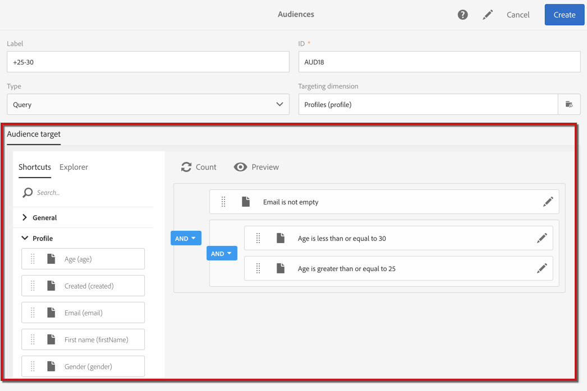

# クエリの編集{#editing-queries}

## クエリエディターについて {#about-query-editor}

クエリエディターは、Adobe Campaign データベースに含まれるデータをフィルターするためのウィザードです。

この機能を使用すると、定義済みフィルターとルールにより、受信者のターゲティングを向上させるための母集団を作成できます。

アプリケーション機能の一部は、次の目的で使用されます。

* **クエリ**&#x200B;タイプ&#x200B;**オーディエンス**&#x200B;の作成
* **E メール**&#x200B;ターゲットの定義
* **ワークフロー**&#x200B;アクティビティでの母集団の定義

## クエリエディターインターフェイス {#query-editor-interface}

クエリエディターは、**パレット**&#x200B;と&#x200B;**ワークスペース**&#x200B;で構成されています。

### パレット {#palette}

パレットはエディターの左側にあり、2 つのタブに分かれています。このタブには、主題ブロックに分割された要素が含まれています。タブには次のようなものがあります。

* デフォルトで使用可能な&#x200B;**ショートカット**、またはインスタンス管理者が作成したショートカット。フィールド、ノード、グループ、1 対 1 リンク、1 対多リンク、その他の定義済みフィルターが表示されます。
* **エクスプローラ**。このエクスプローラを使用すると、ターゲットリソース内の使用可能なすべてのフィールド（ノード、要素のグループ化、リンク（1 対 1、1 対多））にアクセスできます。

タブに含まれる要素は、クエリを設定して考慮するために、ワークスペース内に移動させる必要があります。選択したターゲティングディメンション（[ターゲティングディメンションとリソース](../../automating/using/query.md#targeting-dimensions-and-resources)を参照）に応じて、次の操作を実行できます。

* オーディエンスまたはプロファイルを 1 つずつ選択する
* 定義済みフィルターを使用する
* 選択したフィールドに対して単純なルールを定義する
* 特定のフィールドに関数を適用できる高度なルールを定義する

### ワークスペース {#workspace}

ワークスペースは、パレットから追加されたルール、オーディエンスおよび定義済みフィルターを設定および組み合わせることができる中央ゾーンです。

パレットからワークスペースに要素を移動すると、新しいウィンドウが開き、「[Creating queries](#creating-queries)」を開始できます。

## クエリの作成 {#creating-queries}

クエリエディターを使用して、メッセージ内のオーディエンスまたはテストプロファイル、およびワークフロー内の母集団を定義し、クエリタイプオーディエンスを作成できます。

クエリは、配信の作成時に **[!UICONTROL Audience]** ウィンドウで定義できます。また、ワークフローの作成時には「**Query**」アクティビティで定義できます。

1. パレットの要素をワークスペースに移動します。ルールを編集するためのウィンドウが開きます。

   * 文字列または数値&#x200B;**フィールド**&#x200B;の場合、比較演算子と値を指定します。

      

   * 日付または日付と時間&#x200B;**フィールド**&#x200B;の場合、特定の日付、2 つの日付間の範囲、またはクエリの実行日を基準とした期間を定義できます。

      

   * ブール値&#x200B;**フィールド**&#x200B;の場合、フィールドに設定可能な値にリンクされているチェックボックスをオンにします。
   * グループ化&#x200B;**フィールド**&#x200B;の場合、ルールを作成するグループ化フィールドを選択し、他のフィールドと同様に条件を定義します。

      

   * 別のデータベースリソースとの **1 対 1** リンクの場合、対象となるテーブルから直接値を選択します。

      

   * 別のデータベースリソースとの **1 対多**&#x200B;リンクの場合、この 2 番目のリソースのフィールドにサブクエリを定義できます。

      下位条件を指定する必要はありません。

      例えば、プロファイルトラッキングログでは **[!UICONTROL Exists]** 演算子のみを選択し、ルールを承認できます。ルールは、トラッキングログが存在するすべてのプロファイルを返します。

      

   * **定義済みフィルター**&#x200B;の場合、提供された条件に従って、任意の要素を入力または選択します。

      管理者は、複雑な繰り返しクエリを容易にするフィルターを作成できます。これらのフィルターは事前設定されたルールの形式でクエリエディターに表示され、ユーザーが実行する必要のある手順を合理化します。

      

1. ルールの名前を指定できます。これは、ワークスペースでルール名として表示されます。ルールに名前が付けられていない場合は、条件の自動説明が表示されます。
1. ワークスペース要素を組み合わせるには、それらを相互に連動させて異なるグループやグループレベルを作成します。次に、論理演算子を選択して、同じレベルの要素を組み合わせることができます。

   * **[!UICONTROL AND]**：2 つの条件の積集合。各条件に一致する要素のみが考慮されます。
   * **[!UICONTROL OR]**：2 つの条件の和集合。2 つの条件の少なくとも 1 つに一致する要素が考慮されます。
   * **[!UICONTROL EXCEPT]**：除外条件。最初の条件に一致して 2 番目の条件に一致しない要素が考慮されます。

1. アクションバーの  ボタンと  ボタンを使用して、クエリがターゲットとする要素数を計算し、プレビューできるようになりました。

   

クエリの要素を変更する場合は、編集アイコンをクリックします。ルールは、以前に設定したとおりに開き、必要な調整をおこなうことができます。

クエリが作成され、定義されました。これにより、母集団を作成して配信をより適切にパーソナライズできます。

**関連トピック：**

* [高度な関数](../../automating/using/advanced-expression-editing.md)
* [フィルターの定義](../../developing/using/configuring-filter-definition.md)
* [ユースケース：週 1 回の E メール配信の作成](../../automating/using/workflow-weekly-offer.md)
* [ユースケース：ロケーション別にセグメント化した配信の作成](../../automating/using/workflow-segmentation-location.md)
* [ユースケース：補集合を使用した配信の作成](../../automating/using/workflow-created-query-with-complement.md)
* [ユースケース：メールを開封していないユーザーに新しい配信を送信する再ターゲティングワークフロー](../../automating/using/workflow-cross-channel-retargeting.md)
