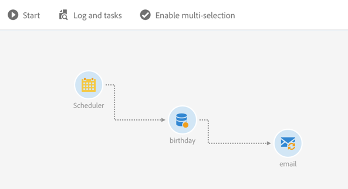

# Email delivery{#email-delivery}

## 説明 {#description}

**[!UICONTROL Email delivery]** アクティビティでは、ワークフローでの電子メールの送信を設定できます。This can be a **single send** email and sent just once, or it can be a **recurring** email.

単一送信電子メールは標準電子メールで、1回送信されます。

定期的な電子メールを使用すると、定義済みの期間にわたって、同一の電子メールを複数のターゲットに対して複数回送信できます。期間ごとの配信を集計して、ニーズに対応するレポートを取得できます。

## Context of use {#context-of-use}

**[!UICONTROL Email delivery]** このアクティビティは、一般に、同じワークフローで計算されたターゲットに電子メールを送信するために使用されます。

スケジューラーにリンクすると、定期的な電子メールを定義できます。

電子メールの受信者は、クエリ、交差などのターゲットアクティビティを通して、同じワークフロー内のアクティビティのアップストリームを定義します。

メッセージの実行パラメーターに従ってメッセージの準備がトリガーされます。メッセージダッシュボードから、メッセージを送信するかどうかを手動で確認できます（デフォルトで必須）。ワークフローを手動で開始することも、ワークフローにスケジューラーアクティビティを配置して実行を自動化することもできます。

## Configuration {#configuration}

1. Drag and drop an **[!UICONTROL Email delivery]** activity into your workflow.
1. Select the activity, then open it using the  button from the quick actions that appear.

   >[!NOTE]
   >
   >You can access the general properties and advanced options of the activity (and not of the delivery itself) via the  button from the activity's quick actions. This button is specific to the **[!UICONTROL Email delivery]** activity. 電子メールのプロパティには、電子メールダッシュボードのアクションバーからアクセスできます。

1. 電子メール送信モードを選択します。

   * **[!UICONTROL Email]**:電子メールが1回送信されます。アクティビティにアウトバウンドトランジションを追加するかどうかを指定できます。この手順の手順7では、様々な移行タイプについて説明しています。
   * **[!UICONTROL Recurring email]**: **[!UICONTROL Scheduler]** アクティビティに定義されている頻度に従って、電子メールが数回送信されます。送信の集計期間を選択します。This allows you to regroup all the sends that occur during the defined period in one single email that is also called **Recurring execution** and can be accessed from the application's marketing activity list.

      例えば、毎日の誕生日の電子メールの場合、毎日送信するように選択できます。これにより、電子メールは毎日送信されるので、毎月の配信に関するレポートを受信できます。

1. 電子メールの種類を選択します。The email types come from email templates defined in the **[!UICONTROL Resources]** &gt; **[!UICONTROL Templates]** &gt; **[!UICONTROL Delivery templates]** menu.
1. 電子メールの一般的なプロパティを入力します。既存のキャンペーンにも添付できます。ワークフローの配信アクティビティのラベルが電子メールラベルで更新されます。
1. 電子メールコンテンツを定義します。[コンテンツの編集](../../designing/using/about-email-content-design.md)に関するセクションを参照してください。
1. By default, the **[!UICONTROL Email delivery]** activity does not include any outbound transitions. If you would like to add an outbound transition to your **[!UICONTROL Email delivery]** activity, go to the **[!UICONTROL General]** tab of the advanced activity options (  button in the activity's quick actions) then check one of the following options:

   * **[!UICONTROL Add outbound transition without the population]**:これにより、インバウンドトランジションとまったく同じ訪問者を含むアウトバウンドトランジションを生成できます。
   * **[!UICONTROL Add outbound transition with the population]**:これにより、電子メールの送信対象母集団を含むアウトバウンドトランジションを生成できます。配信準備中に除外されるターゲットのメンバー（強制隔離、電子メールなど）は、この移行から除外されます。

1. アクティビティの設定を確認し、ワークフローを保存します。

アクティビティを再度開くと、電子メールダッシュボードに直接移動します。編集できるのはコンテンツのみです。

デフォルトでは、配信ワークフローを開始すると、メッセージの準備のみが開始されます。ワークフローを開始した後でもワークフローから作成されたメッセージを送信する必要があります。But from the message dashboard, and only if the message was created from a workflow, you can disable the **[!UICONTROL Request confirmation before sending messages]** option. このオプションのチェックを解除すると、準備が完了すると、それ以上通知なしでメッセージが送信されます。

## Remarks {#remarks}

ワークフロー内で作成された配信は、アプリケーションのマーケティングアクティビティリストからアクセスできます。ダッシュボードを使用して、ワークフローの実行ステータスを表示できます。電子メールサマリペインのリンクを使用すると、リンクされた要素（ワークフロー、キャンペーン、定期的な電子メールの場合の親配信）に直接アクセスできます。

定期配信の実行は、デフォルトでマスクされます。To view them, check the **[!UICONTROL Show recurring executions]** option in the marketing activities' search panel.

In the parent deliveries, which can be accessed from the marketing activity list or directly via the associated recurring executions, you can view the total number of sends that have been processed (according to the aggregation period specified when the **[!UICONTROL Email delivery]** activity was configured). To do this, open the detail view of the parent delivery's **[!UICONTROL Deployment]** block by selecting .

## Example {#example}

この例は誕生日のワークフローです。毎日、その日の誕生日のプロファイルに電子メールが送信されます。これを行うには、次の手順に従います。

* **[!UICONTROL Scheduler]** これにより、毎日午前8時にワークフローを開始できます。

   

* **[!UICONTROL Query]** このアクティビティを使用すると、ワークフローが実行されるたびに、電子メールを提供したプロファイルや、当日に誕生日を持つプロファイルを計算できます。誕生日の計算は、クエリ編集ツールのパレットで使用可能な定義済みフィルターを使用して実行されます。

   

* The **[!UICONTROL Email]** is recurring. 送信は月ごとに集計されます。そのため、1か月に送信されるすべての電子メールが1つのビューに集約されます。In one year, 365 deliveries are therefore executed but they are regrouped into 12 views (also called **recurring executions**) in the Adobe Campaign interface. 履歴とレポートの詳細は毎月表示され、送信ごとには表示されません。

   

