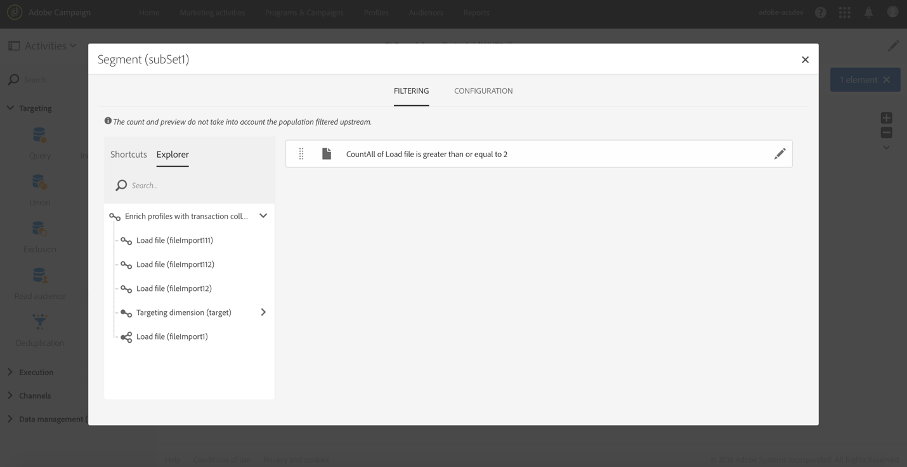

# ファイルに含まれるデータによるプロファイルデータのエンリッチメント {#enriching-profile-data-with-data-contained-in-a-file}

この例では、プロファイルデータをファイルに含まれる購入データと共に拡張する方法を示します。ここでは、購入データがサードパーティのシステムに保存されることを考慮します。 各プロファイルでは、複数の購入をファイルに保存できます。ワークフローの最終目標は、少なくとも 2 つの商品を購入したターゲットプロファイルに E メールを送信して愛顧に感謝することです。

ワークフローは次のように設定します。


* メッセージを受信するプロファイルをターゲットする[クエリ](../../automating/using/query.md)アクティビティ。
* 購入データを読み込む[ファイル](../../automating/using/load-file.md)の読み込みアクティビティ。 次に例を示します。

   ```
   tcode;tdate;customer;product;tamount
   aze123;21/05/2017;dannymars@example.com;TV;799
   aze124;28/05/2017;dannymars@example.com;Headphones;8
   aze125;31/07/2017;john.smith@example.com;Headphones;8
   aze126;14/12/2017;john.smith@example.com;Plastic Cover;4
   aze127;02/01/2018;dannymars@example.com;Case Cover;79
   aze128;04/03/2017;clara.smith@example.com;Phone;149
   ```

   このサンプルファイルでは、E メールアドレスを使用して、データとデータベースプロファイルを紐付けます。また、[こちらのドキュメント](../../developing/using/configuring-the-resource-s-data-structure.md#generating-a-unique-id-for-profiles-and-custom-resources)で説明するように、一意の ID を有効にすることもできます。

* ファイルから読み込まれたトランザクションデータと&#x200B;**[!UICONTROL Query]**&#x200B;で選択されたプロファイルとの間にリンクを作成する[エンリッチメント](../../automating/using/enrichment.md)アクティビティ。 リンクは、アクティビティの「**[!UICONTROL Advanced relations]**」タブで定義します。リンクは、「**[!UICONTROL Load file]**」アクティビティからのトランジションに基づいています。プロファイルリソースの「email」フィールドとインポートされたファイルの「customer」列を紐付け条件として使用します。

   

   リンクが作成されると、次の 2 つの&#x200B;**[!UICONTROL Additional data]**&#x200B;セットが追加されます。

   * 各プロファイルの 2 つの最終トランザクションに対応する 2 行のコレクション。このコレクションの場合は、製品名、トランザクション日、製品の価格が追加データとして追加されます。データに降順ソートが適用されます。コレクションを作成するには、「**[!UICONTROL Additional data]**」タブで次の操作を実行します。

      アクティビティの「**[!UICONTROL Advanced relations]**」タブで既に定義されているリンクを選択します。

      

      「**[!UICONTROL Collection]**」を選択して、取得する行数を指定します（この例では 2）。この画面で、コレクションの「**[!UICONTROL Alias]**」と「**[!UICONTROL Label]**」をカスタマイズできます。ワークフローの後続のアクティビティでこのコレクションを参照する際に、これらの値が表示されます。

      

      コレクション用に保持する「**[!UICONTROL Data]**」として、最終配信で使用する列を選択します。

      

      トランザクション日に降順ソートを適用して、最新のトランザクションを確実に取得します。

      

   * 各プロファイルのトランザクションの合計数をカウントする集計。この集計は、後で、少なくとも 2 つのトランザクションが記録されたプロファイルをフィルターするために使用されます。集計を作成するには、「**[!UICONTROL Additional data]**」タブで次の操作を実行します。

      アクティビティの「**[!UICONTROL Advanced relations]**」タブで既に定義されているリンクを選択します。

      

      「**[!UICONTROL Aggregate]**」を選択します。

      

      保持する「**[!UICONTROL Data]**」として、「**Count All**」集計を定義します。必要に応じて、後続のアクティビティですばやく見つけられるように、カスタムエイリアスを指定します。

      

* 1つのセグメントのみを含む[セグメント化](../../automating/using/segmentation.md)アクティビティ。最低2つのトランザクションが記録された最初のターゲットのプロファイルを取得します。 1 つのトランザクションのみのプロファイルは除外されます。そのために、セグメント化のクエリは、既に定義されている集計に対して実行されます。

   

* [電子メール配信](../../automating/using/email-delivery.md)アクティビティ。**[!UICONTROL Enrichment]**&#x200B;に定義された追加のデータを使用して、プロファイルが最後に行った2つの購入を動的に取得します。 追加データは、パーソナライゼーションフィールドを追加する際に「**Additional data (TargetData)**」ノードに表示されます。

   

**関連トピック：**

* [外部データを使用した顧客プロファイルのエンリッチメント](https://helpx.adobe.com/jp/campaign/kb/simplify-campaign-management.html#Managedatatofuelengagingexperiences)
