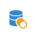

# 除外{#exclusion}

## 説明 {#description}

アクテ **[!UICONTROL Exclusion]** ィビティを使用すると、特定の条件に従って1つの訪問者から要素を除外できます。

## 使用状況 {#context-of-use}

アクティビティ **[!UICONTROL Exclusion]** は、基本的に、インバウンド移行訪問者数に対して追加のフィルタリングを実行するために使用されます。

プライマリセットは、インバウンド遷移で定義されます。 その他の受信移行のメンバーは、プライマリセットから除外されます。 除外アクティビティのアウトバウンド遷移には、他のインバウンド遷移で発生しなかったプライマリセットのメンバーのみが含まれます。

## 設定 {#configuration}

1. アクティビティをワークフロー **[!UICONTROL Exclusion]** にドラッグ&amp;ドロップします。
1. アクティビティを選択し、表示されるクイックアクシ  ョンのボタンを使用して開きます。
1. 受信遷移か **[!UICONTROL Primary set]** らを選択します。 これは、要素を除外するセットです。 他のセットは、プライマリセットから除外される前に要素と一致します。

   >[!NOTE]
   >
   >インバウンド遷移には、同じタイプの母集団を含める必要があります。 例えば、プライマリセットにテストプロファイルが含まれている場合、他のトランジションにもテストプロファイルが含まれている必要があります。

1. 必要に応じて、アクティビティの遷移を管理し [て](../../automating/using/executing-a-workflow.md#managing-an-activity-s-outbound-transitions) 、アウトバウンド母集団のアドバンスオプションにアクセスします。
1. アクティビティの設定を確認し、ワークフローを保存します。

## 例 ：{#example}

次の例は、18 ～ 27歳のAdobe Campaignデータベースから、無効な電子メールアドレスを持つプロファイルをフィルターするように設定された2つのクエリアクティビティを示しています。 その後、無効な電子メールアドレスを持つプロファイルが最初のセットから除外されます。 これにより、例えば電子メールを送信できます。

