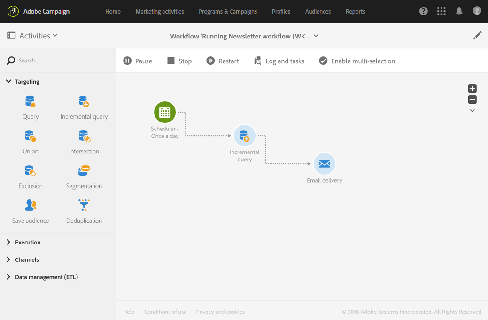

# 実行コマンド {#execution-commands}

アクションバーのアイコンを使用すると、ワークフローの実行を開始、追跡、変更できます。 [ アクションバー ](../../automating/using/workflow-interface.md#action-bar) を参照してください。

利用可能なアクションを次に示します。

**開始**

「」ボタンをクリックすると、ワークフローの実行が開始し、**処理中** （青）ステータスになります。 ワークフローが一時停止していた場合は再開されます。それ以外の場合は、ワークフローが開始され、初期のアクティビティが有効化されます。

>[!NOTE]
>
>開始は非同期プロセスです。リクエストは保存され、ワークフロー実行エンジンによってできるだけ早く処理されます。

**一時停止**

「」ボタンをクリックすると、実行が一時停止します。 ワークフローは **警告** （黄色）ステータスになります。 ワークフローが再開されるまでは新しいアクティビティは有効化されません。ただし、進行中の操作は中断されません。

**停止**

 のボタンは、実行中のワークフローを停止し、ワークフローのステータスを **完了** （緑）にします。 進行中の操作は可能であれば中断され、進行中のインポートまたは SQL クエリは直ちにキャンセルされます。 ワークフローを停止した場所から再開することはできません。

**再起動**

 のボタンをクリックすると、ワークフローの停止と再開が行われます。 ほとんどの場合、これにより、より迅速に再起動できます。 また、停止が有効な場合にのみ「」ボタンを使用できるので、停止に一定の時間がかかると再起動を自動化する場合にも便利です。

ワークフローで 1 つ以上のアクティビティを選択した場合は、次のように、その他の操作を実行できます。

**即時執行**

「」ボタンをクリックすると、選択された保留中のアクティビティをできるだけ早く開始します。

**通常の実行**

 のボタンは、一時停止または非アクティブ化されたアクティビティを再アクティブ化します。

**執行の停止**

「」ボタンをクリックすると、選択したアクティビティでワークフローが一時停止されます。このタスクとその後（同じブランチ内の）すべてのタスクは実行されません。

**実行なし**

 のボタンをクリックすると、選択したアクティビティが非アクティブになります。

>[!NOTE]
>
>クイックアクションを使用すると、1 つの特定のアクティビティに関する様々なアクションにアクセスでき、アクティビティを選択すると表示されます。
