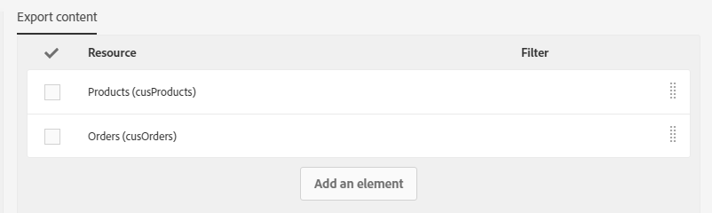

# カスタムリソースのエクスポートとインポート {#exporting-importing-custom-resources}

このチュートリアルでは、カスタムリソースのパッケージを開発環境からエクスポートして本番環境にインポートする方法を説明します。

この例は、Adobe Campaign にリンクされている機能管理者を対象としています。

前提は次のとおりです。

* **1 つ以上のカスタムリソース**：使用可能で公開されていること。

  また、自動プライマリキーはエクスポートされたパッケージに含まれていないので、一意のキーを定義しておく必要があります。そうすることで、リソースのレコードの一意性を、プライマリキーと追加される一意キーによって保証できます。
* パッケージの作成とエクスポートに&#x200B;**必要な権限**。

その他のリソース：

* [パッケージの管理](../../automating/using/managing-packages.md)
* [パッケージのデプロイ：動作原理](../../developing/using/data-model-concepts.md)
* [リソースの追加または拡張](../../developing/using/key-steps-to-add-a-resource.md)

## 構造のエクスポート {#exporting-the-structure}

この節では、カスタムリソースデータの物理構造の詳細を示す最初のパッケージをエクスポートします。

この例には&#x200B;**製品**&#x200B;と&#x200B;**注文**&#x200B;の 2 つのカスタムリソースがあります。

1. **[!UICONTROL Administration]**／**[!UICONTROL Deployment]**／**[!UICONTROL Package exports]**&#x200B;メニューに移動します。

   ここでは、「製品」と「注文」の 2 つのカスタムリソースでフィルタリングした&#x200B;**[!UICONTROL Custom resource (cusResource)]**&#x200B;をエクスポートするための新しいパッケージを作成します。

1. **[!UICONTROL Package exports]**&#x200B;ページで、「**[!UICONTROL Create]**」をクリックして新しいパッケージを作成します。
1. ラベルに情報を入力し、「**[!UICONTROL Create element]**」をクリックします。

   

1. 「**[!UICONTROL Custom resource (cusResource)]**」を検索して選択します。

   

1. **[!UICONTROL Custom resource]**&#x200B;の詳細を、フィルター条件で「**製品**」と「**注文**」の 2 つのリソースを選択して設定します。

   注意：論理演算子を変更することを忘れないでください。製品リソースと注文リソースの構造がパッケージに統合されるように、値を **OR** に設定する必要があります。

   

1. パッケージ定義を確認して保存します。

これで、「**[!UICONTROL Start export]**」をクリックできます。

生成されたパッケージは、ダウンロードフォルダーから入手できます。zip ファイルの名前はランダムに生成されます。この名前は変更できます。

## データのエクスポート {#exporting-the-data}

次のエクスポートでは、**製品**&#x200B;と&#x200B;**注文**&#x200B;のカスタムリソースからデータをエクスポートします。

構造のエクスポートと同じタイプのエクスポートに基づいて、データを含んだ 2 つ目のパッケージを作成します。

1. **[!UICONTROL Package exports]**&#x200B;ページで、「**[!UICONTROL Create]**」をクリックして新しいパッケージを作成します。
1. 「**[!UICONTROL Export data of my resources]**」というラベルを入力して、「**[!UICONTROL Create element]**」を「**[!UICONTROL Export content]**」タブでクリックします。
1. **製品**&#x200B;リソースを検索して選択します。

   

1. **@Label IS NOT NULL** を使用して高度な&#x200B;**フィルター条件**&#x200B;を設定します。

   

1. カウントを確認します。

   

1. **注文**&#x200B;のカスタムリソースに対しても同じ操作を繰り返します。

   

1. パッケージ定義を確認して保存します。

これで、「**[!UICONTROL Start export]**」をクリックできます。

生成されたパッケージは、ダウンロードフォルダーから入手できます。zip ファイルの名前はランダムに生成されます。この名前は変更できます。

## 構造のインポート {#importing-the-structure}

### パッケージのインポート {#importing-the-structure-package}

1. 新しく作成したパッケージのインポート先となる&#x200B;**ターゲットインスタンス**&#x200B;に接続します。
1. **[!UICONTROL Administration]**／**[!UICONTROL Deployment]**／**[!UICONTROL Package imports]**&#x200B;メニューに移動して、新しいパッケージを作成し、最初のエクスポートからファイルをインポートします。
1. インポートファイル用のゾーンに&#x200B;**構造ファイル**&#x200B;をドラッグ＆ドロップします。使用できる形式は ZIP または XML です。

   

1. ラベルを変更し（例えば「**Import structure**」など）、「**[!UICONTROL Save]**」をクリックします。
1. 「**[!UICONTROL Start import]**」をクリックします。

   

### 公開 {#publish-structure}

1. **[!UICONTROL Administration]**／**[!UICONTROL Development]**／**[!UICONTROL Publication]**&#x200B;メニューに移動します。
1. 「**[!UICONTROL Prepare publication]**」、「**[!UICONTROL Publish]**」を順にクリックすると、新しいカスタムリソースのデータでインスタンスが更新されます。
1. インストールされたパッケージに対応するメニューエントリが&#x200B;**[!UICONTROL Client data]**&#x200B;メニューに挿入されます。

   

## データのインポート {#importing-the-data}

この節では、前の手順でインスタンスにインストールしたパッケージにリンクされている&#x200B;**データをインポート**&#x200B;します。

前の手順と同様に、2 つの部分（パッケージのインポートと公開）に分けられます。

### パッケージのインポート {#importing-the-data-package}

1. **[!UICONTROL Administration]**／**[!UICONTROL Deployment]**／**[!UICONTROL Package imports]**&#x200B;メニューに移動して、新しいパッケージを作成し、データを含んだファイルをインポートします。
1. インポートファイル用のゾーンにデータファイルをドラッグ＆ドロップします。使用できる形式は ZIP または XML です。
1. 「Import data」などとラベルを変更し、「**[!UICONTROL Save]**」をクリックします。
1. 「**[!UICONTROL Start import]**」をクリックします。

   

### 公開 {#publish-data}

1. **[!UICONTROL Administration]**／**[!UICONTROL Development]**／**[!UICONTROL Publication]**&#x200B;メニューに移動します。
1. 「**[!UICONTROL Prepare publication]**」、「**[!UICONTROL Publish]**」を順にクリックすると、カスタムリソースのデータでインスタンスが更新されます。
