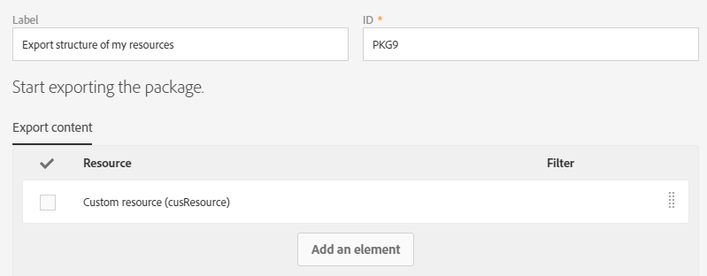

# カスタムリソースの書き出し/読み込み {#exporting-importing-custom-resources}

このチュートリアルでは、カスタムリソースのパッケージを開発環境から実稼働環境に書き出し、読み込む方法について説明します。

この例は、Adobe Campaignにリンクされた機能管理者を対象としています。

前提条件は次のとおりです。

* **使用可能で公開されている** 1つ以上のカスタムリソース。

   また、自動主キーはパッケージにエクスポートされないので、これらのリソースの固有キーを定義する必要があります。 したがって、リソースは主キーと追加の一意キーを持ち、レコードの一意性を保証できます。
* **パッケージを作成** 、書き出すために必要な権限。

その他のリソース：

* [パッケージの管理](../../automating/using/managing-packages.md)
* [パッケージの展開：運営原理](../../developing/using/data-model-concepts.md)
* [リソースの追加または拡張](../../developing/using/key-steps-to-add-a-resource.md)

## 手順1:構造の書き出し {#exporting-the-structure}

この節では、カスタムリソースデータの物理構造の詳細を示す最初のパッケージエクスポートを行います。

この例には2つのカスタムリソースがあります。製 **品** 、 **注文**。

1. / /メニューに **[!UICONTROL Administration]** 移動し **[!UICONTROL Deployment]** てく **[!UICONTROL Package exports]** ださい。

   2つのカスタムリソース「製品」と「注文件数」でフィルタ **[!UICONTROL Custom resource (cusResource)]** ーされたをエクスポートする新しいパッケージを作成します。

1. ページで、を **[!UICONTROL Package exports]** クリックして新し **[!UICONTROL Create]** いパッケージを作成します。
1. ラベルに情報を入力し、をクリックしま **[!UICONTROL Create element]**&#x200B;す。

   

1. を検索し、選択します **[!UICONTROL Custom resource (cusResource)]**。

   

1. フィルター条件で「製品」と「注文 **[!UICONTROL Custom resource]** 」の2つのリソースを選択し **て** 、の詳細を設定します ****。

   論理演算子を変更するのを忘れないでください。 製品リソースと注文リソースの構造がパッケージに統合されるように、この値を **OR** （論理和）に設定する必要があります。

   

1. パッケージ定義を確認して保存します。

これで、をクリックできま **[!UICONTROL Start export]**&#x200B;す。

生成されたパッケージは、Downloadsフォルダーで入手できます。 zipファイルの名前がランダムに生成されます。 名前は変更できます。

## データの書き出し {#exporting-the-data}

この2回目のエクスポートでは、製品と注文のカスタムリソースからデ **ータを** エクス **ポートできます** 。

構造エクスポートと同じタイプのエクスポートに基づいて、データを含む2つ目のパッケージを作成します。

1. ページで、を **[!UICONTROL Package exports]** クリックして新し **[!UICONTROL Create]** いパッケージを作成します。
1. を使用してラベルに記入し、 **[!UICONTROL Export data of my resources]** タブ内のを **[!UICONTROL Create element]** クリック **[!UICONTROL Export content]** します。
1. 製品リソースを検索して選 **択します** 。

   

1. 「 **@Label IS NOT NULL」を使用し** て **、アドバンスフィルタ**&#x200B;ー条件を設定します。

   

1. カウントを確認します。

   

1. Ordersカスタムリソースに対して同じ操 **作を繰り返し** ます。

   

1. パッケージ定義を確認して保存します。

これで、をクリックできま **[!UICONTROL Start export]**&#x200B;す。

生成されたパッケージは、Downloadsフォルダーで入手できます。 zipファイルの名前がランダムに生成されます。 名前は変更できます。

## 構造の読み込み {#importing-the-structure}

### パッケージの読み込み {#importing-the-structure-package}

1. 新しく作成したパ **ッケージの読み込み先の** 、ターゲットインスタンスに接続します。
1. / **[!UICONTROL Administration]** /メニューに移動 **[!UICONTROL Deployment]** し **[!UICONTROL Package imports]** て、新しいパッケージを作成し、最初の書き出しからファイルを読み込みます。
1. この目的で指定したゾ **ーンに** 、構造ファイルをドラッグ&amp;ドロップします。 使用できる形式はZIPまたはXMLです。

   

1. ラベルを変更し(例：「構造を読み込み **」)、**「」をクリックしま **[!UICONTROL Save]**&#x200B;す。
1. Click **[!UICONTROL Start import]**.

   

### パブリッシュ {#publish-structure}

1. / /メニューに **[!UICONTROL Administration]** 移動し **[!UICONTROL Development]** てく **[!UICONTROL Publication]** ださい。
1. 「&gt;」を **[!UICONTROL Prepare publication]** クリック **[!UICONTROL Publish]** し、新しいカスタムリソースのデータでインスタンスを更新します。
1. インストールされたパッケージに対応するメニューエントリがメニューに挿入さ **[!UICONTROL Client data]** れます。

   

## データのインポート {#importing-the-data}

この節では、前の手順でインスタンスにイ **ンストールされたパッケージに** 、リンクされたデータをインポートします。

前の手順と同様に、次の2つの部分に分割されます。パッケージの読み込みと公開を参照してください。

### パッケージの読み込み {#importing-the-data-package}

1. / **[!UICONTROL Administration]** /メニューに移動し **[!UICONTROL Deployment]** て、 **[!UICONTROL Package imports]** 新しいパッケージを作成し、データを含むファイルを読み込みます。
1. データファイルを、この目的で指定したゾーンにドラッグ&amp;ドロップします。 使用できる形式はZIPまたはXMLです。
1. 「データのインポート」などのラベルを変更し、をクリックしま **[!UICONTROL Save]**&#x200B;す。
1. Click **[!UICONTROL Start import]**.

   

### パブリッシュ {#publish-data}

1. / /メニューに **[!UICONTROL Administration]** 移動し **[!UICONTROL Development]** てく **[!UICONTROL Publication]** ださい。
1. 「次へ」を **[!UICONTROL Prepare publication]** クリック **[!UICONTROL Publish]** して、カスタムリソースのデータでインスタンスを更新します。
