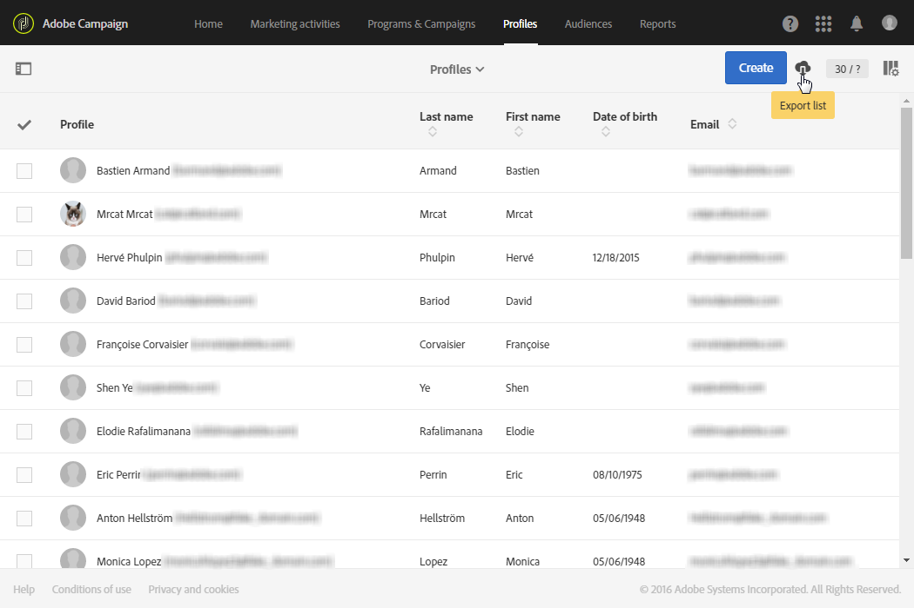

# リストのエクスポート{#exporting-lists}

Adobe Campaignでは、後で使用するために、リストをファイルに直接書き出すことができます。 ファイルにリストを書き出すと、**[!UICONTROL Export audits]**&#x200B;メニューにログエントリが生成されます。 エクスポートの監査について詳しくは、[エクスポートの監査](../../administration/using/auditing-export-logs.md)の節を参照してください。

 [リストの設定方法をビデオで確認](#video)

「リストを書き出し」オプションを使用すると、デフォルトで100,000行まで書き出すことができ、**Nms_ExportListLimit**&#x200B;オプションで定義できます。 このオプションは、機能管理者が&#x200B;**[!UICONTROL Administration]** > **[!UICONTROL Application settings]** > **[!UICONTROL Options]**&#x200B;メニューで管理できます。

書き出しリストは、**[!UICONTROL EXPORT (export)]**&#x200B;の役割を持つユーザー向けに、**リスト**&#x200B;モードビューを持つすべての画面で使用できます。

1. 選択した&#x200B;**リスト**&#x200B;画面に移動します。 例えば、テストプロファイルの概要画面( **[!UICONTROL Profiles & audiences]** > **[!UICONTROL Test profiles]** )。
1. 画面が&#x200B;**リスト**&#x200B;モードであることを確認します。

   

1. 右上隅の&#x200B;**[!UICONTROL Configure list]**&#x200B;ボタンを使用して、リストの列をエクスポートする順序に整理します。 設定された列に加えて、リソースのプライマリキーもエクスポートされます。
1. 必要に応じて、フィルターを適用できます。 これをおこなうには、左上隅の「 」ボタンをクリックして、検索ペインを表示します。

   異なるリソースを含むリストからエクスポートを実行する場合、1つのタイプのリソースのみがリストに表示されるようにフィルターを適用する必要があります。

1. 必要に応じて、選択した列を並べ替えます。
1. エクスポートボタンを選択します。

   書き出しを確認するポップアップが表示されます。 エクスポートを確認すると、ファイルが自動的にコンピューターにダウンロードされます。

ファイルはCSV形式で、拡張子は.TXTになります。 この名前は、書き出されたリソースと書き出し日に従って付けられます。 例：profileBase_20150426_120253.txtという名前は、2015年4月26日(PT)の12:02:53に実行されるプロファイルエクスポートに適用されます。 UTF-8形式でエンコードされます。

数値および日付は、エクスポートを実行するユーザーのローカル時間（ロケール）を考慮に入れます。 例：DD-MM-YYYYまたはMM-DD-YYYY。

これよりも大きい書き出しを実行するには、専用のワークフローを作成する必要があります。 [ファイルの抽出](../../automating/using/extract-file.md)の節を参照してください。

**例**

次の例は、以下に定義するプロファイルリストから実行されるエクスポートです。

* 表示される列（順序）:姓、名、生年月日、Eメールアドレス。
* 名前はアルファベット順に並べ替えられます。



生成されるファイルは、次のようになります（最初の10件のレコード）。

```
Last name;First name;Birth date;Email;Zip code
Abalo;Patrick;11/11/1941 02:00:00;patrick.a@testmail.com;29200
Abasq;Joel;21/08/1977 02:00:00;abasq.joel@testmail.com;92160
Abernot;John;12/07/1963 01:00:00;john.abernot@testmail.com;78510
Abiven;Christian;16/03/1975 01:00:00;chris.a@mailtest.com;35000
Abouvier;Peter;02/07/1975 01:00:00;pabouvier@mailtest.com;94560
Accardi;Mike;22/06/1948 01:00:00;mike.accardi@mail.com;76400
Accremont;Frank;27/04/1947 01:00:00;accr.frank@mailtest.com;13500
Adam;Daniel;17/09/1953 01:00:00;danieladam@mail.com;17000
Adama;Pascal;22/01/1990 01:00:00;adapascal@mailtest.com;75012
Adama;Henry;22/09/1992 02:00:00;henry.adama@mail.com;64120
```

**関連トピック：**

* [役割](../../administration/using/list-of-roles.md)
* [リストのカスタマイズ](../../start/using/customizing-lists.md)

## チュートリアルビデオ {#video}

このビデオでは、リストの設定方法を説明します。

>[!VIDEO](https://video.tv.adobe.com/v/25288/?quality=12)

追加のCampaign Standardハウツービデオは[こちら](https://experienceleague.adobe.com/docs/campaign-standard-learn/tutorials/overview.html?lang=ja)からご覧いただけます。
