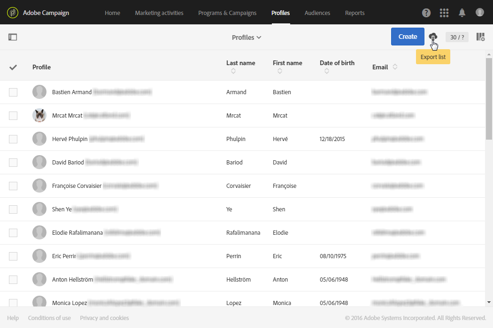

# リストのエクスポート{#exporting-lists}

Adobe Campaignでは、後で使用するためにリストをファイルに直接書き出すことができます。 ファイル内のリストを書き出すと、**[!UICONTROL Export audits]** メニューにログエントリが生成されます。 エクスポートの監査について詳しくは、[エクスポートの監査](../../administration/using/auditing-export-logs.md)の節を参照してください。

 [ ビデオでリストを設定する方法を確認](#video)

リストの書き出しオプションを使用すると、デフォルトで最大100,000行を書き出し、**Nms_ExportListLimit** オプションで定義できます。 このオプションは、**[!UICONTROL Administration]** > **[!UICONTROL Application settings]** > **[!UICONTROL Options]** メニューで機能管理者が管理できます。

書き出しリストは、**[!UICONTROL EXPORT (export)]**&#x200B;の役割を持つユーザーに対して、**リスト** モード ビューを持つすべての画面で使用できます。

1. 選択した&#x200B;**リスト**&#x200B;画面に移動します。 例えば、テストプロファイルの概要画面（**[!UICONTROL Profiles & audiences]** > **[!UICONTROL Test profiles]**）などです。
1. 画面が&#x200B;**リスト** モードであることを確認してください。

   

1. リスト内の列を、右上隅の&#x200B;**[!UICONTROL Configure list]** ボタンを使用して書き出す順序で整理します。 設定された列に加えて、リソースのプライマリキーも書き出されます。
1. 必要に応じて、フィルターを適用できます。 これを行うには、左上隅のボタンをクリックして検索ペインを表示します。

   異なるリソースを含むリストから書き出しを実行する場合は、リストに表示されるリソースの種類が1つだけになるように、フィルターを適用する必要があります。

1. 必要に応じて、選択した列を並べ替えます。
1. 書き出しボタン を選択します。

   書き出しを確認するポップアップが表示されます。 書き出しを確認すると、ファイルは自動的にコンピューターにダウンロードされます。

ファイルは、.TXT拡張子を持つCSV形式で生成されます。 書き出されたリソースと書き出し日に応じて名前が付けられます。 例：profileBase_20150426_120253.txtという名前は、2015年4月26日12:02:53に実行されたプロファイル書き出しに適用されます。 UTF-8形式でエンコードされます。

数値と日付は、書き出しを実行するユーザーの現地時間（ロケール）を考慮します。 例：DD-MM-YYYYまたはMM-DD-YYYY

これより大きい書き出しを実行するには、専用のワークフローを作成する必要があります。 「[ ファイルを抽出](../../automating/using/extract-file.md)」セクションを参照してください。

**例**

次の例は、次に定義するプロファイルリストから実行される書き出しです。

* 表示される列（順）：姓、名、生年月日、メールアドレス。
* 名前はアルファベット順に並べ替えられます。



生成されたファイルは次のように表示されます（最初の10件のレコードについて）。

```
Last name;First name;Birth date;Email;Zip code
Abalo;Patrick;11/11/1941 02:00:00;patrick.a@testmail.com;29200
Abasq;Joel;21/08/1977 02:00:00;abasq.joel@testmail.com;92160
Abernot;John;12/07/1963 01:00:00;john.abernot@testmail.com;78510
Abiven;Christian;16/03/1975 01:00:00;chris.a@mailtest.com;35000
Abouvier;Peter;02/07/1975 01:00:00;pabouvier@mailtest.com;94560
Accardi;Mike;22/06/1948 01:00:00;mike.accardi@mail.com;76400
Accremont;Frank;27/04/1947 01:00:00;accr.frank@mailtest.com;13500
Adam;Daniel;17/09/1953 01:00:00;danieladam@mail.com;17000
Adama;Pascal;22/01/1990 01:00:00;adapascal@mailtest.com;75012
Adama;Henry;22/09/1992 02:00:00;henry.adama@mail.com;64120
```

**関連トピック：**

* [役割](../../administration/using/list-of-roles.md)
* [リストのカスタマイズ](../../start/using/customizing-lists.md)

## チュートリアルビデオ {#video}

このビデオでは、リストの設定方法を説明します。

>[!VIDEO](https://video.tv.adobe.com/v/25288/?quality=12)

その他のCampaign Standardのハウツー動画は[こちら](https://experienceleague.adobe.com/docs/campaign-standard-learn/tutorials/overview.html?lang=ja)でご覧いただけます。
