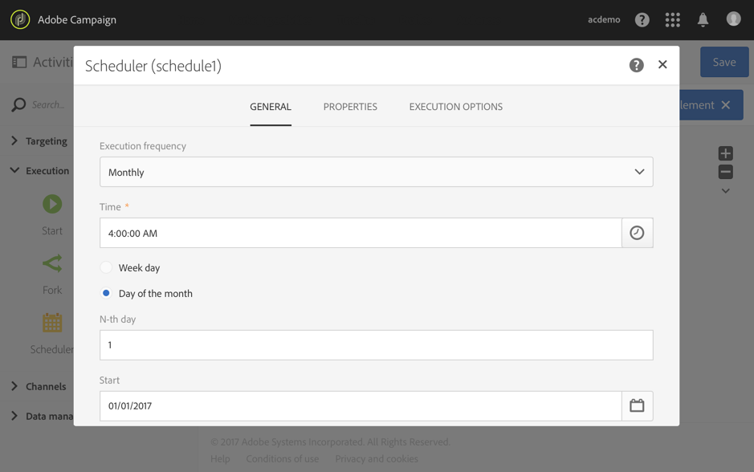
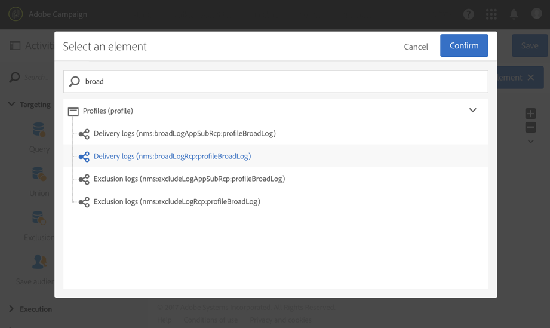
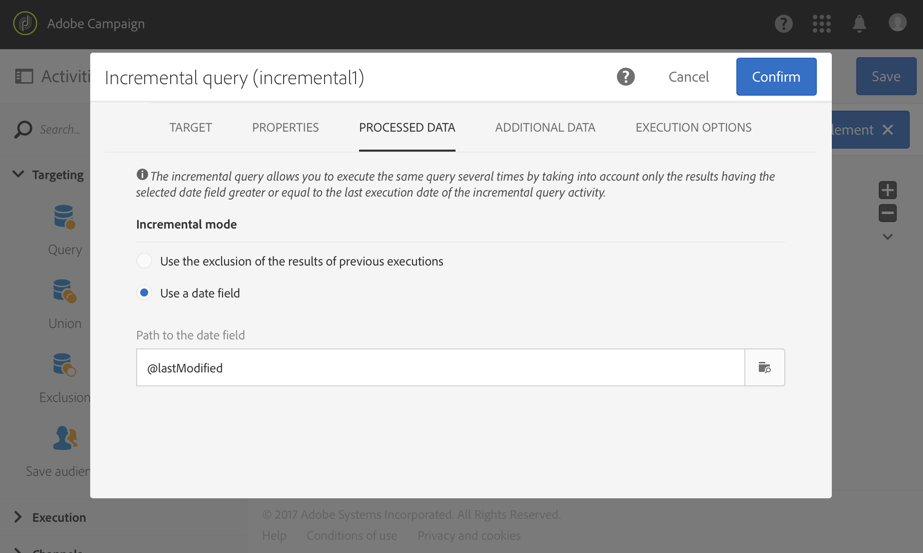

# ログのエクスポート{#exporting-logs}

配信や購読に関わらず、ログデータはシンプルなワークフローを通じて書き出すことができます。 これにより、独自のレポートやBI ツールでキャンペーンの結果を分析することができます。

>[!CAUTION]
>
>**[!UICONTROL Administration]**&#x200B;の役割と&#x200B;**すべての** ユニットへのアクセス権を持つ機能的な[管理者](../../administration/using/users-management.md#functional-administrators)のみが、送信ログ、メッセージログ、トラッキングログ、除外ログまたはサブスクリプションログにアクセスできます。 管理者以外のユーザーは、これらのログをターゲットにできますが、リンクされたテーブル（プロファイル、配信）から開始します。

ワークフローを実行するたびに新しいログのみを取得する&#x200B;**[!UICONTROL Incremental query]**&#x200B;と、出力列を定義する単純な&#x200B;**[!UICONTROL Extract file]** アクティビティを使用することで、必要な形式とすべてのデータを含むファイルを取得できます。 次に、**[!UICONTROL Transfer file]** アクティビティを使用して、最終ファイルを取得します。 各ワークフロー実行は&#x200B;**[!UICONTROL Scheduler]**&#x200B;によって計画されています。

書き出しログの操作は、標準ユーザーが実行できます。 **プロファイル**&#x200B;のブロードログ、トラッキングログ、除外ログ、サブスクリプションログ、サブスクリプション履歴ログなどのプライベートリソースは、機能管理者のみが管理できます。

1. [このセクション &#x200B;](../../automating/using/building-a-workflow.md#creating-a-workflow)で詳しく説明されているように、新しいワークフローを作成します。
1. **[!UICONTROL Scheduler]** アクティビティを追加し、必要に応じて設定します。 以下は、月間実行の例です。

   

1. **[!UICONTROL Incremental query]** アクティビティを追加し、必要なログを選択するように設定します。 例えば、すべての新規または更新されたブロードログ（プロファイル配信ログ）を選択するには、次の手順に従います。

   * 「**[!UICONTROL Properties]**」タブで、ターゲットリソースを&#x200B;**配信ログ** （broadLogRcp）に変更します。

     

   * 「**[!UICONTROL Target]**」タブで、2016年以降に送信された配信に対応するすべての配信ログを取得する条件を設定します。 詳しくは、「[&#x200B; クエリの編集](../../automating/using/editing-queries.md#creating-queries)」の節を参照してください。

     

   * 「**[!UICONTROL Processed data]**」タブで「**[!UICONTROL Use a date field]**」を選択し、「**lastModified**」フィールドを選択します。 ワークフローの次の実行では、最後の実行後に変更または作成されたログのみが取得されます。

     

     ワークフローの初回実行後は、このタブに表示される最後の実行日が次回の実行に使用されます。 この日付は、ワークフローが実行されるたびに、自動的に更新されます。 それでも、必要に応じて手動で別の値を入力すれば、この値を上書きすることはできます。

1. クエリされたデータをファイルにエクスポートする&#x200B;**[!UICONTROL Extract file]** アクティビティを追加します。

   * 「**[!UICONTROL Extraction]**」タブで、ファイルの名前を指定します。

     **[!UICONTROL Add date and time to the file name]** オプションを選択すると、この名前はエクスポート日で自動的に完了し、抽出されたすべてのファイルが一意であることを確認します。 ファイルに書き出す列を選択します。 配信やプロファイル情報などの関連リソースから取得したデータをここで選択できます。

     >[!NOTE]
     >
     >ログごとに一意のIDをエクスポートするには、**[!UICONTROL Delivery log ID]**&#x200B;要素を選択します。

     最終的なファイルを整理するには、並べ替えを適用できます。 例えば、次の例に示すように、ログ日付に関する例。

     

   * 「**[!UICONTROL File structure]**」タブで、ニーズに合わせて出力ファイルの形式を定義します。

     定義済みリストの値をエクスポートする場合は、「**[!UICONTROL Export labels instead of internal values of enumerations]**」オプションを選択します。 このオプションを使用すると、ID の代わりに短くてわかりやすいラベルを取得できます。

1. **[!UICONTROL Transfer file]** アクティビティを追加し、新しく作成したファイルをAdobe Campaign サーバーからSFTP サーバーなどの別の場所に転送するように設定します。

   * 「**[!UICONTROL General]**」タブで、「**[!UICONTROL File upload]**」を選択します。その目的は、ファイルをAdobe Campaignから別のサーバーに送信することです。
   * 「**[!UICONTROL Protocol]**」タブで、転送パラメーターを指定し、使用する[外部アカウント &#x200B;](../../administration/using/external-accounts.md#creating-an-external-account)を選択します。

1. **[!UICONTROL End]** アクティビティを追加して、適切に終了し、ワークフローを保存します。

   

ワークフローを実行し、外部サーバー上の出力ファイルを取得できるようになりました。

**関連トピック：**

[ワークフロー](../../automating/using/get-started-workflows.md)
