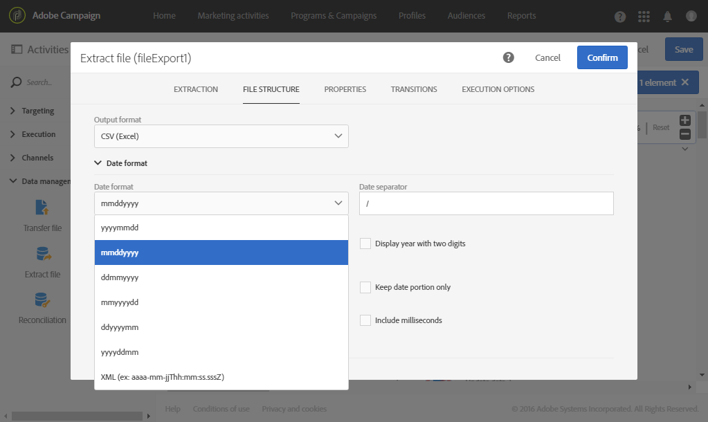
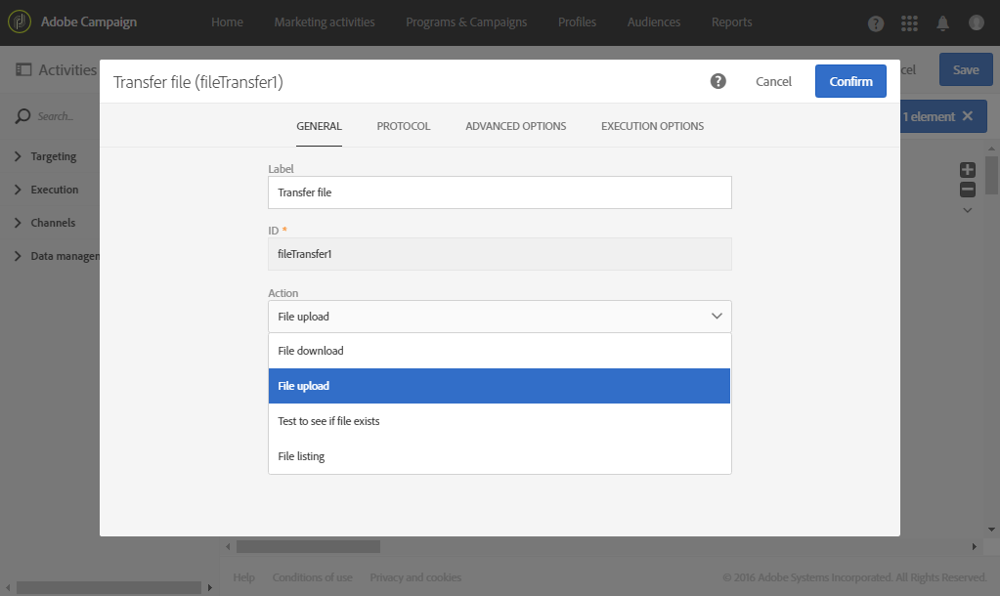

# 外部ファイル内のプロファイルの書き出し {#exporting-profiles-external-file}

次の例は、「**[!UICONTROL Query]**」アクティビティの後に「**[!UICONTROL Extract file]**」アクティビティを設定する方法を示しています。

このワークフローの目的は、プロファイルのリストを外部ファイルの形式で書き出し、Adobe Campaign 外でデータを使用できるようにすることです。

1. [ファイル](../../automating/using/extract-file.md)を抽出アクティビティーをワークフローにドラッグ&amp;ドロップし、[クエリー](../../automating/using/query.md)アクティビティーの後に配置します。

   この例では、クエリは 18～30 歳のすべてのプロファイルで実行されます。

1. **[!UICONTROL Extract file]**&#x200B;アクティビティを開いて編集します。
1. 出力ファイルに名前を付けます。
1. 出力列を追加します。

   この例では、プロファイルの E メール、年齢、生年月日、名、姓が出力列として追加されます。

   

1. 「**[!UICONTROL File structure]**」タブをクリックして次を定義します。

   * CSV 出力形式

      

   * 日付フォーマット

      

1. アクティビティを確認します。
1. [**[!UICONTROL Extract file]**&#x200B;アクティビティの後にファイル](../../automating/using/transfer-file.md)の転送アクティビティをドラッグ&amp;ドロップして、外部アカウント上の抽出ファイルを回復します。
1. アクティビティを開き、**[!UICONTROL File upload]** アクションを選択します。

   

1. 外部アカウントを選択し、サーバー上のフォルダーのパスを入力します。

   

1. アクティビティを確認し、ワークフローを保存します。
1. ワークフローを開始します。

   ワークフローが正しく実行されると、抽出したファイルが外部アカウントで利用できるようになります。
