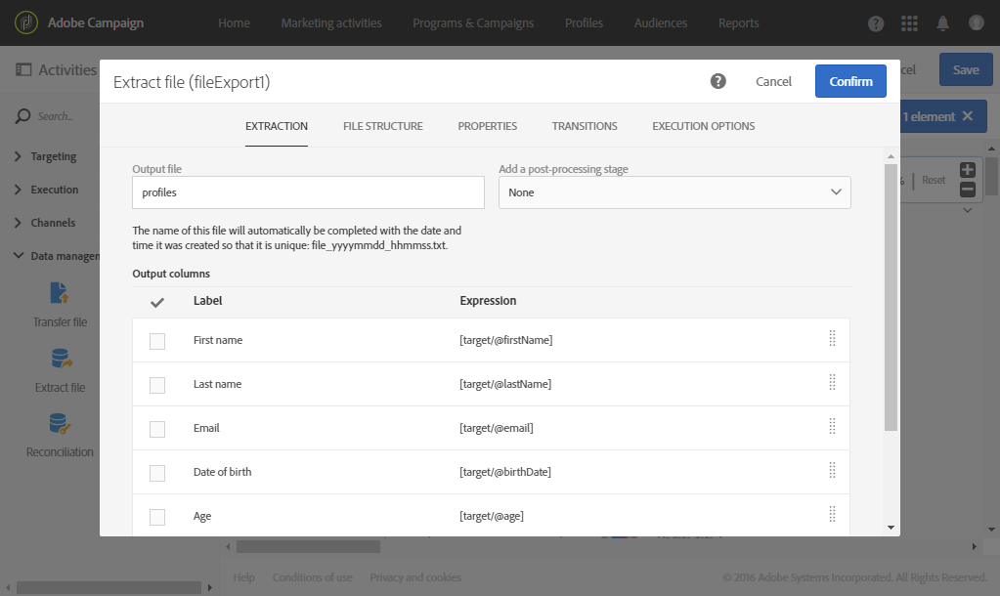
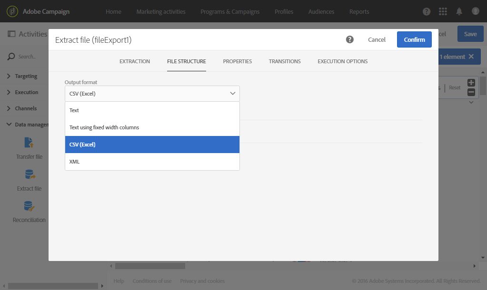
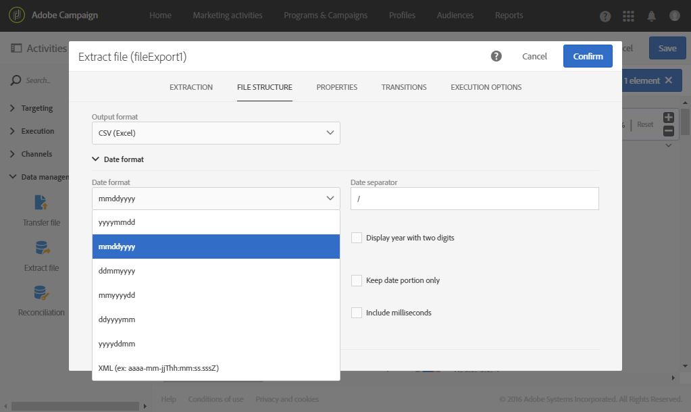
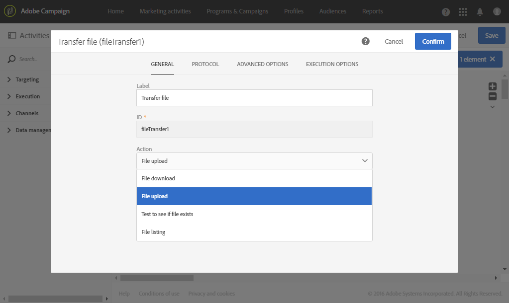
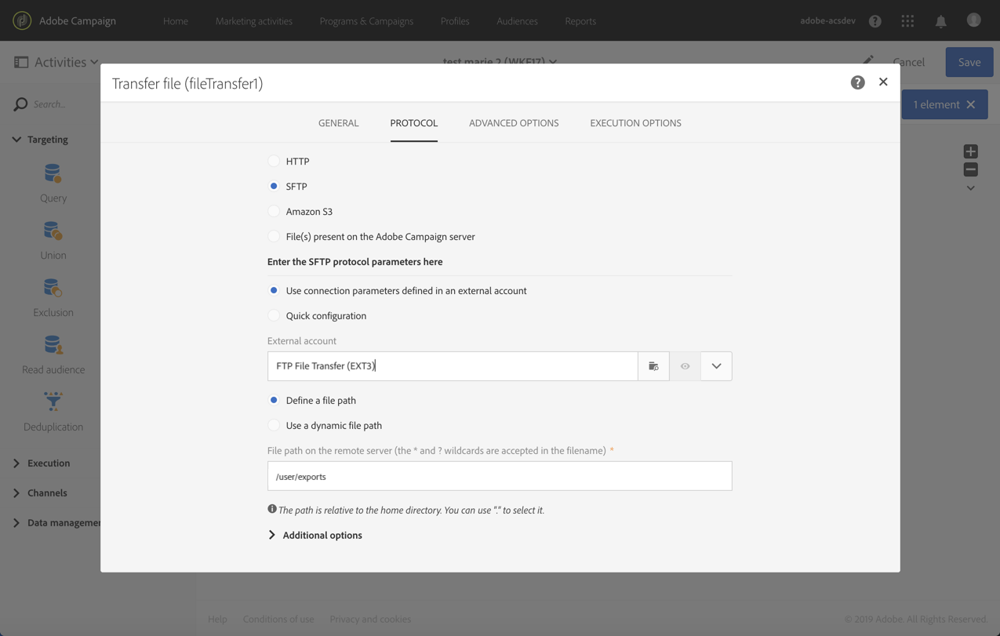

# 外部ファイルへのプロファイルのエクスポート {#exporting-profiles-external-file}

次の例は、「**[!UICONTROL Query]**」アクティビティの後に「**[!UICONTROL Extract file]**」アクティビティを設定する方法を示しています。

このワークフローの目的は、プロファイルのリストを外部ファイルの形式でエクスポート、Adobe Campaign 外でデータを使用できるようにすることです。

1. [ ファイルを抽出](../../automating/using/extract-file.md) アクティビティをワークフローにドラッグ&amp;ドロップし、[ クエリ ](../../automating/using/query.md) アクティビティの後に配置します。

   この例では、クエリは 18～30 歳のすべてのプロファイルで実行されます。

1. **[!UICONTROL Extract file]** アクティビティを開いて編集します。
1. 出力ファイルに名前を付けます。
1. 出力列を追加します。

   この例では、プロファイルのメール、年齢、生年月日、名、姓が出力列として追加されます。

   

1. 「**[!UICONTROL File structure]**」タブをクリックして次を定義します。

   * CSV 出力形式

     

   * 日付フォーマット

     

1. アクティビティを確認します。
1. **[!UICONTROL Extract file]** アクティビティの後に[ ファイル転送](../../automating/using/transfer-file.md) アクティビティをドラッグ&amp;ドロップして、外部アカウントの抽出ファイルを回復します。
1. アクティビティを開き、**[!UICONTROL File upload]** アクションを選択します。

   

1. 外部アカウントを選択し、サーバー上のフォルダーのパスを入力します。

   

1. アクティビティを確認し、ワークフローを保存します。
1. ワークフローを開始します。

   ワークフローが正しく実行されると、抽出したファイルが外部アカウントで利用できるようになります。
