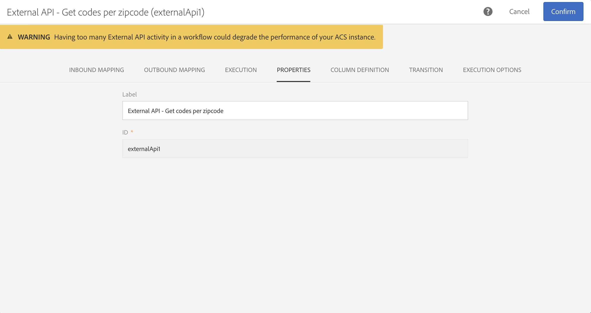

# 外部 API {#external-api}

## 説明 {#description}

「**[!UICONTROL External API]**」アクティビティでは、**HTTP API** 呼び出しを介して、**外部システム**&#x200B;からデータをワークフローに取り込みます。

外部システムのエンドポイントには、パブリック API エンドポイント、顧客管理システム、またはサーバーレスアプリケーションインスタンス（[Adobe I/O Runtime](https://www.adobe.io/apis/experienceplatform/runtime.html) など）、その他のカテゴリがあります。

>[!NOTE]
>
>セキュリティ上の理由から、JSSP の使用は Campaign Standard ではサポートされていません。コードを実行する必要がある場合は、「外部 API」アクティビティを通じて Adobe I/O Runtime インスタンスを呼び出すことができます。

このアクティビティの主な特徴は次のとおりです。

* JSON 形式のデータをサードパーティの REST API エンドポイントに渡す機能
* JSON からの応答を受け取り、それを出力テーブルにマッピングして、下流の他のワークフローアクティビティに渡す機能
* アウトバウンド固有のトランジションによる失敗の管理

### 下位互換性に関する注意 {#from-beta-to-ga}

With the Campaign Standard 20.4 release, the http response data size limit and response timeout guardrails have been lowered to align with best practices - see [Limitations and guardrails](#guardrails). これらのガードレールの変更は、既存の外部 API アクティビティには影響しません。したがって、既存の外部 API アクティビティを、すべてのワークフローの新しいバージョンで置き換えることをお勧めします。

「外部 API」アクティビティを置き換える場合は、新しい「外部 API」アクティビティをワークフローに追加し、設定の詳細を手動でコピーしてから、古いアクティビティを削除します。

>[!NOTE]
>
>アクティビティ固有のヘッダー値はアクティビティ内でマスクされているので、コピーすることはできません。

### 制限事項とガードレール {#guardrails}

このアクティビティには、次のガードレールが適用されます。

* 5 MB HTTP 応答データサイズ制限（注：これは、前のリリースの 50 MB の制限からの変更です）
* 要求のタイムアウトは 1 分です（注：これは、前のリリースの 10 分のタイムアウトからの変更です）
* HTTP リダイレクト：禁止
* HTTPS 以外の URL：却下
* 「Accept: application/json」リクエストヘッダーと「Content-Type: application/json」の応答ヘッダー：許可

特定のガードレールが配置されました。

* **JSON の最大深度**：JSON のカスタムネストの処理可能な深さを最大 10 レベルに制限。
* **JSON の最大キー長**：生成される内部キーの最大長を 255 に制限。このキーは列 ID に関連付けられています。
* **JSON 最大重複キーの許可**：列 ID として使用される重複 JSON プロパティ名の合計数の上限は 150。

>[!CAUTION]
>
>外部 API アクティビティは、キャンペーン全体のデータ（最新のオファーセット、最新のスコアなど）を取得するためのものであり、各プロファイルの特定の情報を取得するためのものではありません（大量のデータが転送される可能性があるため）。プロファイル関連のデータ取得が必要な場合は、「[ファイル転送](../../automating/using/transfer-file.md)」アクティビティを使用することをお勧めします。

## 設定 {#configuration}

ワークフローに「**[!UICONTROL External API]**」アクティビティをドラッグ＆ドロップし、アクティビティを開いて設定を開始します。

### 「INBOUND MAPPING」タブ

インバウンドマッピングは、以前のインバウンドアクティビティによって生成された一時テーブルで、UI に JSON として送信され表示されます。
この一時テーブルに基づいて、ユーザーはインバウンドデータを変更できます。

**Inbound resource** ドロップダウンでは、一時テーブルを作成するクエリアクティビティを選択できます。

「**Add count parameter**」チェックボックスをオンにすると、行ごとに一時テーブルから得られるカウント値が追加されます。このチェックボックスは、インバウンドアクティビティが一時テーブルを生成している場合にのみ使用可能です。

「**Inbound Columns**」セクションでは、インバウンドトランジションテーブルから任意のフィールドを追加できます。選択した列は、データオブジェクトのキーになります。JSON 内のデータオブジェクトは、インバウンドトランジションテーブルの各行から選択した列のデータを含んだ配列リストになります。

「**customize parameter**」テキストボックスを使用すると、有効な JSON を「外部 API」で必要な追加データと共に追加できます。この追加データは、生成された JSON 内の params オブジェクトに追加されます。

### 「OUTBOUND MAPPING」タブ

このタブでは、API 呼び出しから返されるサンプル **JSON 構造**&#x200B;を定義できます。

JSON パーサーは、標準の JSON 構造パターンタイプに対応するように設計されていますが、一部例外があります。標準パターンの例を次に示します。`{“data”:[{“key”:“value”}, {“key”:“value”},...]}`

サンプルの JSON 定義には&#x200B;**次の特性**&#x200B;が必要です。

* **配列要素**には、第 1 レベルのプロパティを含める必要があります（これより深いレベルはサポートされていません）。
   **プロパティ名**&#x200B;は、出力された一時テーブルの出力スキーマの列名になります。
* 取り込む **JSON 要素**&#x200B;は、JSON 応答内のネストが 10 レベル以下であることが必要です。
* **列名**の定義は、「data」配列の最初の要素に基づいています。
列定義（追加／削除）とプロパティのタイプ値は、「**COLUMN DEFINITION**」タブで編集できます。

**「Flatten」ェックボックス**&#x200B;の動作：

「Flatten」チェックボックス（デフォルトではオフ）は、JSON をキー／値マップにフラット化するかどうかを指定するために用意されています。

* この&#x200B;**チェックボックスが無効**（オフ）の場合、サンプル JSON は配列オブジェクトを探すために解析されます。使用したい配列を Adobe Campaign が正確に判断できるように、ユーザーは、API 応答のサンプル JSON 形式をトリミングしたバージョンを提供する必要があります。ワークフロー作成時に、ネストされた配列オブジェクトへのパスが決定されて記録されます。これにより、API 呼び出し実行時に受け取った JSON 応答本文からその配列オブジェクトにアクセスできるようになります。

* この&#x200B;**チェックボックスが有効**（オン）の場合、サンプル JSON はフラット化され、提供されたサンプル JSON で指定されたすべてのプロパティが出力一時テーブルの列の作成に使用され、「COLUMN DEFINITION」タブに表示されます。サンプル JSON に配列オブジェクトがある場合は、それらの配列オブジェクトのすべての要素もフラット化されます。

**解析が検証**&#x200B;されると、メッセージが表示され、「COLUMN DEFINITION」タブでデータマッピングをカスタマイズするように促されます。その他の場合は、エラーメッセージが表示されます。

### 「EXECUTION」タブ

このタブでは、接続エンドポイントを定義できます。「**[!UICONTROL URL]**」フィールドでは、ACS にデータを送信する **HTTPS エンドポイント**&#x200B;を定義できます。

エンドポイントで必要な場合、次の 2 種類の認証方法を使用できます。

* 基本認証：「**[!UICONTROL Request Header(s)]**」フィールドにユーザー名／パスワード情報を入力します。

* OAuth 認証：**[!UICONTROL Use connection parameters defined in an external account]** をクリックすると、OAuth 認証が定義されている外部アカウントを選択できます。詳しくは、「[外部アカウント](../../administration/using/external-accounts.md)」の節を参照してください。

### 「PROPERTIES」タブ

このタブを使用すると、UI に表示されるラベルなど、「外部 API」アクティビティの&#x200B;**一般的なプロパティ**&#x200B;を調整できます。内部 ID はカスタマイズできません。

### 「COLUMN DEFINITION」タブ

>[!NOTE]
>
>このタブは、**応答データ形式**&#x200B;が「OUTBOUND MAPPING」タブで入力および検証された場合に表示されます。

「**COLUMN DEFINITION**」タブでは、エラーのないデータをインポートし、将来の操作に備えて Adobe Campaign データベースに既に存在するデータタイプと一致させるために、各列のデータ構造を正確に指定できます。

例えば、列のラベルを変更し、そのタイプ（文字列、整数、日付など）を選択したり、エラー処理を指定することもできます。

詳しくは、[データの追加](../../automating/using/load-file.md)の節を参照してください。

### 「TRANSITION」タブ

このタブでは、**アウトバウンドトランジション**&#x200B;とそのラベルをアクティブ化できます。この特定のトランジションは、**タイムアウト**&#x200B;の場合、またはペイロードが&#x200B;**データサイズ制限**&#x200B;を超える場合に役立ちます。

### 「EXECUTION OPTIONS」タブ

このタブは、ほとんどのワークフローアクティビティで使用できます。詳しくは、[アクティビティのプロパティ](../../automating/using/activity-properties.md)の節を参照してください。

## トラブルシューティング

この新しいワークフローアクティビティには、情報とエラーの 2 種類のログメッセージが追加されています。これらは潜在的な問題のトラブルシューティングに役立ちます。

### 情報

このログメッセージは、ワークフローアクティビティの実行中に有用なチェックポイントに関する情報を記録するために使用されます。
<table> 
 <thead> 
  <tr> 
   <th> メッセージのフォーマット  </th> 
   <th> 例  </th> 
  </tr> 
 </thead> 
 <tbody> 
  <tr> 
   <td> Invoking API URL '%s'.</td> 
   <td> 
API URL「https://example.com/api/v1/web-coupon?count=2」を呼び出しています。
</td> 
  </tr> 
  <tr> 
   <td> Retrying API URL '%s' due to %s in %d ms, attempt %d.</td> 
   <td> 
HTTP - 401 のため、API URL「https://example.com/api/v1/web-coupon?count=0」を 2,364 ミリ秒後に再試行します (試行 2)。
</td>
  </tr> 
  <tr> 
   <td> Transferring content from '%s' (%s / %s).</td> 
   <td> 
「Https://example.com/api/v1/web-coupon?count=2」からコンテンツを転送しています (1234/1234)。
</td> 
  </tr>
  <tr> 
   <td> Using cached access token for provider ID '%s'.</td> 
   <td> 
プロバイダー ID「EXT25」にキャッシュされたアクセストークンを使用しています。注：EXT25 は、外部アカウントの ID（または名前）です。 
</td> 
  </tr>
  <tr> 
   <td> Fetched access token from server for provider ID '%s'.</td> 
   <td> 
プロバイダー ID「EXT25」のアクセストークンをサーバーから取得しました。注：EXT25 は、外部アカウントの ID（または名前）です。
</td> 
  </tr>
  <tr> 
   <td> Refreshing OAuth access token due to error (HTTP: '%d').</td> 
   <td> 
エラー (HTTP : 「401」) が発生したため、OAuth アクセストークンを更新しています。
</td> 
  </tr>
  <tr> 
   <td> Error refreshing OAuth access token (error: '%d'). </td> 
   <td> 
OAuth アクセストークンの更新中にエラーが発生しました (エラー : 「404」)。
</td> 
  </tr>
  <tr> 
   <td> Failed to fetch the OAuth access token using the specified external account on attempt %d, retrying in %d ms.</td> 
   <td> 
試行 1 で指定された外部アカウントを使用して OAuth アクセストークンを取得できませんでした。1,387 ミリ秒後に再試行します。
</td> 
  </tr>
 </tbody> 
</table>

### エラー

このログメッセージは、最終的にワークフローアクティビティの失敗を招く可能性のある予期しないエラー状態に関する情報を記録するために使用されます。

<table> 
 <thead> 
  <tr> 
   <th> コード　-　メッセージ形式  </th> 
   <th> 例  </th> 
  </tr> 
 </thead> 
 <tbody> 
  <tr> 
   <td> WKF-560250 - API request body exceeded limit (limit: '%d').</td> 
   <td> 
API リクエスト本文が制限を超えました (制限 : 「5242880」)。
</td> 
  </tr> 
  <tr> 
   <td> WKF-560239 -  API response exceeded limit (limit: '%d').</td> 
   <td> 
API 応答が制限を超えました (制限 : 「5242880」)。
</td> 
  </tr> 
  <tr> 
   <td> WKF-560245 - API URL could not be parsed (error: '%d').</td> 
   <td> 
API URL を解析できませんでした (エラー : 「2010」)。

   
 注意：このエラーは、API URL が検証ルールに失敗した場合に記録されます。
</td>
  </tr> 
  <tr>
   <td> WKF-560244 - API URL host must not be 'localhost', or IP address literal (URL host: '%s').</td> 
   <td> 
API URL ホストは「localhost」または IP アドレスリテラル (URL ホスト : 「localhost」) でないことが必要です。

    
API URL ホストは「localhost」または IP アドレスリテラル (URL ホスト : 「192.168.0.5」) でないことが必要です。

    
API URL ホストは「localhost」または IP アドレスリテラル (URL ホスト : 「[2001]」) でないことが必要です。
</td>
  </tr> 
  <tr> 
   <td> WKF-560238 - API URL must be a secure URL (https) (requested URL: '%s').</td> 
   <td> 
API URL は、セキュリティで保護された URL (https) である必要があります (要求された URL : 「https://example.com/api/v1/web-coupon?count=2」)。
</td> 
  </tr> 
  <tr> 
   <td> WKF-560249 - Failed to create request body JSON.「%s」を追加中にエラーが発生しました。</td> 
   <td> 
JSON リクエスト本文を作成できませんでした。「params」を追加中にエラーが発生しました。

    
JSON リクエスト本文を作成できませんでした。「data」を追加中にエラーが発生しました。
</td>
  </tr> 
  <tr> 
   <td> WKF-560246 - HTTP header key is bad (header key: '%s').</td> 
   <td> 
HTTP ヘッダーキーが正しくありません (ヘッダーキー : 「%s」)。

   
 注意：このエラーは、カスタムヘッダーキーが <a href="https://tools.ietf.org/html/rfc7230#section-3.2.html">RFC</a> に従った検証に失敗した場合に記録されます。
</td> 
  </tr>
 <tr> 
   <td> WKF-560248 - HTTP header key is not allowed (header key: '%s').</td> 
   <td> 
HTTP ヘッダーキーが使用できません (ヘッダーキー : 「Accept」)。
</td> 
  </tr> 
  <tr> 
   <td> WKF-560247 -  A HTTP header value is bad (header value: '%s').</td> 
   <td> 
HTTP ヘッダー値が正しくありません (ヘッダー値 : 「%s」)。 

    
注意：このエラーは、カスタムヘッダー値が <a href="https://tools.ietf.org/html/rfc7230#section-3.2.html">RFC</a> に従った検証に失敗した場合に記録されます。
</td> 
  </tr> 
  <tr> 
   <td> WKF-560240 - JSON payload has bad property '%s'.</td> 
   <td> 
JSON ペイロードに不正なプロパティ「blah」があります。
</td>
  </tr> 
  <tr>
   <td> WKF-560241 - Malformed JSON or unacceptable format.</td> 
   <td> 
無効な形式の JSON または受け入れられない形式です。

   
注意：このメッセージは、「外部 API」からの応答本文の解析にのみ適用され、応答本文がこのアクティビティで必須の JSON 形式に準拠しているかどうかを検証しようとしたときに記録されます。
</td>
  </tr>
  <tr> 
   <td> WKF-560246 - Activity failed (reason: '%s').</td> 
   <td> 
HTTP 401 エラー応答が原因でアクティビティに失敗した場合：アクティビティに失敗しました (理由 : 「HTTP - 401」)。

        
内部呼び出しの失敗によりアクティビティが失敗した場合：アクティビティに失敗しました (理由 : 「iRc - -Nn」)。

        
Content-Type ヘッダーが無効なためアクティビティが失敗した場合：アクティビティに失敗しました (理由 : 「Content-Type - application/html」)。
</td> 
  </tr>
  <tr> 
   <td> WKF-560278 - "Error initializing OAuth helper (error: '%d')" .</td> 
   <td> 
このエラーは、アクティビティが内部 OAuth 2.0 ヘルパーファシリティを初期化できなかったことを示します。これは、外部アカウントで設定された属性を使用してヘルパーを初期化する際のエラーが原因です。
</td>
  </tr>
  <tr> 
   <td> WKF-560279 - "HTTP header key is not allowed (header key: '%s')."</td> 
   <td> 
この警告（エラーではない）メッセージは、OAuth 2.0 外部アカウントが秘密鍵証明書を HTTP ヘッダーとして追加するように設定されているが、使用されるヘッダーキーは予約済みのヘッダーキーであるため、許可されていないことを示します。
</td>
  </tr>
  <tr> 
   <td> WKF-560280 - External account of '%s' ID cannot be found.</td> 
   <td> 
ID「EXT25」の外部アカウントが見つかりません。注：このエラーは、アクティビティが外部アカウントを使用するように設定されているが、見つからなくなったことを示します。これは、アカウントが DB から削除された場合に最も多く発生し、通常の動作環境では発生する可能性が低いです。
</td>
  </tr>
  <tr> 
   <td> WKF-560281 - External account of '%s' ID is disabled.</td> 
   <td> 
ID「EXT25」の外部アカウントが無効です。注：このエラーは、アクティビティが外部アカウントを使用するように設定されているが、そのアカウントが無効になっている（または非アクティブになっている）ことを示します。
</td>
  </tr>
  <tr> 
   <td> WKF-560282 - Protocol not supported.</td> 
   <td> 
このエラーは、アクティビティに関連付けられている外部アカウントが OAuth 2.0 外部アカウントではないことを示します。したがって、アクティビティ設定に何らかの破損や手動の変更がない限り、このエラーは発生しません。
</td>
  </tr>
  <tr> 
   <td> WKF-560283 - Failed to fetch the OAuth access token.</td> 
   <td> 
このエラーの最も一般的な原因は、外部アカウントの構成の誤りです（例えば、接続が成功したことをテストせずに外部アカウントを使用した場合など）。外部アカウント上の URL／資格情報が変更される可能性があります。
</td>
  </tr>
  <tr> 
   <td> CRL-290199 - Cannot reach page at: %s.</td> 
   <td> 
このエラーメッセージは、外部アカウントを OAuth 用に設定する際にそのアカウントの UI 画面に表示されます。これは、外部認証サーバーの URL が、サーバーからの誤った／変更された／応答が「ページが見つかりません」であることを意味します。
</td>
  </tr>
  <tr> 
   <td> CRL-290200 - Incomplete/Incorrect credentials.</td> 
   <td> 
このエラーメッセージは、外部アカウントを OAuth 用に設定する際にそのアカウントの UI 画面に表示されます。これは、資格情報が正しくないか、認証サーバーに接続するために必要な資格情報が他にいくつか見つからないことを意味します。

</td>
  </tr>
 </tbody> 
</table>

<!--
## Example: Managing coupons with External API Activity

This example illustrates how to **add coupon value** retrieving by a REST call to profiles and then sending an email containing these coupon values.

The workflow is presented as follows:

1. Drag and drop an **External API** activity
    1. Parse the JSON sample responsa as {"data":[{"code":"value"}]}.
    1. Add the **Rest endpoint URL** and define authentication setting if needed
    
    1. In the **column definition** tab, add a new column called **code** that will store the code value.
        
    1. Enabled an **outbound transition** to manage request failures.
1. Drag and drop a **Query** activity
    1. Configure the **Target** tab to query all the **@adobe.com** email. For different Query samples, refer to the [Query](../../automating/using/query.md) section.
    1. In the **additional data** tab, add a new column based on **rowId()** function. This additional column allows you to reconciliate coupon code with the profile ID..
        

        >[!NOTE]
        >
        >This reconciliation approach means that the profile query number is equal to the number of coupon values returned by the REST call.
1. Once this two activities are configured, drag and drop an **Enrichment** activity to associate coupon values with profiles.
    1. Select the previous Query activity in the **primarySet** field.
        
    1. Create a new relation in the **Advanced relations** tab, and add the following reconciliation criteria:
    1. **@expr1** coming grom the Query activity in the source expression field.
    1. **@lineNum** as an expression that returns the line number for each coupon value in the destination field.
        
        More information on the enrichment activity are available [here](../../automating/using/enrichment.md)

    1. The transition **Data Structure** will contain:
        
1. Finally drag and drop a **Send via Email** activity.
    You can modify your email template by adding the **code** personnalized field.

-->
