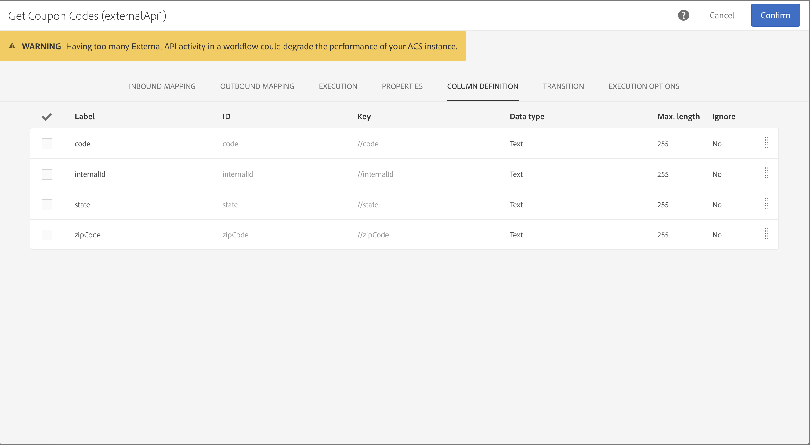

# 外部 API {#external-api}

## 説明 {#description}

この **[!UICONTROL External API]** アクティビティは、 **HTTP API呼び出しを介して外部シス** テムから **、ワークフローにデータを取り込みます** 。

外部システムエンドポイントは、パブリックAPIエンドポイント、顧客管理システム、またはサーバーレスアプリケーションインスタンス( [Adobe I/O Runtime](https://www.adobe.io/apis/experienceplatform/runtime.html)など)で、いくつかのカテゴリに言及できます。

>[!NOTE]
>
>セキュリティ上の理由から、JSSPの使用はサポートされていません。Campaign Standard コードを実行する必要がある場合は、External APIアクティビティを介してAdobe I/O Runtimeインスタンスを呼び出すことができます。

このアクティビティの主な特徴は、

* JSON形式のデータをサードパーティのREST APIエンドポイントに渡す機能
* JSON応答を受け取り、出力テーブルにマッピングして、他のワークフローアクティビティに渡す機能。
* アウトバウンド固有のトランジション

### ベータ版からGAへの移行 {#from-beta-to-ga}

Campaign Standard20.3リリースでは、外部API機能により、ベータ版がGA (General Availability)に移行しました。

その結果、ベータ版External APIアクティビティを使用していた場合は、すべてのワークフローでそれらをGA External APIアクティビティに置き換える必要があります。  ワークフローがベータ版のExternal APIを使用している場合、20.3リリース以降は動作しなくなります。

外部APIアクティビティを置き換える場合は、新しい外部APIアクティビティをワークフローに追加し、設定の詳細を手動でコピーしてから、古いアクティビティを削除します。

>[!NOTE]
>
>ヘッダー値はヘッダー内でマスクされるので、これらの値をコピーすることはできません。アクティビティ

次に、新しいExternal APIアクティビティのデータを参照または使用するように、ベータExternal APIアクティビティのデータを参照または使用するワークフロー内の他のアクティビティを再設定します。 アクティビティの例：電子メール配信(パーソナライゼーションフィールド)、エンリッチメントアクティビティなど

### 制限とガードレール {#guardrails}

このアクティビティでは、次のガードレールが配置されました。

* 50MB HTTP応答のデータサイズの制限
* 要求のタイムアウトは10分です
* HTTPリダイレクトは許可されません
* HTTPS以外のURLは拒否されます
* 「受け入れ：application/json&quot;リクエストヘッダーと&quot;Content-Type:application/json&quot;応答ヘッダーを使用できます

>[!CAUTION]
>
>このアクティビティは、キャンペーン全体のデータ(最新のオファーのセット、最新のスコアなど)を取得するためのものであり、各プロファイルの特定の情報を取得するために大量のデータが転送されることはありません。 使用事例で必要な場合は、「ファイルを転送」 [アクティビティを使用](../../automating/using/transfer-file.md) 。

JSON用に特定のガードレールが配置されました。

* **JSONの最大深度**:10レベルまで処理できるカスタムのネストされたJSONの最大の深さを制限します。
* **JSON Max Key Length**:生成される内部キーの最大長を255に制限します。 このキーは列IDに関連付けられています。
* **JSONの最大重複キーの許可**: 列IDとして使用される重複JSONプロパティ名の最大数は150に制限されます。

このアクティビティは、次のようにJSON構造をサポートしていません。

* 配列オブジェクトと他の配列以外の要素との結合
* JSON配列オブジェクトは、1つ以上の中間配列オブジェクト内にネストされます。

## 設定 {#configuration}

ワークフローにアクティビティをドラッ **[!UICONTROL External API]** グ&amp;ドロップし、アクティビティを開いて設定を開始します。

### 受信マッピング

受信マッピングは、以前の受信アクティビティによって生成された一時テーブルで、UIにJSONとして表示および送信されます。
この一時テーブルに基づいて、ユーザーは受信データを変更できます。

[受信リ **ソース** ]ドロップダウンでは、一時テーブルを作成するクエリアクティビティを選択できます。

カウン **** 追加トパラメータのチェックボックスは、一時テーブルからの各行のカウント値を追加します。 このチェックボックスは、受信アクティビティが一時テーブルを生成する場合にのみ使用できます。

「受信 **列」セクションでは** 、ユーザーは受信ユーザーテーブルから任意のフィールドをトランジションできます。 選択した列は、データオブジェクトのキーになります。 JSON内のデータオブジェクトは、受信リストテーブルの各行から選択した列のデータを含む配列トランジションです。

「 **customize parameter** 」テキストボックスを使用すると、外部APIで必要なデータを含む有効なJSONを追加できます。 この追加データは、生成されたJSON内のparamsオブジェクトに追加されます。

### 送信マッピング

このタブでは、API呼び出しによって返さ **れるサンプル** JSON構造を定義できます。

JSONパーサーは、標準のJSON構造パターンタイプに対応するように設計されていますが、一部の例外があります。 標準パターンの例を次に示します。`{“data”:[{“key”:“value”}, {“key”:“value”},...]}`

サンプルJSON定義には、次の特性が必要 **です**。

* **配列要素には** 、第1レベルのプロパティが含まれている必要があります（より深いレベルはサポートされていません）。
   **プロパティ名は** 、出力一時テーブルの出力スキーマの列名になります。
* **取り込むJSON要素は** 、JSON応答内の10以下のネストレベルである必要があります。
* **列名の定義は** 、「データ」配列の最初の要素に基づいています。
列の定義（追加/削除）とプロパティのタイプ値は、「列の定義」タブで編 **集できます** 。

**チェックボックスの統合** の動作：

「統合」チェックボックス(デフォルト：)は、JSONをキー/値マップにフラット化するかどうかを示すために、オフになっています。

* このチェッ **クボックスが無効** （オフ）の場合、サンプルJSONは解析され、配列オブジェクトが検索されます。 Adobe Campaignがどの配列を使用したいかを正確に判断できるように、API応答のサンプルJSON形式の一部を提供する必要があります。 ワークフローオーサリング時に、ネストされた配列オブジェクトへのパスが決定され、記録されます。これにより、実行時に、API呼び出しから受け取ったJSON応答本体からその配列オブジェクトにアクセスするために使用できます。

* このチェ **ックボックスを有効** （オン）にすると、サンプルJSONが統合され、提供されたサンプルJSONで指定されたすべてのプロパティが、出力の一時テーブルの列の作成に使用され、「列の定義」タブに表示されます。 サンプルJSONに配列オブジェクトが含まれている場合、それらの配列オブジェクトのすべての要素も統合されます。

解析が検証 **されると**、メッセージが表示され、「列の定義」タブでデータマッピングをカスタマイズするように招待されます。 その他の場合は、エラーメッセージが表示されます。

### 実行

このタブでは、ACSにデータを送信する **HTTPSエンドポイント** (HTTPS Endpoint)を定義できます。 必要に応じて、次のフィールドに認証情報を入力できます。

### プロパティ

このタブを使用すると、UIに表 **示されるラベルと同様に** 、External APIアクティビティの一般的なプロパティを制御できます。 内部IDはカスタマイズできません。

### 列の定義

>[!NOTE]
>
>このタブは、応答データの形式が **完了し** 、「送信マッピング」タブで検証されたときに表示されます。

「 **Column definition** 」タブでは、各列のデータ構造を正確に指定して、エラーを含まないデータをインポートし、今後の操作のためにAdobe Campaignデータベースに既に存在するタイプと一致させることができます。

例えば、列のラベルを変更し、そのタイプ（文字列、整数、日付など）を選択できます。 またはエラー処理を指定することもできます。

For more information, refer to the [Load File](../../automating/using/load-file.md) section.

### トランジション

このタブでは、アウトバウンド **トランジション** とそのラベルをアクティブ化します。 この特定のトランジションは、タイムアウトの場合 **や** 、ペイロードがデータサイズの制限を超え **た場合に役立ちます**。

### 実行オプション

このタブは、ほとんどのワークフローアクティビティで使用できます。 詳しくは、「 [アクティビティプロパティ](../../automating/using/executing-a-workflow.md#activity-properties) 」を参照。

## トラブルシューティング

この新しいワークフローメッセージには、次の2種類のログアクティビティが追加されます。情報とエラー。 潜在的な問題のトラブルシューティングに役立ちます。

### 情報

これらのログメッセージは、ワークフローメッセージの実行中に役立つチェックポイントに関する情報を記録するために使用されます。アクティビティ 具体的には、次のログメッセージを使用して、APIへのアクセスの再試行（および最初の試行に失敗した理由）と共に、最初の試行をログに記録します。

<table> 
 <thead> 
  <tr> 
   <th> メッセージのフォーマット  </th> 
   <th> 例 ：  </th> 
  </tr> 
 </thead> 
 <tbody> 
  <tr> 
   <td> API URL '%s'を呼び出しています。</td> 
   <td> 
API URLを呼び出しています： https://example.com/api/v1/web-coupon?count=2'
</td> 
  </tr> 
  <tr> 
   <td> API URL '%s'を再試行していますが、前回の試行に失敗しました('%s')。</td> 
   <td> 
API URL 'https://example.com/api/v1/web-coupon?count=2''を再試行していますが、以前の試行は失敗しました('HTTP - 401')。
</td>
  </tr> 
  <tr> 
   <td> '%s'からコンテンツを転送中(%s / %s)。</td> 
   <td> 
'https://example.com/api/v1/web-coupon?count=2' (1234 / 1234)からコンテンツを転送しています。
</td> 
  </tr>
 </tbody> 
</table>

### エラー数

これらのログメッセージは、予期しないエラー状態に関する情報を記録するために使用され、最終的にワークフローのアクティビティが失敗する可能性があります。

<table> 
 <thead> 
  <tr> 
   <th> コード — メッセージの形式  </th> 
   <th> 例 ：  </th> 
  </tr> 
 </thead> 
 <tbody> 
  <tr> 
   <td> WKF-560250 - API要求本文が制限を超えました(制限：'%d')。</td> 
   <td> 
APIリクエスト本文が制限を超えました(制限：'5242880')。
</td> 
  </tr> 
  <tr> 
   <td> WKF-560239 - API応答が制限を超えました(制限：'%d')。</td> 
   <td> 
API応答が制限を超えました(制限：5242880')。
</td> 
  </tr> 
  <tr> 
   <td> WKF-560245 - API URLを解析できませんでした(エラー：'%d')。</td> 
   <td> 
API URLを解析できませんでした(エラー：'-2010')。

   
 注意：このエラーは、API URLが検証ルールに失敗した場合に記録されます。
</td>
  </tr> 
  <tr>
   <td> WKF-560244 - APIのURLホストは'localhost'またはIPアドレスリテラル(URLホスト：'%s')。</td> 
   <td> 
API URLホストは'localhost'またはIPアドレスリテラル(URLホスト：'localhost')。

    
API URLホストは'localhost'またはIPアドレスリテラル(URLホスト：'192.168.0.5')。

    
API URLホストは'localhost'またはIPアドレスリテラル(URLホスト：'[2001]')。
</td>
  </tr> 
  <tr> 
   <td> WKF-560238:API URLは安全なURL (https)である必要があります(要求されたURL:'%s')。</td> 
   <td> 
API URLは、セキュリティで保護されたURL(https)である必要があります(要求されたURL:'https://example.com/api/v1/web-coupon?count=2')。
</td> 
  </tr> 
  <tr> 
   <td> WKF-560249 — 要求本文JSONを作成できませんでした。 '%s'の追加中にエラーが発生しました。</td> 
   <td> 
要求本文JSONを作成できませんでした。 'params'の追加中にエラーが発生しました。

    
要求本文JSONを作成できませんでした。 「データ」の追加中にエラーが発生しました。
</td>
  </tr> 
  <tr> 
   <td> WKF-560246 - HTTPヘッダーキーが正しくありません(ヘッダーキー：'%s')。</td> 
   <td> 
HTTPヘッダーキーが正しくありません(ヘッダーキー：'%s')。

   
 注意：このエラーは、 <a href="https://tools.ietf.org/html/rfc7230#section-3.2.html">RFCに従ってカスタムヘッダーキーの検証に失敗した場合に記録されます</a>
</td> 
  </tr>
 <tr> 
   <td> WKF-560248 - HTTPヘッダーキーは使用できません(ヘッダーキー：'%s')。</td> 
   <td> 
HTTPヘッダーキーは使用できません(ヘッダーキー：'受け入れ')。
</td> 
  </tr> 
  <tr> 
   <td> WKF-560247 - AHTTPヘッダー値が正しくありません(ヘッダー値：'%s')。</td> 
   <td> 
HTTPヘッダー値が正しくありません(ヘッダー値：'%s')。 

    
注意：このエラーは、 <a href="https://tools.ietf.org/html/rfc7230#section-3.2.html">RFCに従ったカスタムヘッダ値の検証に失敗した場合に記録されます</a>
</td> 
  </tr> 
  <tr> 
   <td> WKF-560240 - JSONペイロードのプロパティ'%s'が正しくありません。</td> 
   <td> 
JSONペイロードに不正なプロパティ'blah'があります。
</td>
  </tr> 
  <tr>
   <td> WKF-560241 — 形式が正しくないか、受け入れられない形式です。</td> 
   <td> 
形式が正しくないか、受け入れられない形式です。

   
注意：このメッセージは、外部APIからの応答本文の解析にのみ適用され、応答本文がこのアクティビティで必須のJSON形式に準拠しているかどうかを検証しようとすると記録されます。
</td>
  </tr>
  <tr> 
   <td> WKF-560246 -アクティビティに失敗しました(理由：'%s')。</td> 
   <td> 
HTTP 401エラー応答が原因でアクティビティが失敗した場合 —アクティビティに失敗しました(理由：'HTTP - 401')

        
内部呼び出しの失敗によりアクティビティが失敗した場合 —アクティビティに失敗しました(理由：'iRc - -Nn')。

        
Content-Typeヘッダーが無効なためにアクティビティに失敗した場合。 -アクティビティに失敗しました(理由：「Content-Type - application/html」)。
</td> 
  </tr>
 </tbody> 
</table>

<!--
## Example: Managing coupons with External API Activity

This example illustrates how to **add coupon value** retrieving by a REST call to profiles and then sending an email containing these coupon values.

The workflow is presented as follows:

1. Drag and drop an **External API** activity
    1. Parse the JSON sample responsa as {"data":[{"code":"value"}]}.
    1. Add the **Rest endpoint URL** and define authentication setting if needed
    
    1. In the **column definition** tab, add a new column called **code** that will store the code value.
        
    1. Enabled an **outbound transition** to manage request failures.
1. Drag and drop a **Query** activity
    1. Configure the **Target** tab to query all the **@adobe.com** email. For different Query samples, refer to the [Query](../../automating/using/query.md) section.
    1. In the **additional data** tab, add a new column based on **rowId()** function. This additional column allows you to reconciliate coupon code with the profile ID..
        

        >[!NOTE]
        >
        >This reconciliation approach means that the profile query number is equal to the number of coupon values returned by the REST call.
1. Once this two activities are configured, drag and drop an **Enrichment** activity to associate coupon values with profiles.
    1. Select the previous Query activity in the **primarySet** field.
        
    1. Create a new relation in the **Advanced relations** tab, and add the following reconciliation criteria:
    1. **@expr1** coming grom the Query activity in the source expression field.
    1. **@lineNum** as an expression that returns the line number for each coupon value in the destination field.
        
        More information on the enrichment activity are available [here](../../automating/using/enrichment.md)

    1. The transition **Data Structure** will contain:
        
1. Finally drag and drop a **Send via Email** activity.
    You can modify your email template by adding the **code** personnalized field.

-->
