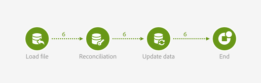
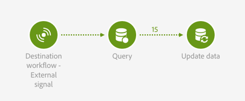

# 外部信号とデータ読み込み {#external-signal-data-import}

以下に、「**[!UICONTROL External signal]**」アクティビティの一般的なユースケースを示します。 ソースワークフローでデータインポートが実行されます。 インポートが完了し、データベースが更新されると、2 番目のワークフローがトリガーされます。 この 2 番目のワークフローでは、インポートされたデータを対象として集計を更新します。

ソースワークフローは次のとおりです。

* 「[ファイル読み込み](../../automating/using/load-file.md)」アクティビティで、新規の購入データを含んだファイルをアップロードします。 なお、デフォルトではデータマートに購入データが存在しないので、適宜[データベースが拡張](../../developing/using/data-model-concepts.md)されています。

  例：

  ```
  tcode;tdate;customer;product;tamount
  aze123;21/05/2015;dannymars@example.com;A2;799
  aze124;28/05/2015;dannymars@example.com;A7;8
  aze125;31/07/2015;john.smith@example.com;A7;8
  aze126;14/12/2015;john.smith@example.com;A10;4
  aze127;02/01/2016;dannymars@example.com;A3;79
  aze128;04/03/2016;clara.smith@example.com;A8;149
  ```

* 「[紐付け](../../automating/using/reconciliation.md)」アクティビティで、インポートしたデータとデータベースの間にリンクが作成されます。その結果、トランザクションデータがプロファイルおよび製品に正しく接続されるようになります。
* 「[データ更新](../../automating/using/update-data.md)」アクティビティによって、データベースのトランザクションリソースが挿入され、受信データで更新されます。
* [終了](../../automating/using/start-and-end.md) アクティビティは、集計の更新に使用する宛先ワークフローをトリガーします。



宛先ワークフローは次のとおりです。

* ソース ワークフローが正常に完了するまで、[外部信号](../../automating/using/external-signal.md) アクティビティが待機します。
* 「[クエリ](../../automating/using/query.md#enriching-data)」アクティビティで、プロファイルをターゲットとし、コレクションセットでエンリッチメントを実行して最終購入日を取得します。
* 「[データ更新](../../automating/using/update-data.md)」アクティビティで、専用のカスタムフィールドに追加データを保存します。 なお、プロファイルリソースは、「**最終購入日**」フィールドを追加するために拡張されています。


