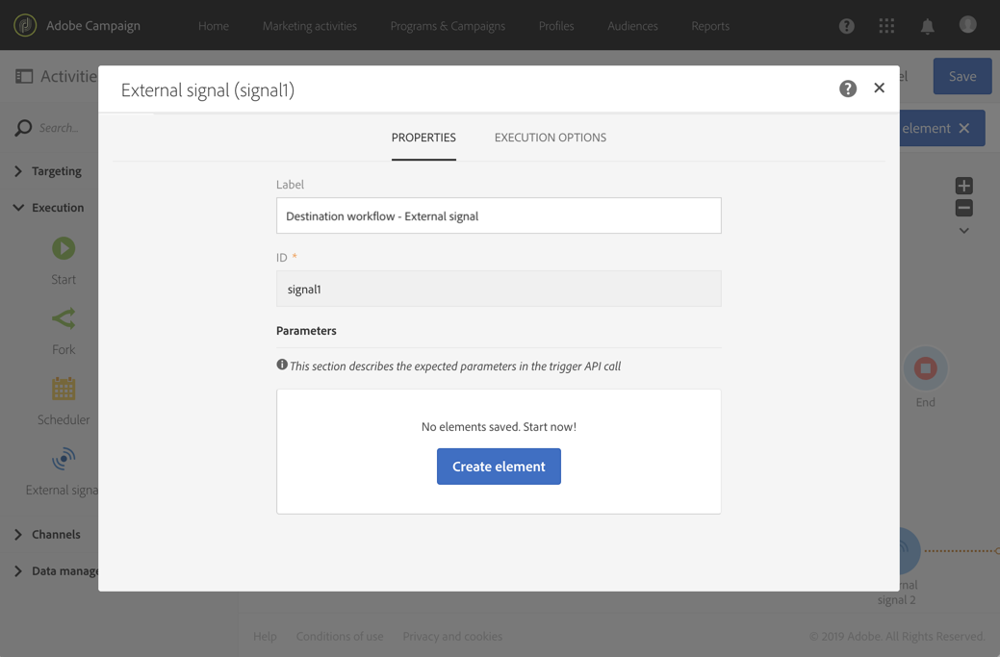

# 外部シグナル{#external-signal}

## 説明 {#description}

「**[!UICONTROL External signal]**」アクティビティでは、別のワークフローで特定の条件が満足されたときに、または REST API 呼び出しからワークフローをトリガーします。

## 使用状況 {#context-of-use}

「**[!UICONTROL External signal]**」アクティビティは、同じカスタマージャーニーの構成要素である様々なプロセスを様々なワークフローに編成する場合に使用します。このアクティビティでは、あるワークフローを別のワークフローから起動できるので、さらに複雑なカスタマージャーニーをサポートできる一方、問題が発生した場合の監視と対応を改善することができます。

「**[!UICONTROL External signal]**」アクティビティは、あるワークフローの最初のアクティビティとして配置するように設計されています。このアクティビティは、別のワークフローの「**[!UICONTROL End]**」アクティビティから、または REST API 呼び出しからトリガーできます（REST API 呼び出しについて詳しくは、[API のドキュメント](../../api/using/triggering-a-signal-activity.md)を参照してください）。

トリガーする際に外部パラメーターを定義し、ワークフローイベント変数で使用することができます。外部パラメーターを指定してワークフローを呼び出す方法について詳しくは、[こちらの節](../../automating/using/calling-a-workflow-with-external-parameters.md)を参照してください。

>[!NOTE]
>
>このアクティビティは、10 分未満の間隔でトリガーすることはできません。

なお、「**[!UICONTROL External signal]**」アクティビティは、別の複数のイベントからトリガーできます。その場合、「**[!UICONTROL External signal]**」アクティビティは、いずれか 1 つのソースワークフローまたは API 呼び出しが実行されるとすぐにトリガーされます。すべてのソースワークフローが完了している必要はありません。

**関連トピック**

* [使用例：外部シグナルのアクティビティとデータのインポート](../../automating/using/external-signal-data-import.md).
* [使用例：外部パラメーターを使用したファイルからのオーディエンスの作成のためのワークフローの呼び出し](../../automating/using/use-case-calling-workflow.md)

## 設定 {#configuration}

外部シグナルを設定する場合は，まず宛先ワークフローに［**[!UICONTROL External signal]**］アクティビティを設定することが重要です。設定が完了したら、このワークフローの「**[!UICONTROL External signal]**」アクティビティを使用してソースワークフローの「**[!UICONTROL End]**」アクティビティを設定できるようになります。

1. 宛先ワークフローに「**[!UICONTROL External signal]**」アクティビティをドラッグ＆ドロップします。
1. アクティビティを選択し、表示されるクイックアクションの  ボタンを使用して開きます。
1. アクティビティのラベルを編集します。このラベルは、「**[!UICONTROL External signal]**」をトリガーするソースワークフローを設定するときに必要になります。

   パラメーターを指定してワークフローを呼び出す場合は、「**[!UICONTROL Parameters]**」エリアを使用してパラメーターを宣言します。詳しくは、[このページ](../../automating/using/declaring-parameters-external-signal.md)を参照してください。

   

1. アクティビティの設定を確認し、その他必要なアクティビティを追加して、ワークフローを保存します。

   >[!NOTE]
   >
   >別のワークフローから宛先ワークフローをトリガーする場合は、次の手順に進みます。また、REST API 呼び出しから宛先ワークフローをトリガーする場合は、[API のドキュメント](../../api/using/triggering-a-signal-activity.md)を参照して詳細を確認してください。

1. ソースワークフローを開き、「**[!UICONTROL End]**」アクティビティを選択します。使用できる「**[!UICONTROL End]**」アクティビティがない場合は、ワークフローの分岐の最終アクティビティの後に追加します。

   アクティビティによっては、デフォルトでアウトバウンドトランジションがない場合があります。こうしたアクティビティについては、「**[!UICONTROL Properties]**」タブでアウトバウンドトランジションを追加できます。

   例えば、「**[!UICONTROL Update data]**」アクティビティの場合は、「**[!UICONTROL Transitions]**」タブに移動して、「**[!UICONTROL Add an outbound transition without the population]**」オプションをオンにします。このオプションを使用すると、データを含んでいないトランジションを追加できるので、システムの領域を不必要に消費せずに済みます。このオプションを使用するだけで宛先ワークフローをトリガーする追加の「**[!UICONTROL End]**」アクティビティを接続できます。

   

1. 「**[!UICONTROL End]**」アクティビティの「**[!UICONTROL External signal]**」タブで、宛先ワークフローと、このワークフロー内でトリガーする「**[!UICONTROL External signal]**」アクティビティを選択します。

   別のワークフローをトリガーする「**[!UICONTROL End]**」アクティビティを設定すると、そのアイコンにシグナルシンボルが追加されます。

   パラメーターを指定してワークフローを呼び出す場合は、「**[!UICONTROL Parameters and values]**」エリアを使用します。詳しくは、[このページ](../../automating/using/defining-parameters-calling-workflow.md)を参照してください。

   

1. ソースワークフローを保存します。

ソースワークフローの「**[!UICONTROL End]**」アクティビティ、または REST API 呼び出しが実行されると、「**[!UICONTROL External signal]**」アクティビティから宛先ワークフローが自動的にトリガーされます。

>[!NOTE]
>
>宛先ワークフローをトリガーするには、その前に手動で開始しておく必要があります。開始すると、**[!UICONTROL External activity]**&#x200B;が有効になり、ソースワークフローからシグナルが送られるのを待機します。
