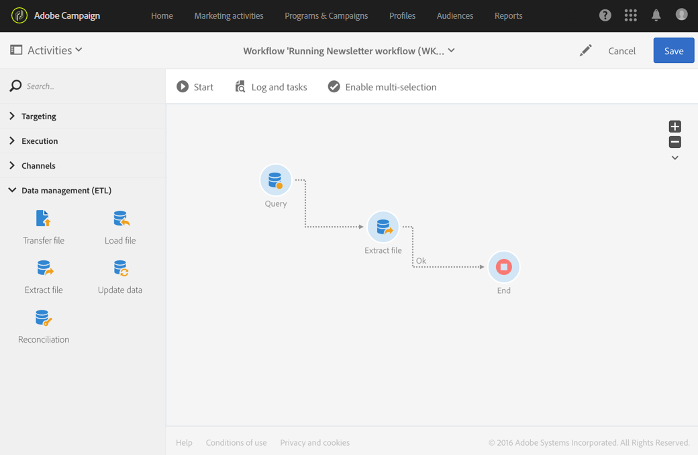
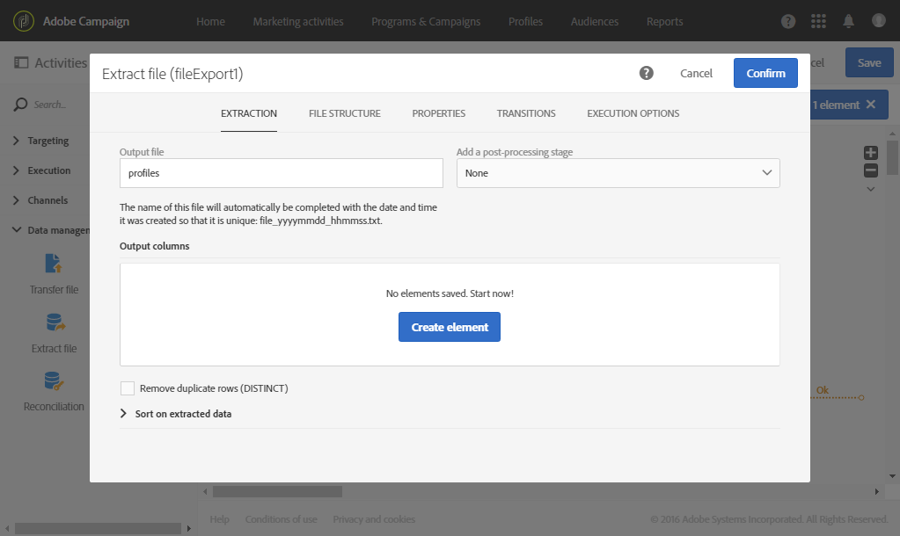
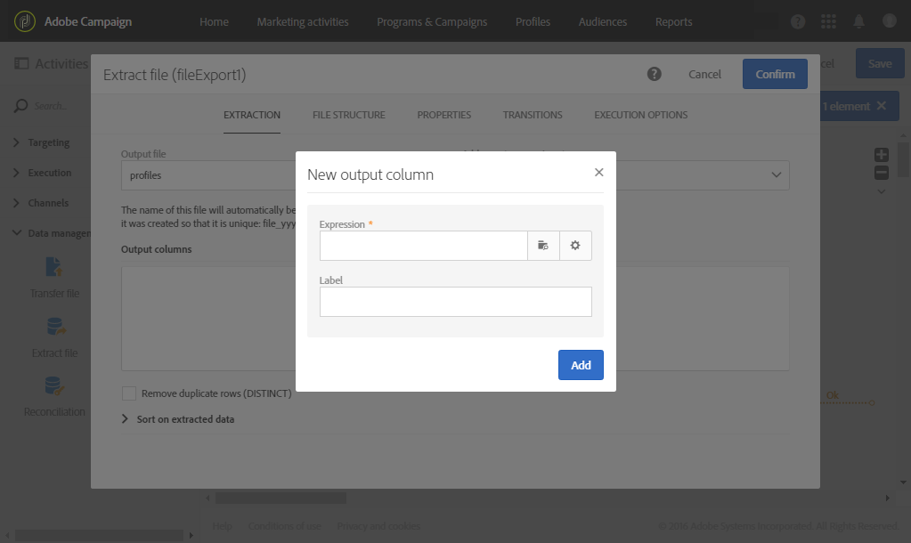
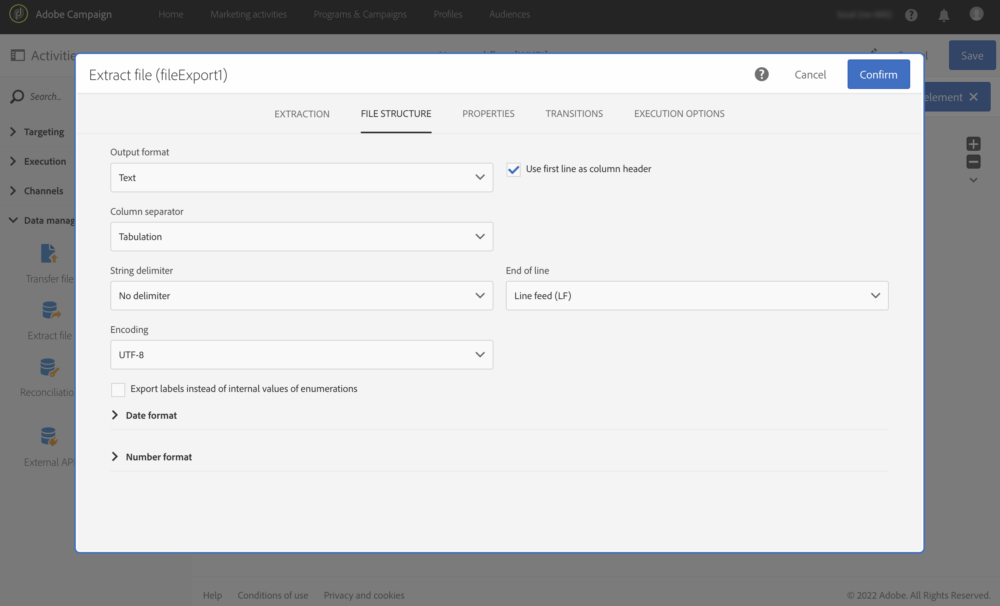

# ファイルを抽出{#extract-file}

## 説明 {#description}

「**[!UICONTROL Extract file]**」アクティビティを使用すると、Adobe Campaign から外部ファイルの形式でデータをエクスポートできます。

## Context of use {#context-of-use}

データの抽出方法は、アクティビティの設定時に定義されます。

>[!CAUTION]
>
>「**[!UICONTROL Extract file]**」アクティビティを使用するには、「**[!UICONTROL Query]**」アクティビティの後に配置する必要があります。

**関連トピック：**

* [使用例：外部ファイルでのプロファイルの書き出し](../../automating/using/exporting-profiles-in-file.md)

## 設定 {#configuration}

1. ワークフローに「**[!UICONTROL Extract file]**」アクティビティをドラッグ＆ドロップします。

   

1. アクティビティを選択し、表示されるクイックアクションの  ボタンを使用して開きます。
1. **Output file** のラベルを入力します。 ファイルのラベルは、一意になるように、作成された日時と共に自動的に入力されます。 例：recipients_20150815_081532.txtは、2015年8月15日の08:15:32に生成されたファイルです。

   >[!NOTE]
   >
   >このフィールドで **[!UICONTROL formatDate]** 関数を使用して、ファイル名を指定できます。

1. 必要に応じて、「**[!UICONTROL Add a post-processing stage]**」フィールドの **[!UICONTROL Compression]** を選択して、出力ファイルを zip 形式で圧縮できます。 出力ファイルは圧縮されて GZIP ファイル（.gz）になります。

   **[!UICONTROL Add a post-processing stage]** フィールドでは、ファイルを抽出する前に暗号化することもできます。 暗号化されたファイルの操作方法について詳しくは、[この節](../../automating/using/managing-encrypted-data.md)を参照してください

1. 「**[!UICONTROL Create element]**」ボタンをクリックして、出力列を追加します。

   

   新しいウィンドウが開きます。

   

1. 式を入力します。 これをおこなうには、既存の式を選択するか、**式エディター**&#x200B;を使用して新しい式を作成します。
1. 式を確認します。

   式が出力列に追加されます。

1. 必要な数の列を作成します。 列の式とラベルをクリックすると、列を編集できます。

   プロファイルをエクスポートして外部ツールで使用する場合は、一意の識別子をエクスポートする必要があります。 デフォルトでは、すべてのプロファイルが一意の識別子を有しているわけではありません。一意の識別子の有無は、プロファイルがデータベースに追加される方法に左右されます。 詳しくは、[プロファイルに対する一意の ID の生成](../../developing/using/configuring-the-resource-s-data-structure.md#generating-a-unique-id-for-profiles-and-custom-resources)を参照してください。

1. 「**[!UICONTROL File structure]**」タブをクリックして、エクスポートするファイルの出力、日付、数値の形式を設定します。

   定義済みリストの値をエクスポートする場合は、「**[!UICONTROL Export labels instead of internal values of enumerations]**」オプションを選択します。 このオプションを使用すると、ID の代わりに短くてわかりやすいラベルを取得できます。

   

   >[!NOTE]
   >
   >特定のエンコーディングを使用してCSV ファイルにデータを抽出する場合は、まず「テキスト」出力形式を選択します。 ドロップダウンリストから目的のエンコーディングを選択し、出力形式を「CSV （Excel）」に変更します。

1. 「**[!UICONTROL Properties]**」タブで、インバウンドトランジションが空の場合に空のファイルを SFTP サーバーで作成してアップロードしないようにする「**[!UICONTROL Do not generate a file if the inbound transition is empty]**」オプションを選択します。
1. アクティビティの設定を確認し、ワークフローを保存します。
