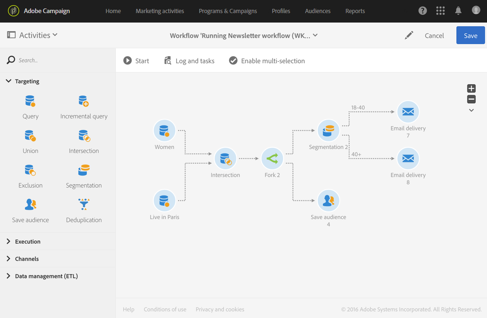

# 分岐{#fork}

## 説明 {#description}

「**[!UICONTROL Fork]**」アクティビティを使用すると、アウトバウンドトランジションを作成して、複数のアクティビティを同時に開始できます。

## 使用状況 {#context-of-use}

「**[!UICONTROL Fork]**」アクティビティを使用すると、同じワークフロー内で複数の異なるアクティビティを個別に実行できます。

## 設定 {#configuration}

1. ワークフローに「**[!UICONTROL Fork]**」アクティビティをドラッグ＆ドロップします。
1. そのアクティビティを、事前に実行する他のアクティビティ（クエリなど）に接続します。
1. アクティビティを選択し、表示されるクイックアクションの  ボタンを使用して開きます。
1. アウトバウンドトランジションを作成、削除または複製して、アウトバウンドトランジションの数を指定します。また、名前とラベルを付けることもできます。
1. アクティビティの設定を確認し、ワークフローを保存します。

## 例 {#example}

次の例は、Adobe Campaign データベース内のプロファイル（この場合はパリに住む女性）をターゲットにした 2 つの「クエリ」アクティビティの積集合を示しています。したがって、「分岐」アクティビティを使用すると、複数のアクティビティを同時に使用できます。1 つは、オーディエンスを保存して、計算された母集団を記憶するためのもの、もう 1 つは、母集団をセグメント化して、セグメントごとにターゲットコンテンツを含んだ 2 つの異なるメールを送信するためのものです。最初のメールは 18～40 歳のパリの女性に送信され、もう 1 つは 41 歳以上のパリの女性をターゲットにします。

