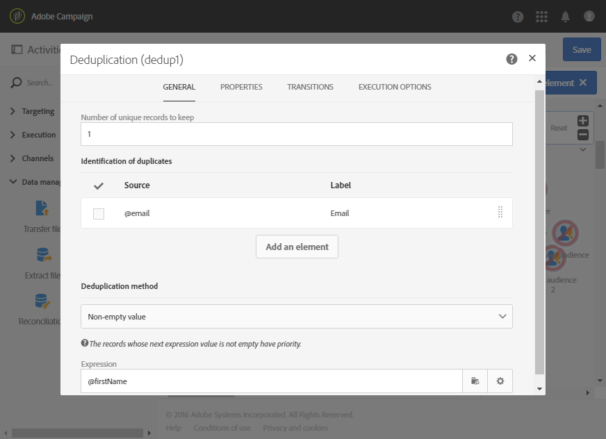

# 配信前の重複の特定 {#identifying-duplicates-before-a-delivery}

次に、E メールを送信する前にターゲットの重複を除外する重複排除の例を示します。同じプロファイルに対して同じ通信を複数回送信することを回避できます。

このワークフローは次の要素で構成されます。

* 電子メールのターゲットを定義できる[クエリ](../../automating/using/query.md)。 このワークフローでは、18 歳から 25 歳までのプロファイルのうち、1 年以上クライアントデータベースに存在しているすべてのプロファイルがターゲットになります。

   

* [重複排除 - 重複](../../automating/using/deduplication.md)アクティビティ。前のクエリから来た重複を識別できます。 この例では、保存されるレコードは重複ごとに 1 つだけです。重複は E メールアドレスを使用して識別されます。つまり、ターゲティングに存在する E メールアドレスごとに 1 回しか E メール配信を送信できません。

   選択する重複排除方法は「**[!UICONTROL Non-empty value]**」です。これにより、重複が識別された場合、**名前（名）**&#x200B;が含まれているレコードを優先して保持することができます。E メールコンテンツのパーソナライゼーションフィールドで名が使用されている場合に一貫性が向上する方法です。

   また、重複を保持し一覧表示するために、トランジションが追加されています。

   

* 重複排除 - 重複のメインの送信トランジションの後に配置される[電子メール配信](../../automating/using/email-delivery.md)。
* 重複を&#x200B;**重複**&#x200B;オーディエンスーに保存するために、重複排除 - 重複の追加トランジションの後に配置される[保存オーディエンス](../../automating/using/save-audience.md)アクティビティ。 このオーディエンスを再利用して、E メール配信のたびにオーディエンスのメンバーを直接除外することができます。
