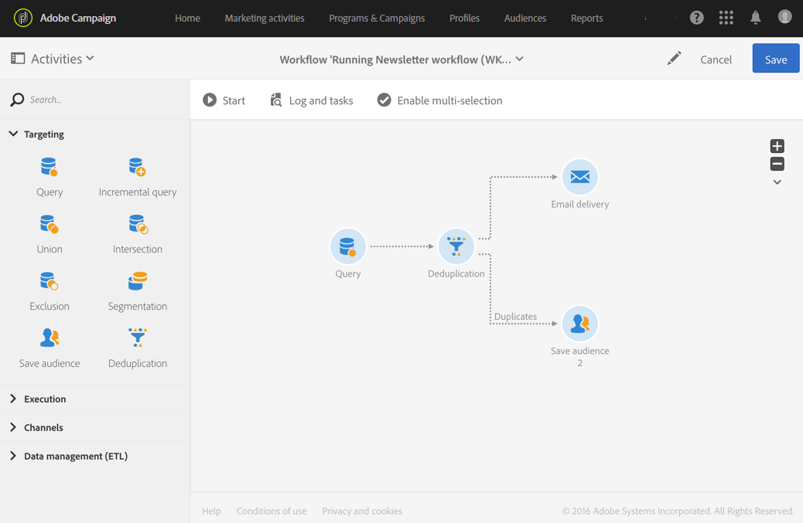

# 配信前の重複の特定 {#identifying-duplicates-before-a-delivery}

次に、メールを送信する前にターゲットの重複を除外する重複排除の例を示します。 同じプロファイルに対して同じ通信を複数回送信することを回避できます。

このワークフローは次の要素で構成されます。

* メールのターゲットを定義できる[&#x200B; クエリ &#x200B;](../../automating/using/query.md)です。 このワークフローでは、18 歳から 25 歳までのプロファイルのうち、1 年以上クライアントデータベースに存在しているすべてのプロファイルがターゲットになります。

  

* [重複排除](../../automating/using/deduplication.md) アクティビティ。前のクエリから発生した重複を識別できます。 この例では、保存されるレコードは重複ごとに 1 つだけです。 重複はメールアドレスを使用して識別されます。 つまり、ターゲティングに存在するメールアドレスごとに 1 回しかメール配信を送信できません。

  選択する重複排除方法は「**[!UICONTROL Non-empty value]**」です。 これにより、重複が識別された場合、**名前（名）**&#x200B;が含まれているレコードを優先して保持することができます。 メールコンテンツのパーソナライゼーションフィールドで名が使用されている場合に一貫性が向上する方法です。

  また、重複を保持し一覧表示するために、トランジションが追加されています。

  

* 重複排除のメインのアウトバウンドトランジションの後に配置された[&#x200B; メール配信](../../automating/using/email-delivery.md)。
* 重複を&#x200B;**重複** オーディエンスに保存するために、重複排除の追加移行後に配置された[&#x200B; オーディエンスを保存](../../automating/using/save-audience.md) アクティビティ。 このオーディエンスを再利用して、メール配信のたびにオーディエンスのメンバーを直接除外することができます。
