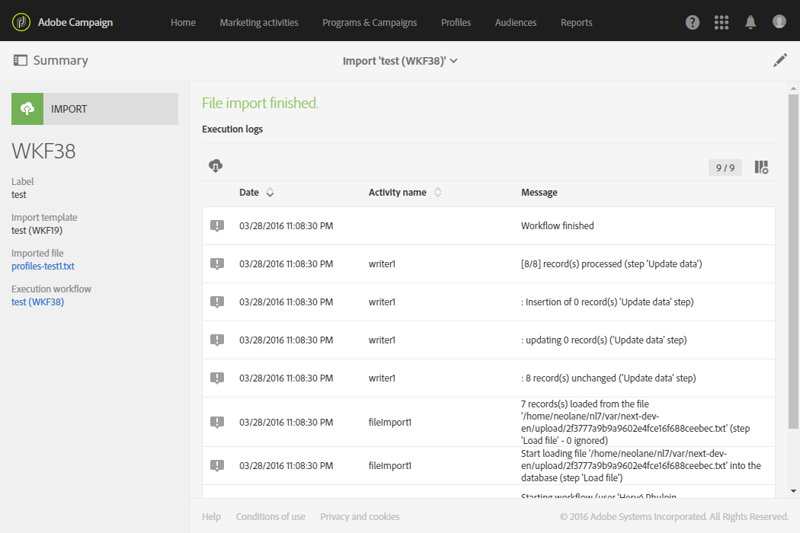

# インポートテンプレートを使用したデータのインポート{#importing-data-with-import-templates}

データをインポートすると、データを収集してキャンペーンのデータベースをフィードできます。

また、 [Adobe Campaignには](../../automating/using/discovering-workflows.md)、管理者が定義した特定のタイプのインポートを管理できる、シンプルなインポート機能が用意されています。

運営原則は以下の通り。管理者は **、インポートテンプレート** (インポートテンプレート [の定義を参照](../../automating/using/defining-import-templates.md))を定義および管理します。 これらのインポートテンプレートは、&gt;メニューの簡略表示を使用するユーザが使用で **[!UICONTROL Profiles & audiences]** きるように **[!UICONTROL Imports]** なります。

したがって、実行するインポートのタイプを選択し、インポートするデータと共にファイルをアップロードするだけで済みます。 管理者が定義したワークフローは、ユーザに対して透過的に実行され、インポートの完了後に結果の詳細にアクセスできます。

>[!NOTE]
>
>Import data function can be managed by users with **[!UICONTROL GENERIC IMPORT (import)]** and **[!UICONTROL WORKFLOW (workflow)]** roles. ロールについて詳しくは、[この節](../../administration/using/list-of-roles.md)を参照してください。

インポートは、実行元のテンプレート、実行日、および実行ステータスに従ってフィルタリングできます。

1. インポートの概要で、ボタンをクリック **[!UICONTROL Create]** します。 ウィザードが開きます。
1. 実行するインポートのタイプを選択します。 読み込みタイプは、使用可能な読み込みテンプレートに対応します。
1. 必要に応じて、テンプレートにリンクされたサンプルファイルをコンピューターにダウンロードし、読み込むファイルに必要なデータタイプを表示します。
1. インポートするデータを含むファイルをウィザードにダウンロードします。
1. インポートを開始します。 ウィザードが閉じ、使用したテンプレートで実行されたインポートのリストに戻ります。
1. ページを更新し、実行の詳細を表示するために実行したインポートを選択します。

   

インポートの実行の詳細が利用できるようになりました。 インポートされたファイルと、拒否されたデータ（インポートされなかったデータ）を含むファイルの両方を、コンピューターにダウンロードできます。
