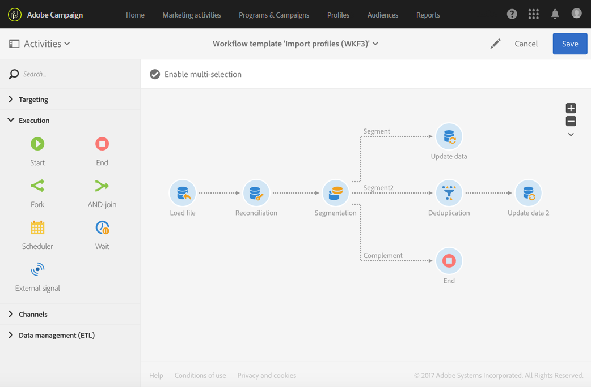

# データのインポート{#importing-data}

## データの収集 {#collecting-data}

ファイルからデータを収集して処理したり、Adobe Campaignデータベースにインポートしたりできます。

* アクティビティ **[!UICONTROL Load file]** を使用すると、1つの構造化されたフォームにデータをインポートして、Adobe Campaignでこのデータを使用できます。 データが一時的にインポートされ、Adobe Campaignデータベースに統合するには、別のアクティビティが必要です。
* このア **[!UICONTROL Transfer file]** クティビティでは、ファイルの受信や送信、Adobe Campaign内のファイルの有無のテスト、ファイルのリスト表示を行うことができます。

   外部ソースからファイルを取得する必要が **[!UICONTROL Load file]** ある場合に備えて、このアクティビティを外部ソースの前に使用できます。

## ベストプラクティスのインポート {#import-best-practices}

次に説明するいくつかのシンプルなルールに注意して従うと、データベース内のデータの一貫性を確保し、データベースの更新中またはデータを読み込む際の一般的なエラーを避けるのに非常に役立ちます。

### インポートテンプレートの使用 {#using-import-templates}

Most import workflows should contain the following activities: **[!UICONTROL Load file]**, **[!UICONTROL Reconciliation]**, **[!UICONTROL Segmentation]**, **[!UICONTROL Deduplication]**, **[!UICONTROL Update data]**.

インポートテンプレートを使用すると、同様のインポートを準備したり、データベース内のデータの一貫性を確保したりするのに非常に便利です。

In many projects, imports are built without **[!UICONTROL Deduplication]** activity because the files used in the project do not have duplicates. 複数のファイルをインポートすると、重複が発生する場合があります。そうなると、重複排除は困難になります。そのため、すべてのインポートワークフローで重複排除ステップを設けることは、優れた予防措置となります。

受信データは一貫性があり正しいとか、IT 部門や Adobe Campaign スーパーバイザーが対処するとは思わないでください。プロジェクトの間、データクレンジングに留意してください。データをインポートする際には、重複排除し、紐付けし、一貫性を維持します。

データの読み込み用に設計された汎用ワークフローテンプレートの例を、例で [示します。ワークフローテンプレートのインポート](#example--import-workflow-template) 」セクションを参照してください。

>[!NOTE]
>
>テンプレートの読み込みも [使用できます](../../automating/using/importing-data-with-import-templates.md)。 管理者が定義したワークフローテンプレートで、一度アクティブ化すると、インポートするデータを含むファイルを指定できるようになります。

### フラットファイルフォーマットの使用 {#using-flat-file-formats}

インポートで最も効率的なフォーマットは、フラットファイルです。フラットファイルは、データベースレベルで、一括モードでインポートできます。

次に例を示します。

* 区切り記号：タブまたはセミコロン
* 最初の行は見出し
* 文字列の区切り記号なし
* 日付形式：YYYY/MM/DD HH:mm:SS

インポートするファイルの例：

```
lastname;firstname;birthdate;email;crmID
Smith;Hayden;23/05/1989;hayden.smith@example.com;124365
Mars;Daniel;17/11/1987;dannymars@example.com;123545
Smith;Clara;08/02/1989;hayden.smith@example.com;124567
Durance;Allison;15/12/1978;allison.durance@example.com;120987
```

### 圧縮の使用 {#using-compression}

可能であれば、インポートおよびエクスポートに zip 形式のファイルを使用します。GZIPはデフォルトでサポートされています。 ファイルの読み込み時に前処理を追加したり、データ抽出時に後処理を追加したりできます。これらの処理は、それぞれワークフ **[!UICONTROL Load file]** ローアクティビティ **[!UICONTROL Extract file]** で行います。

### 差分モードでのインポート {#importing-in-delta-mode}

通常のインポートは、差分モードで行う必要があります。 つまり、毎回、テーブル全体ではなく、新規または変更されたデータのみが Adobe Campaign に送信されるようにします。

完全インポートは、最初の読み込みにのみ使用する必要があります。

### 一貫性の維持 {#maintaining-consistency}

Adobe Campaign データベースのデータの一貫性を維持するには、次の原則に従います。

* インポートされたデータが Adobe Campaign の参照テーブルに一致する場合、ワークフローでそのテーブルと紐付けされる必要があります。一致しないレコードは、却下される必要があります。
* インポートされたデータが常に&#x200B;**「正規化」**&#x200B;されている（E メール、電話番号、ダイレクトメールアドレス）ことと、この正規化が信頼でき、何年にもわたって変更されないことを確認します。該当しない場合、データベースに何らかの重複が現れる可能性が高く、Adobe Campaign には「あいまい」一致をおこなうツールがないので、重複を管理および削除することが非常に難しくなります。
* 重複の作成を避けるために、トランザクションデータは、紐付けキーを持ち、既存のデータと紐付けされている必要があります。
* **関連ファイルを順番どおりにインポートします**。お互いに依存する複数のファイルでインポートが構成されている場合、ワークフローでファイルが正しい順番でインポートされていることを確認する必要があります。あるファイルが失敗すると、他のファイルはインポートされません。
* データをインポートする際には、**重複排除**&#x200B;し、紐付けし、一貫性を維持します。

## 例：ワークフローテンプレートの読み込み {#example--import-workflow-template}

同じ構造のファイルを頻繁にインポートする必要がある場合、インポートテンプレートを使用することをお勧めします。

この例では、Adobe Campaign データベースの CRM からのプロファイルのインポートに再利用できるワークフローを事前設定する方法を示します。

1. Create a new workflow template from **[!UICONTROL Resources > Templates > Workflow templates]**.
1. 次のアクティビティを追加します。

   * **[!UICONTROL Load file]**:インポートするデータを含むファイルの予期される構造を定義します。

      >[!NOTE]
      >
      >1つのファイルからのみデータをインポートできます。 ワークフローに複数のアクティビティ **[!UICONTROL Load file]** が含まれる場合は、毎回同じファイルが使用されます。

   * **[!UICONTROL Reconciliation]**:インポートしたデータをデータベースデータと調整します。
   * **[!UICONTROL Segmentation]**:レコードを調整できるかどうかに応じて、レコードを処理するフィルターを作成します。
   * **[!UICONTROL Deduplication]**:データベースに挿入する前に、受信ファイルのデータの重複を除外します。
   * **[!UICONTROL Update data]**:インポートしたプロファイルでデータベースを更新します。
   

1. Configure the **[!UICONTROL Load file]** activity:

   * サンプルファイルをアップロードすることで、求められる構造を定義します。サンプルファイルには、インポートに必要なすべての列と、いくつかの行のみが含まれている必要があります。ファイルフォーマットをチェックおよび編集して、各列のタイプが正しく設定されていることを確認します（テキスト、日付、整数など）。次に例を示します。

      ```
      lastname;firstname;birthdate;email;crmID
      Smith;Hayden;23/05/1989;hayden.smith@mailtest.com;123456
      ```

   * セクション **[!UICONTROL File to load]** で、フィールド **[!UICONTROL Upload a new file from the local machine]** を選択し、空白のままにします。 このテンプレートから新しいワークフローを作成するたびに、ここで、定義された構造に対応するファイルを指定できます。

      任意のオプションを使用できますが、それに応じてテンプレートを修正する必要があります。For example, if you select **[!UICONTROL Use the file specified in the inbound transition]**, you can add a **[!UICONTROL Transfer file]** activity before to retrieve the file to import from a FTP/SFTP server.

      読み込み中に発生したエラーを含むファイルをユーザーがダウンロードできるようにするには、このオプションをオン **[!UICONTROL Keep the rejects in a file]** にして、を指定しま **[!UICONTROL File name]**&#x200B;す。

      

1. Configure the **[!UICONTROL Reconciliation]** activity. ここでのこのアクティビティの目的は、受信データを識別することです。

   * タブで、読み込 **[!UICONTROL Relations]** んだデータと **[!UICONTROL Create element]** 受信者のターゲットディメンションとの間のリンクを選択して定義します(ディメンションとリソ [ースのターゲット設定を参照](../../automating/using/query.md#targeting-dimensions-and-resources))。 この例では、結合条件の作成に **CRM ID** カスタムフィールドが使用されています。一意のレコードを識別できる限り、必要なフィールドまたはフィールドの組み合わせを使用します。
   * タブで、こ **[!UICONTROL Identification]** のオプションはオフのまま **[!UICONTROL Identify the document from the working data]** にします。
   

1. Configure the **[!UICONTROL Segmentation]** activity to retrieve reconciled recipients in one transition and recipients that could not be reconciled but who have enough data in a second transition.

   紐付けされた受信者を含むトランジションは、データベースを更新するために使用できます。不明な受信者を含むトランジションは、ファイルで最小限の情報が利用できる場合、データベースに新しい受信者エントリを作成するために使用できます。

   紐付けできず、十分なデータを持たない受信者は、補集合アウトバウンドトランジションで選択され、別のファイルにエクスポートしたり、単純に無視したりできます。

   * アクティビティ **[!UICONTROL General]** のタブで、をに設定し、タ **[!UICONTROL Resource type]** ーゲッ **[!UICONTROL Temporary resource]** トセットと **[!UICONTROL Reconciliation]** して選択します。
   * In the **[!UICONTROL Advanced options]** tab, check the **[!UICONTROL Generate complement]** option to be able to see if any record cannot be inserted in the database. 必要に応じて、補完データのさらなる処理（ファイルエクスポート、リスト更新など）を適用できます。
   * In the first segment of the **[!UICONTROL Segments]** tab, add a filtering condition on the inbound population to select only records for which the profile's CRM ID is not equal to 0. これにより、データベースのプロファイルと調整されたファイルのデータが、そのサブセット内で選択されます。

      

   * データベースに挿入するのに十分なデータを持つ未調整レコードを選択する2つ目のセグメントを追加します。 （例：E メールアドレス、姓名）。調整されていないレコードのプロファイルのCRM ID値は0です。

      

   * All records that are not selected in the first two subsets are selected in the **[!UICONTROL Complement]**.

1. Configure the **[!UICONTROL Update data]** activity located after the first outbound transition of the **[!UICONTROL Segmentation]** activity configured previously.

   * Select **[!UICONTROL Update]** as **[!UICONTROL Operation type]** since the inbound transition only contains recipients already present in the database.
   * タブで、 **[!UICONTROL Identification]** 「 - Profiles **[!UICONTROL Using reconciliation criteria]** in this case」とアクティビティで作成さ **[!UICONTROL Dimension to update]** れたリンクの間のキーを選択して定義し **[!UICONTROL Reconciliation]** ます。 この例では、**CRM ID** カスタムフィールドが使用されています。

      

   * In the **[!UICONTROL Fields to update]** tab, indicate the fields from the Profiles dimension to update with the value of the corresponding column from the file. ファイル列の名前が受信者ディメンションフィールドの名前と同一またはほとんど同じ場合、自動選択ボタンを使用して、異なるフィールドを自動的に一致させることができます。

      

      >[!NOTE]
      >
      >これらのプロファイルにダイレクトメールを送信する場合は、ダイレクトメールプロバイダーにとって重要な情報であるので、必ず住所を含めてください。 また、プロファイルの情報の **[!UICONTROL Address specified]** ボックスがチェック済みであることを確認します。 ワークフローからこのオプションを更新するには、更新するフィールドに要素を追加し、 **1** を指定し **[!UICONTROL Source]** て、「postalAddress/@addrDefined **」フィールドを「** 」として選択します **[!UICONTROL Destination]**。 ダイレクトメールの詳細とオプションの使用方法については、こ **[!UICONTROL Address specified]** のドキュメントを参 [照してくださ](../../channels/using/about-direct-mail.md#recommendations)い。

1. Configure the **[!UICONTROL Deduplication]** activity located after the transition containing unreconciled profiles:

   * タブで、 **[!UICONTROL Properties]** をワークフローのア **[!UICONTROL Resource type]** クティビティから生成された一時リ **[!UICONTROL Reconciliation]** ソースに設定します。

      

   * この例では、一意のプロファイルを見つけるために、E メールフィールドが使用されています。入力されていることがわかっており、一意の組み合わせを構成する任意のフィールドを使用できます。
   * を選択しま **[!UICONTROL Deduplication method]**&#x200B;す。 この場合、重複する場合にどのレコードを保持するかはアプリケーションによって自動的に決定されます。
   

1. Configure the **[!UICONTROL Update data]** activity located after the **[!UICONTROL Deduplication]** activity configured previously.

   * Select **[!UICONTROL Insert only]** as **[!UICONTROL Operation type]** since the inbound transition only contains profiles not present in the database.
   * タブで、 **[!UICONTROL Identification]** 「 - Profiles **[!UICONTROL Using reconciliation criteria]** in this case」とアクティビティで作成さ **[!UICONTROL Dimension to update]** れたリンクの間のキーを選択して定義し **[!UICONTROL Reconciliation]** ます。 この例では、**CRM ID** カスタムフィールドが使用されています。

      

   * In the **[!UICONTROL Fields to update]** tab, indicate the fields from the Profiles dimension to update with the value of the corresponding column from the file. ファイル列の名前が受信者ディメンションフィールドの名前と同一またはほとんど同じ場合、自動選択ボタンを使用して、異なるフィールドを自動的に一致させることができます。

      

      >[!NOTE]
      >
      >これらのプロファイルにダイレクトメールを送信する場合は、ダイレクトメールプロバイダーにとって重要な情報であるので、必ず住所を含めてください。 また、プロファイルの情報の **[!UICONTROL Address specified]** ボックスがチェック済みであることを確認します。 ワークフローからこのオプションを更新するには、更新するフィールドに要素を追加し、 **1** を指定し **[!UICONTROL Source]** て、「postalAddress/@addrDefined **[」フィールドを「]** 」として選択します **[!UICONTROL Destination]**。 ダイレクトメールの詳細とオプションの使用方法については、こ **[!UICONTROL Address specified]** のドキュメントを参 [照してくださ](../../channels/using/about-direct-mail.md#recommendations)い。

1. After the third transition of the **[!UICONTROL Segmentation]** activity, add a **[!UICONTROL Extract file]** activity and a **[!UICONTROL Transfer file]** activity if you want to keep track of data not inserted in the database. これらのアクティビティを設定して、必要な列をエクスポートし、ファイルを取得可能な FTP または SFTP サーバーにファイルを転送します。
1. Add an **[!UICONTROL End]** activity and save the workflow template.

これで、テンプレートが使用できるようになり、すべての新規ワークフローに利用できます。All is needed is then to specify the file containing the data to import in the **[!UICONTROL Load file]** activity.


