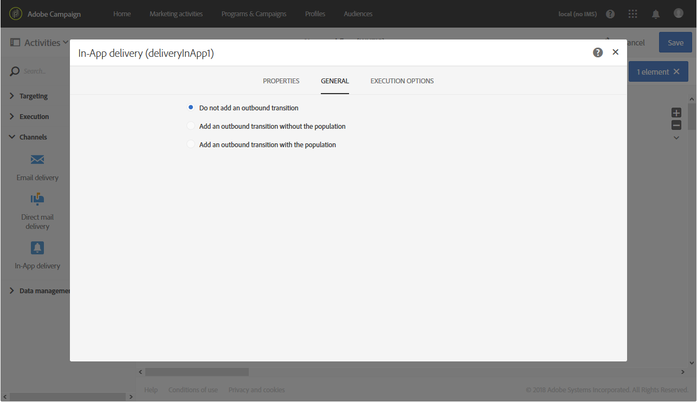

# アプリ内配信{#in-app-delivery}

## 説明 {#description}

The **アプリ内配信** 「 」アクティビティでは、ワークフロー内でのアプリ内メッセージの送信を設定できます。 アプリ内メッセージを使用すると、アプリ内でユーザーがアクティブな場合にメッセージを表示できます。 アプリ内配信について詳しくは、 [セクション](../../channels/using/about-in-app-messaging.md).

## 使用状況 {#context-of-use}

The **[!UICONTROL In-App delivery]** 「 」アクティビティは、通常、同じワークフロー内で計算されるターゲットオーディエンスへのアプリ内メッセージ送信を自動化するために使用されます。

受信者は、同じワークフロー内アクティビティの上流で、「クエリ」や「積集合」などのターゲティングアクティビティを通じて定義されます。

メッセージの準備は、ワークフロー実行パラメーターに従ってトリガーされます。メッセージを送信するために手動確認を要求するかどうかをメッセージダッシュボードで選択できます（デフォルトでは必須）。ワークフローは、手動で開始するか、ワークフロー内に「スケジューラー」アクティビティを配置して自動的に実行することができます。

## 設定 {#configuration}

1. 次をドラッグ&amp;ドロップ： **[!UICONTROL Query]** アクティビティをワークフローに追加します。 なお、 **[!UICONTROL Query]** アクティビティのターゲティングディメンション **[!UICONTROL Properties]** 手順 4 で選択したテンプレートに従ってタブを更新する必要があります。

   * ターゲティングディメンションは、次のように設定する必要があります。 **[!UICONTROL mobileApp (mobileAppV5)]** （の） **[!UICONTROL Target all users of a Mobile app (inAppBroadcast)]** テンプレート。
   * ターゲティングディメンションは、次のように設定する必要があります。 **[!UICONTROL profile (profile)]** （の） **[!UICONTROL Target users based on their Campaign profile (inAppProfile)]** テンプレート。
   * ターゲティングディメンションは、次のように設定する必要があります。 **[!UICONTROL subscriptions to an application (nms:appSubscriptionRcp:appSubscriptionRcpDetail)]** （の） **[!UICONTROL Target users based on their Mobile profile (inApp)]** テンプレート。

1. ワークフローに「**[!UICONTROL In-App delivery]**」アクティビティをドラッグ＆ドロップします。
1. アクティビティを選択し、表示されるクイックアクションの  ボタンを使用して開きます。

   >[!NOTE]
   >
   >を使用して、（配信自体のオプションではなく）アクティビティの一般的なプロパティや詳細設定オプションにアクセスできます。  ボタンを使用して、アクティビティのクイックアクションを編集できます。

   

1. 「アプリ内メッセージ」タイプを選択します。 これは、 **[!UICONTROL Query]** アクティビティ。

   * **[!UICONTROL Target users based on their Campaign profile (inAppProfile)]**：このメッセージタイプでは、モバイルアプリケーションを購読したAdobe Campaignプロファイルをターゲットにし、Campaign で使用できるプロファイル属性を使用してアプリ内メッセージをパーソナライズできます。
   * **[!UICONTROL Target all users of a Mobile app (inAppBroadcast)]**：このメッセージタイプでは、Campaign にプロファイルが存在しない場合でも、モバイルアプリケーションのすべてのユーザーにメッセージを送信できます。
   * **[!UICONTROL Target users based on their Mobile profile (inApp)]**：このメッセージタイプでは、Campaign にモバイルプロファイルがあるモバイルアプリのすべてのユーザーをターゲットにし、モバイルデバイスから取得したプロファイル属性を使用してアプリ内メッセージをパーソナライズできます。

   

1. アプリ内メッセージのプロパティを入力し、「 **[!UICONTROL Associate a Mobile App to a delivery]** フィールドに入力します。
1. 「**[!UICONTROL Triggers]**」タブで、メッセージのトリガーとして使用するイベントをドラッグ＆ドロップします。次の 3 つのカテゴリのイベントを使用できます。
1. アプリ内コンテンツを定義します。 関する節を参照 [アプリ内カスタマイズ](../../channels/using/customizing-an-in-app-message.md).
1. デフォルトでは、「**[!UICONTROL In-App delivery]**」アクティビティにアウトバウンドトランジションは含まれていません。アウトバウンドトランジションを「**[!UICONTROL In-App delivery]**」アクティビティに追加する場合は、アクティビティの詳細設定オプション（アクティビティのクイックアクションにある  ボタンで開く）の「**[!UICONTROL General]**」タブに移動し、次のいずれかのオプションをオンにします。

   * **[!UICONTROL Add outbound transition without the population]**：インバウンドトランジションとまったく同じ母集団を含んだアウトバウンドトランジションを生成できます。
   * **[!UICONTROL Add outbound transition with the population]**：メッセージの送信先となった母集団を含んだアウトバウンドトランジションを生成できます。 配信の準備中に除外されたターゲットのメンバーは、このトランジションから除外されます。

   

1. アクティビティの設定を確認し、ワークフローを保存します。

アクティビティを再度開くと、アプリ内ダッシュボードに直接に移動します。 そのコンテンツのみ編集可能です。

デフォルトでは、配信ワークフローを開始すると、メッセージの準備のみトリガーされます。ワークフローで作成したメッセージでも、ワークフローを開始した後で送信の確認をおこなう必要があります。ただし、メッセージダッシュボードから操作している場合と、メッセージをワークフローから作成した場合に限り、「**[!UICONTROL Request confirmation before sending messages]**」オプションを無効にできます。このオプションをオフにした場合は、準備が完了したら、追加の通知なしでそのままメッセージが送信されます。

## 備考 {#remarks}

ワークフロー内で作成された配信には、アプリケーションのマーケティングアクティビティリストからアクセスできます。ダッシュボードを使用して、ワークフローの実行ステータスを確認できます。プッシュ通知の概要パネルのリンクを使用すると、リンクされた要素（ワークフロー、キャンペーンなど）に直接アクセスできます。

マーケティングアクティビティリストからアクセスできる親配信では、( **[!UICONTROL In-App delivery]** アクティビティが設定された場合 )。 この合計数を表示するには、 をクリックして、親配信の「**[!UICONTROL Deployment]**」ブロックの詳細表示を開きます。
