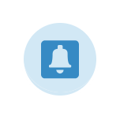
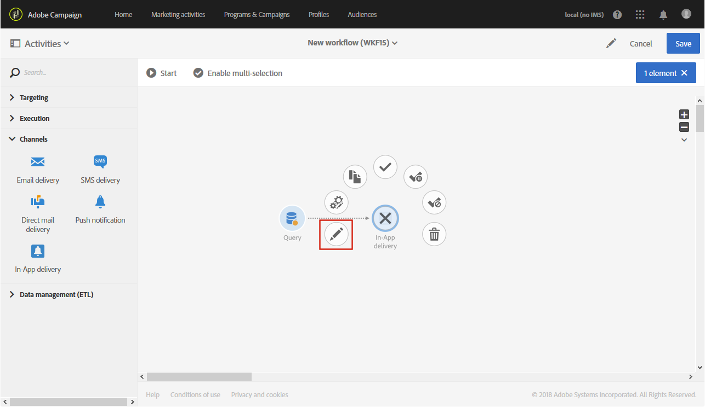
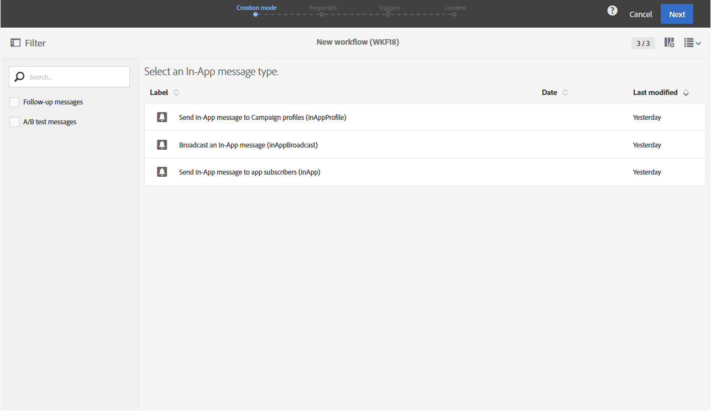
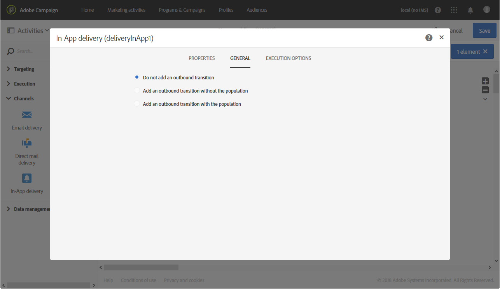

# アプリ内配信{#in-app-delivery}

## 説明 {#description}

**アプリ内配信** アクティビティを使用すると、ワークフロー内でのアプリ内メッセージの送信を設定できます。 アプリ内メッセージを使用すると、ユーザーがアプリケーション内でアクティブな場合にメッセージを表示できます。 アプリ内配信について詳しくは、この[&#x200B; セクション &#x200B;](../../channels/using/about-in-app-messaging.md)を参照してください。

## Context of use {#context-of-use}

**[!UICONTROL In-App delivery]** アクティビティは、通常、同じワークフローで計算されたターゲットオーディエンスにアプリ内メッセージを自動的に送信するために使用されます。

受信者は、クエリ、積集合などのターゲティングアクティビティを使用して、同じワークフローのアクティビティの上流で定義されます。

メッセージの準備は、ワークフロー実行パラメーターに従ってトリガーされます。 メッセージを送信するために手動確認を要求するかどうかをメッセージダッシュボードで選択できます（デフォルトでは必須）。 ワークフローは、手動で開始するか、ワークフロー内に「スケジューラー」アクティビティを配置して自動的に実行することができます。

## 設定 {#configuration}

1. ワークフローに&#x200B;**[!UICONTROL Query]** アクティビティをドラッグ&amp;ドロップします。 **[!UICONTROL Properties]** タブの&#x200B;**[!UICONTROL Query]** アクティビティターゲティングディメンションは、手順4で選択したテンプレートに従って更新する必要があることに注意してください。

   * ターゲティングディメンションは、**[!UICONTROL Target all users of a Mobile app (inAppBroadcast)]** テンプレートの&#x200B;**[!UICONTROL mobileApp (mobileAppV5)]**&#x200B;に設定する必要があります。
   * ターゲティングディメンションは、**[!UICONTROL Target users based on their Campaign profile (inAppProfile)]** テンプレートの&#x200B;**[!UICONTROL profile (profile)]**&#x200B;に設定する必要があります。
   * **[!UICONTROL Target users based on their Mobile profile (inApp)]** テンプレートのターゲティングディメンションは&#x200B;**[!UICONTROL subscriptions to an application (`nms:appSubscriptionRcp:appSubscriptionRcpDetail`）]**&#x200B;に設定する必要があります。

1. ワークフローに「**[!UICONTROL In-App delivery]**」アクティビティをドラッグ＆ドロップします。
1. アクティビティを選択し、表示されるクイックアクションの  ボタンを使用して開きます。

   >[!NOTE]
   >
   >アクティビティのクイックアクションの  ボタンを使用して、（配信自体のオプションではなく）アクティビティの一般的なプロパティや詳細設定オプションにアクセスできます。

   

1. アプリ内メッセージタイプを選択します。 これは、**[!UICONTROL Query]** アクティビティでターゲットとするデータによって異なります。

   * **[!UICONTROL Target users based on their Campaign profile (inAppProfile)]**：このメッセージタイプを使用すると、モバイルアプリケーションを購読したAdobe Campaign プロファイルをターゲットにしたり、Campaignで使用可能なプロファイル属性を使用してアプリ内メッセージをパーソナライズしたりできます。
   * **[!UICONTROL Target all users of a Mobile app (inAppBroadcast)]**：このメッセージタイプを使用すると、Campaignに既存のプロファイルがない場合でも、モバイルアプリケーションのすべてのユーザーにメッセージを送信できます。
   * **[!UICONTROL Target users based on their Mobile profile (inApp)]**：このメッセージタイプを使用すると、Campaignでモバイルプロファイルを持つモバイルアプリのすべてのユーザーをターゲットにしたり、モバイルデバイスから取得したプロファイル属性を使用してアプリ内メッセージをパーソナライズしたりできます。

   

1. アプリ内メッセージのプロパティを入力し、**[!UICONTROL Associate a Mobile App to a delivery]** フィールドでモバイルアプリを選択します。
1. 「**[!UICONTROL Triggers]**」タブで、メッセージのトリガーとして使用するイベントをドラッグ＆ドロップします。 イベントには、次の3つのカテゴリがあります。
1. アプリ内コンテンツを定義。 [&#x200B; アプリ内カスタマイズ &#x200B;](../../channels/using/customizing-an-in-app-message.md)に関する節を参照してください。
1. デフォルトでは、「**[!UICONTROL In-App delivery]**」アクティビティにアウトバウンドトランジションは含まれていません。 アウトバウンドトランジションを「**[!UICONTROL In-App delivery]**」アクティビティに追加する場合は、アクティビティの詳細設定オプション（アクティビティのクイックアクションにある  ボタンで開く）の「**[!UICONTROL General]**」タブに移動し、次のいずれかのオプションをオンにします。

   * **[!UICONTROL Add outbound transition without the population]**：インバウンドトランジションとまったく同じ母集団を含んだアウトバウンドトランジションを生成できます。
   * **[!UICONTROL Add outbound transition with the population]**：これにより、メッセージの送信先の母集団を含むアウトバウンドトランジションを生成できます。 配信準備中に除外されたターゲットのメンバーは、この移行から除外されます。

   

1. アクティビティの設定を確認し、ワークフローを保存します。

アクティビティを再度開くと、アプリ内ダッシュボードに直接移動します。 そのコンテンツのみ編集可能です。

デフォルトでは、配信ワークフローを開始すると、メッセージの準備のみトリガーされます。 ワークフローで作成したメッセージでも、ワークフローを開始した後で送信の確認をおこなう必要があります。 ただし、メッセージダッシュボードから操作している場合と、メッセージをワークフローから作成した場合に限り、「**[!UICONTROL Request confirmation before sending messages]**」オプションを無効にできます。 このオプションをオフにした場合は、準備が完了したら、追加の通知なしでそのままメッセージが送信されます。

## 備考 {#remarks}

ワークフロー内で作成された配信には、アプリケーションのマーケティングアクティビティリストからアクセスできます。 ダッシュボードを使用して、ワークフローの実行ステータスを確認できます。 プッシュ通知の概要ペインのリンクを使用すると、リンクされた要素（ワークフロー、キャンペーンなど）に直接アクセスできます。

マーケティング活動リストからアクセスできる親配信では、処理された送信の合計数を表示できます（**[!UICONTROL In-App delivery]** アクティビティが設定されたときに指定された集計期間に従います）。 この合計数を表示するには、 をクリックして、親配信の「**[!UICONTROL Deployment]**」ブロックの詳細表示を開きます。
