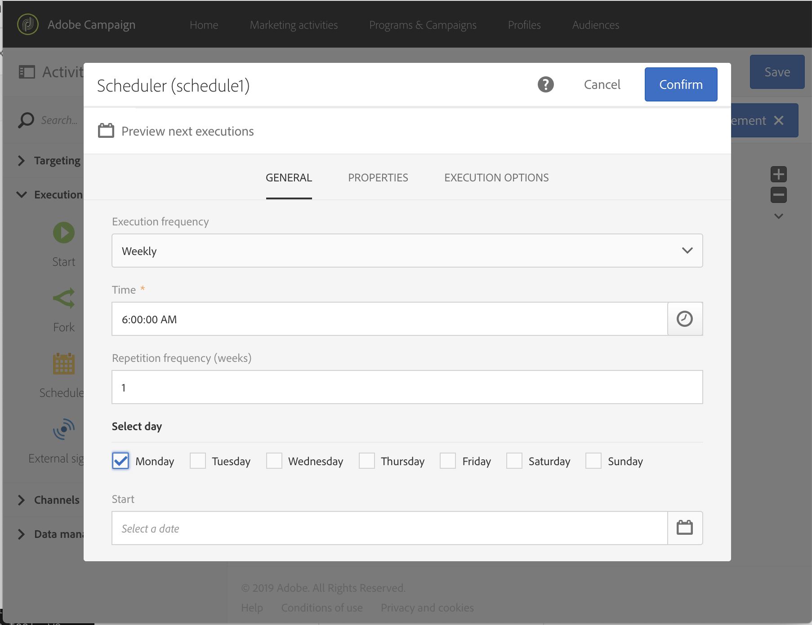

# サービス購読者に対する増分処理クエリ {#example--incremental-query-on-subscribers-to-a-service}

次の例は、**Running Newsletter** サービスを購読しているプロファイルを Adobe Campaign データベース内でフィルタリングして、プロモーションコードを記載したウェルカムメールをそれらのプロファイルに送信する「**[!UICONTROL Incremental query]**」アクティビティの設定を示しています。

ワークフローは、次の要素で構成されています。

* [スケジューラー](../../automating/using/scheduler.md)アクティビティ：毎週月曜日午前 6 時にワークフローを実行します。

  

* [増分クエリ](../../automating/using/incremental-query.md)アクティビティ：初回実行時には、その時点の全購読者をターゲットにし、それ以降の実行ではその週の新規購読者だけをターゲットにします。

  

* [&#x200B; メール配信 &#x200B;](../../automating/using/email-delivery.md) アクティビティ。 ワークフローは週に 1 回実行されますが、送信されたメールとその結果を 1 ヶ月ごとに集計できます。例えば、1 週間単位ではなく、1 ヶ月全体でのレポートを生成できます。

  それには、ここで&#x200B;**[!UICONTROL Recurring email]**&#x200B;を作成し、「**[!UICONTROL By month]**」で指定した月数を単位としてメールとその結果を再グループ化します。

  メールのコンテンツを定義し、ウェルカムプロモーションコードを挿入します。 詳しくは、[&#x200B; メールコンテンツの定義 &#x200B;](../../designing/using/personalization.md) の節を参照してください。

そのあと、ワークフローの実行を開始します。毎週、新規購読者には、プロモーションコードが記載されたウェルカムメールが送信されます。
