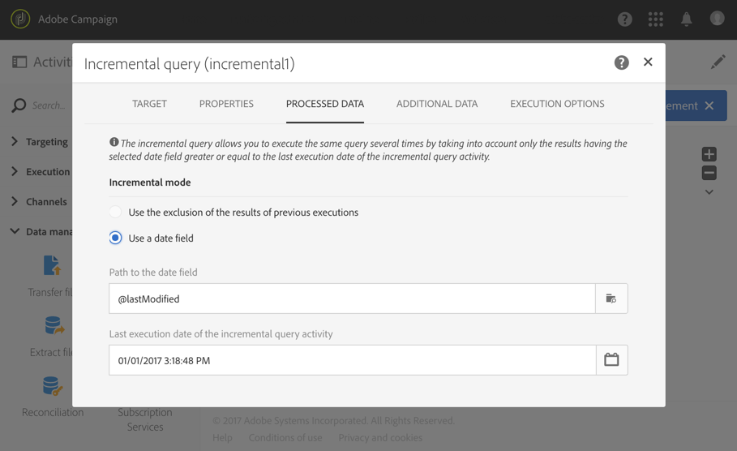

# 増分クエリ{#incremental-query}

## 説明 {#description}

「**[!UICONTROL Incremental query]**」アクティビティを使用すると、Adobe Campaign データベースから要素の母集団をフィルタリングして抽出できます。 このアクティビティが実行されるたびに、以前の実行結果が除外されます。 これにより、新しい要素だけをターゲットにすることができます。

該当するタブを使用して、ターゲット母集団の **[!UICONTROL Additional data]** を定義できます。 このデータは追加の列に格納され、進行中のワークフローでのみ使用できます。

このアクティビティではクエリエディターツールを使用します。 このツールについては、[該当する節](../../automating/using/editing-queries.md#about-query-editor)で詳しく説明します。

## Context of use {#context-of-use}

ワークフローしたがってクエリの実行頻度を定義するには、「**[!UICONTROL Incremental query]**」を「**[!UICONTROL Scheduler]**」にリンクする必要があります。

このアクティビティに固有の「**[!UICONTROL Processed data]**」タブでは、必要に応じて、アクティビティの以前の実行による結果を表示できます。

「**[!UICONTROL Incremental query]**」アクティビティは、次のような様々な用途に使用できます。

* 個人をセグメント化して、メッセージやオーディエンスなどのターゲットを定義する。

* データをエクスポートする。

  「**[!UICONTROL Incremental query]**」アクティビティを使用して、新規ログを定期的にファイルにエクスポートできます。 例えば、外部レポートやBI ツールでログデータを使用する場合に便利です。 完全な例については、[ログのエクスポート](../../automating/using/exporting-logs.md)の節を参照してください。

**関連トピック**

* [ユースケース：サービスのサブスクライバーに対する増分クエリ](../../automating/using/incremental-query-on-subscribers.md)

## 設定 {#configuration}

1. ワークフローに「**[!UICONTROL Incremental query]**」アクティビティをドラッグ＆ドロップします。
1. アクティビティを選択し、表示されるクイックアクションの  ボタンを使用して開きます。
1. プロファイルリソース以外のリソースに対してクエリを実行する場合は、アクティビティの「**[!UICONTROL Properties]**」タブに移動し、「**[!UICONTROL Resource]**」と「**[!UICONTROL Targeting dimension]**」を選択します。

   「**[!UICONTROL Resource]**」では、パレットに表示されるフィルターを絞り込むことができます。これに対して、「**[!UICONTROL Targeting dimension]**」は、選択されたリソースに応じて異なり、取得する母集団のタイプ（特定されたプロファイル、配信、選択されたリソースにリンクしているデータなど）に対応しています。

1. 「**[!UICONTROL Target]**」タブで、ルールを定義して組み合わせ、クエリを実行します。
1. 「**[!UICONTROL Processed data]**」タブで、ワークフローの次回の実行に使用する増分処理モードを次の中から選択します。

   * **[!UICONTROL Use the exclusion of the results of previous executions]**：新たな実行のたびに、前回の実行の結果が除外されます。
   * **[!UICONTROL Use a date field]**：次回の実行では、選択された日付フィールドが「**[!UICONTROL Incremental query]**」アクティビティの最後の実行日以降になっている結果のみ考慮に入れます。 「**[!UICONTROL Properties]**」タブで選択したリソースに関する任意の日付フィールドを選択できます。 ログデータなどの大量のリソースに対してクエリを実行する場合は、このモードの方がパフォーマンスが良くなります。

     ワークフローの初回実行後は、このタブに表示される最後の実行日が次回の実行に使用されます。 この日付は、ワークフローが実行されるたびに、自動的に更新されます。 それでも、必要に応じて手動で別の値を入力すれば、この値を上書きすることはできます。

   >[!NOTE]
   >
   >「**[!UICONTROL Use a date field]**」モードでは、選択された日付フィールドに応じて、より柔軟な指定が可能です。 例えば、選択したフィールドが変更日に対応する場合、日付フィールドモードでは、最後に更新されたデータを取得できます。一方、これ以外のモードでは、ワークフローの最後の実行以降に変更が加えられている場合でも、前回の実行で既にターゲットになったレコードは単に除外されます。

   

1. 該当するタブを使用して、ターゲット母集団の **[!UICONTROL Additional data]** を定義できます。 このデータは追加の列に格納され、進行中のワークフローでのみ使用できます。 特に、クエリのターゲティングディメンションにリンクされた Adobe Campaign データベースのテーブルからデータを追加できます。 [データのエンリッチメント](../../automating/using/query.md#enriching-data)の節を参照してください。
1. アクティビティの設定を確認し、ワークフローを保存します。

## データのエンリッチメント {#enriching-data}

クエリと同様に、**[!UICONTROL Incremental query]**」からデータのエンリッチメントをおこなうことができます。 [データのエンリッチメント](../../automating/using/query.md#enriching-data)の節を参照してください。
