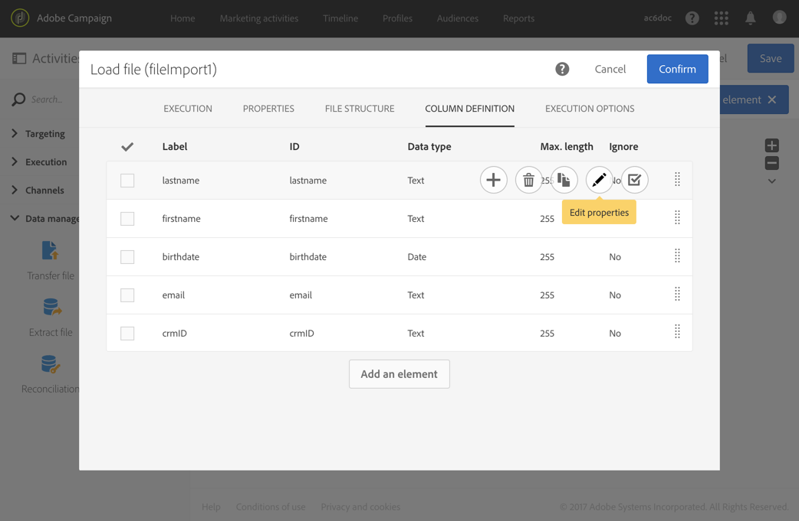

# Load file{#load-file}

## 説明 {#description}

**[!UICONTROL Load file]** このアクティビティにより、Adobe Campaignでこのデータを使用するために、構造化された1つのフォームにデータを読み込むことができます。データは一時的にインポートされ、別のアクティビティがAdobe Campaignデータベースに定義するために必要になります。

## Context of use {#context-of-use}

データの抽出方法は、アクティビティの設定時に定義されます。読み込むファイルは、連絡先のリストです。

>[!CAUTION]
>
>例えば、.txt、. csvなどのファイルなど、「フラット」構造ファイルのみが考慮されます。

次のことができます。

* Use the file structure to apply it to another file's data (recovered using the **[!UICONTROL Transfer file]** activity) or,
* ファイルの構造とデータを使用して、Adobe Campaignにインポートします。

## Configuration {#configuration}

アクティビティの設定には2つの手順があります。まず、サンプルファイルをアップロードして、期待されるファイル構造を定義する必要があります。これが完了したら、データをインポートするファイルの出典を指定できます。

>[!NOTE]
>
>サンプルファイルのデータは、アクティビティの設定に使用されますが、インポートされません。データの少ないサンプルファイルを使用することをお勧めします。

1. Drag and drop a **[!UICONTROL Load file]** activity into your workflow.
1. Select the activity, then open it using the  button from the quick actions that appear.
1. 最終ファイルを読み込む際に想定される構造を定義するサンプルファイルをアップロードします。

   

   Once the data file is uploaded, two new tabs appear in the activity: **[!UICONTROL File structure]** and **[!UICONTROL Column definition]**.

1. Go to the **[!UICONTROL File structure]** tab to view the structure that is automatically detected from the sample file.

   ファイル構造が誤って検出された場合、可能なエラーを修正するためのいくつかのオプションがあります。

   * **[!UICONTROL Detect structure from a new file]** オプションを選択して、別のファイルの構造を使用することもできます。
   * デフォルトの検出パラメーターを変更して、ファイルに適応させることができます。**[!UICONTROL File type]** このフィールドでは、読み込むファイルが固定長の列で構成されているかどうかを指定できます。In that case, you must also specify the maximum number of characters for each column in the **[!UICONTROL Column definition]** tab.

      All of the detection options necessary to correctly recover the data from the file are regrouped in **[!UICONTROL File format]**. これらの設定を変更するには、これらの新しい設定を考慮して、アクティビティに読み込まれた最後のファイルの構造を再検出します。To do this, use the **[!UICONTROL Apply configuration]** button. 例えば、異なる列の区切り文字を指定できます。

      >[!NOTE]
      >
      >この操作では、アクティビティに読み込まれた最後のファイルが考慮されます。ファイルが検出された場合、データプレビューには最初の30行のみが表示されます。

      

      **[!UICONTROL File format]** このセクションで **[!UICONTROL Check columns from file against column definitions]** は、アップロードするファイルの列が列定義に対応していることを確認できます。

      列の番号または名前が列定義と一致しない場合、ワークフローの実行時にエラーメッセージが表示されます。このオプションが有効になっていない場合は、ログファイルに警告が表示されます。

      

1. Go to the **[!UICONTROL Column definition]** tab to check the data format for each column and adjust the parameters if necessary.

   **[!UICONTROL Column definition]** このタブでは、エラーを含まないデータをインポートするための各列のデータ構造を正確に指定できます（例えば、null管理を使用して、今後の操作用にAdobe Campaignデータベースに存在するタイプと一致させる）。

   例えば、列のラベルを変更したり、タイプ（文字列、整数、日付など）を選択したりできます。または、エラー処理を指定します。

   For more information, refer to the [Column format](../../automating/using/load-file.md#column-format) section.

   

1. **[!UICONTROL Execution]** タブで、データを読み込むためにファイルを処理するかどうかを指定します。

   * ワークフローのインバウンドトランジションから取得されます。
   * 前の手順でアップロードしたものです。
   * ローカルマシンからアップロードする新しいファイルです。The **[!UICONTROL Upload a new file from local machine]** option appears if uploading a first file was already defined in the workflow. これにより、現在のファイルがニーズに合わない場合に処理する別のファイルをアップロードできます。

      

1. If the file that you want to load the data from is compressed into a GZIP file (.gz), select the **[!UICONTROL Decompression]** option in the **[!UICONTROL Add a pre-processing step]** field. これにより、データを読み込む前にファイルの解凍が可能になります。このオプションは、ファイルがアクティビティのインバウンド移行から取得された場合にのみ使用できます。
1. **[!UICONTROL Keep the rejects in a file]** このオプションを使用すると、読み込み中に発生したエラーを含むファイルをダウンロードしたり、後処理段階に適用したりできます。

   >[!NOTE]
   >
   >**[!UICONTROL Add date and time to the file name]** このオプションを使用すると、拒否を含むファイルの名前にタイムスタンプを追加できます。

   

1. アクティビティの設定を確認し、ワークフローを保存します。

## Column format {#column-format}

サンプルファイルを読み込むと、各データタイプのデフォルトパラメーターで列の形式が自動的に検出されます。これらのデフォルトパラメーターを変更すると、特にエラーまたは空白の値がある場合に、データに適用する特定のプロセスを指定できます。

To do this, select **[!UICONTROL Edit properties]** from the quick actions of the column whose format you would like to define. 列形式の詳細ウィンドウが開きます。

その後、各列の書式設定を変更できます。

列の書式設定では、各列の値処理を定義できます。

* **[!UICONTROL Ignore column]**:は、データの読み込み中にこの列を処理しません。
* **[!UICONTROL Data type]**:は、各列に必要なデータのタイプを指定します。
* **[!UICONTROL Format and separators]**、 **プロパティ**:は、テキスト、時間、日付および数値の形式と、列コンテキストで指定された区切り文字のプロパティを指定します。

   * **[!UICONTROL Maximum number of characters]**:は、文字列タイプ列の最大文字数を指定します。

      長さが固定された列で構成されるファイルを読み込むときに、このフィールドを入力する必要があります。

   * **[!UICONTROL Letter case management]**: **文字** の大文字と小文字を区別するかどうかを定義します。
   * **[!UICONTROL White space management]**:は **、テキスト** データの文字列で特定のスペースを無視する必要があるかどうかを指定します。
   * **[!UICONTROL Time format]**， **[!UICONTROL Date format]**，形式を **指定********します。**
   * **[!UICONTROL Format]**:では **、整数** データと **浮動小数点数** データの数値の形式を定義できます。
   * **[!UICONTROL Separator]**:は、 **日付**、 **時間**、 **日時**、 **整数**、 **浮動小数点数** データの列コンテキスト（数値の区切り文字または数値の区切り文字、日付と時間の区切り文字の区切り文字）によって指定された区切り文字を定義します。

* **[!UICONTROL Remapping of values]**:このフィールドは、列の詳細設定でのみ使用できます。これにより、読み込み時に特定の値を変換できます。例えば、"3"を"3"に変換できます。
* **[!UICONTROL Error processing]**:は、エラーが発生した場合に動作を定義します。

   * **[!UICONTROL Ignore the value]**:値は無視されます。ワークフロー実行ログに警告が生成されます。
   * **[!UICONTROL Reject the line]**:行全体が処理されません。
   * **[!UICONTROL Use a default value]**:の値は **[!UICONTROL Default value]** 、フィールド内で定義されているデフォルト値でエラーになります。
   * **[!UICONTROL Use a default value in case the value is not remapped]**:は、エラーの原因となる値を置き換えます。この値は、誤った値に対してマッピングが定義されていない限り **[!UICONTROL Default value]** 、フィールドで定義されています（上記 **[!UICONTROL Remapping of values]** のオプションを参照）。
   * **[!UICONTROL Reject the line when there is no remapping value]**:エラーの値にマッピングが定義されていない限り、行全体が処理されません（上記のオプションを参照し **[!UICONTROL Remapping of values]** てください）。
   >[!NOTE]
   >
   >**[!UICONTROL Error processing]** では、インポートされたファイル内の値に関するエラーが発生します。例えば、エラーのあるデータ型（「整数」列の"4"すべての文字）、最大数の文字を含む文字列、区切り文字付きの日付を含む文字列などがあります。ただし、このオプションは、空の値管理によって生成されるエラーには影響しません。

* **[!UICONTROL Default value]**:は、選択したエラー処理に従ってデフォルト値を指定します。
* **[!UICONTROL Empty value management]**:では、データの読み込み中に空の値を管理する方法を指定します。

   * **[!UICONTROL Generate an error for numerical fields]**:数値フィールドに対してのみエラーが発生し、それ以外の場合はNULL値が挿入されます。
   * **[!UICONTROL Insert NULL in the corresponding field]**:空の値を許可します。したがって、NULL値が挿入されます。
   * **[!UICONTROL Generate an error]**:値が空の場合にエラーが発生します。

## Example {#example}

読み込みファイルアクティビティは、主に、既存のデータに統合するために、転送ファイルアクティビティのデータを構造化します。

次の例は、転送ファイルアクティビティを介して自動的にダウンロードされた読み込みファイルアクティビティの結果を示し、次に更新データアクティビティを示しています。このワークフローでは、Adobe Campaignデータベースを新しいプロファイルで拡張したり、インポートされたファイルから回復したデータを使用して既存のプロファイルを更新したりすることを目的としています。

1. Drag and drop a **[!UICONTROL Transfer file]** activity into your workflow and configure it in a way so that it recovers the file you would like.
1. Drag and drop a **[!UICONTROL Load file]** activity into your workflow and place it after the **[!UICONTROL Transfer file]** activity.
1. Select the activity, then open it using the  button from the quick actions that appear.
1. In the **[!UICONTROL File to load]** section of the **[!UICONTROL Execution]** tab, check the **[!UICONTROL Use the file specified in the inbound transition]** option.

   

1. 以前に指定したようにアクティビティを設定します。
1. Drag and drop an **[!UICONTROL Update data]** activity into your workflow and place it after the **[!UICONTROL Load file]** activity, then configure it. Refer to [Update data](../../automating/using/update-data.md).

ワークフローが開始されると、アップロードされたファイルからのデータが抽出され、Adobe Campaignデータベースの拡張に使用されます。
