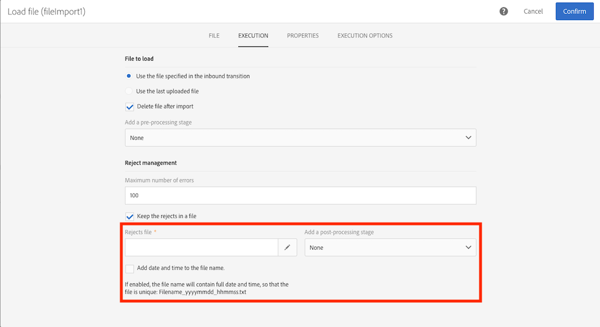

# ファイル読み込み {#load-file}

## 説明 {#description}

>[!CAUTION]
>
>この機能を使用する際は、Adobe Campaign契約に従って、SFTPストレージ、DBストレージ、アクティブなプロファイルの制限に留意してください。

この **[!UICONTROL Load file]** アクティビティを使用すると、1つの構造化されたフォームにデータを読み込んで、このデータをAdobe Campaignで使用できます。 データは一時的にインポートされ、Adobe Campaignデータベースに確実に統合するには別のアクティビティが必要です。

## 使用状況 {#context-of-use}

データの抽出方法は、アクティビティの設定時に定義されます。 読み込むファイルは、例えば連絡先のリストである場合があります。

>[!CAUTION]
>
>.txt、.csvなどのフラットな構造ファイルのみが考慮されます。

次の操作をおこなうことができます。

* ファイル構造を使用して、別のファイルのデータに適用する( **[!UICONTROL Transfer file]** アクティビティを使用してリカバリする)か、
* ファイルの構造とデータを使用して、Adobe Campaignに読み込みます。

**関連トピック：**

* [使用例： 外部データを使用したデータベースの更新](../../automating/using/update-database-file.md)
* [使用例： ファイルの自動ダウンロードに基づくデータの更新](../../automating/using/update-data-automatic-download.md)
* [使用例： 強化されたフィールドを含む電子メールの送信](../../automating/using/sending-email-enriched-fields.md)
* [使用例： ファイルオーディエンスとデータベースとの調整](../../automating/using/reconcile-file-audience-with-database.md)

## 設定 {#configuration}

アクティビティの設定には、2つの手順があります。 まず、サンプルファイルをアップロードして、必要なファイル構造を定義する必要があります。 この処理が完了したら、データをインポートするファイルの接触チャネルを指定できます。

>[!NOTE]
>
>サンプルファイルのデータはアクティビティの設定に使用されますが、読み込まれません。 データの少ないサンプルファイルを使用することをお勧めします。

1. ワークフローに **[!UICONTROL Load file]** アクティビティをドラッグ&amp;ドロップします。
1. アクティビティを選択し、表示されるクイックアクションの  ボタンを使用して開きます。
1. 最終的なファイルの読み込み時に、期待する構造を定義できるサンプルファイルをアップロードします。

   

   データファイルがアップロードされると、2つの新しいタブがアクティビティに表示されます。 **[!UICONTROL File structure]** と **[!UICONTROL Column definition]**。

1. タブに移動して、サンプルファイルから自動的に検出される構造を表示します。 **[!UICONTROL File structure]**

   ファイル構造が正しく検出されなかった場合は、次のいくつかの方法でエラーを修正できます。

   * 別のファイルの構造を使用する場合は、この **[!UICONTROL Detect structure from a new file]** オプションを選択します。
   * デフォルトの検出パラメータを変更して、ファイルに合わせることができます。 読み込むファイルが、固定長の列で構成されているかどうかを **[!UICONTROL File type]** フィールドで指定できます。 その場合は、 **[!UICONTROL Column definition]** タブの各列の最大文字数も指定する必要があります。

      ファイルからデータを正しく回復するために必要なすべての検出オプションは、に再グループ化され **[!UICONTROL File format]**&#x200B;ます。 これらの新しい設定を考慮すると、ファイルを変更した後、アクティビティに読み込まれた最後のファイルの構造を再検出できます。 これを行うには、 **[!UICONTROL Apply configuration]** ボタンを使用します。 例えば、別の列区切り文字を指定できます。

      >[!NOTE]
      >
      >この操作では、アクティビティーに最後に読み込まれたファイルが考慮されます。 検出されたファイルのサイズが大きい場合、データプレビューには最初の30行だけが表示されます。

      

      この **[!UICONTROL File format]****[!UICONTROL Check columns from file against column definitions]** セクションでは、アップロードするファイルの列が列定義に対応していることを確認できます。

      列の数や名前が列の定義と一致しない場合は、ワークフローの実行時にエラーメッセージが表示されます。 このオプションが有効になっていない場合は、ログファイルに警告が表示されます。

      

1. タブに移動して各列のデータ形式をチェックし、必要に応じてパラメータを調整します。 **[!UICONTROL Column definition]**

   この **[!UICONTROL Column definition]** タブでは、エラーのないデータをインポート（例えば、null managementを使用）し、将来の操作のためにAdobe Campaignデータベースに既に存在するデータ型と一致させるために、各列のデータ構造を正確に指定できます。

   例えば、列のラベルを変更し、そのタイプ（文字列、整数、日付など）を選択すると、 またはエラー処理を指定することもできます。

   For more information, refer to the [Column format](#column-format) section.

   

1. タブで、データの読み込み用にファイルを処理するかどうかを指定し **[!UICONTROL Execution]** ます。

   * ワークフローの受信トランジションから取得されます。
   * は、前の手順でアップロードしたものです。
   * ローカルマシンからアップロードする新しいファイルです。 この **[!UICONTROL Upload a new file from local machine]** オプションは、最初のファイルが既にワークフローで定義されている場合に表示されます。 これにより、現在のファイルがニーズに合わない場合は、別のファイルをアップロードして処理できます。

      

1. データの読み込み元のファイルが圧縮されてGZIPファイル(.gz)になっている場合は、フィールドで **[!UICONTROL Decompression]** オプションを選択し **[!UICONTROL Add a pre-processing step]** ます。 これにより、データを読み込む前にファイルを解凍できます。 このオプションは、ファイルがアクティビティの受信トランジションから送信された場合にのみ使用できます。

   また、この **[!UICONTROL Add a pre-processing step]** フィールドでは、ファイルをデータベースにインポートする前に、そのファイルを復号化することもできます。 暗号化されたファイルを使用する方法について詳しくは、 [この節を参照してください](../../automating/using/managing-encrypted-data.md)

1. この **[!UICONTROL Keep the rejects in a file]** オプションを使用すると、読み込み中に発生したエラーを含むファイルをダウンロードし、後処理段階でそのファイルに適用できます。 このオプションを有効にすると、送信トランジションの名前が「拒否」に変更されます。

   >[!NOTE]
   >
   >この **[!UICONTROL Add date and time to the file name]** オプションを使用すると、タイムスタンプを、リジェクトを含むファイルの名前に追加できます。

   

1. アクティビティの設定を確認し、ワークフローを保存します。

ワークフローの実行後にアクティビティでエラーが発生した場合は、ログを参照して、ファイル内の誤った値の詳細を取得します。 For more on workflows logs, refer to [this section](../../automating/using/monitoring-workflow-execution.md).

## 列のフォーマット {#column-format}

サンプルファイルを読み込むと、列の形式が各データ型のデフォルトパラメーターで自動的に検出されます。 このデフォルトのパラメーターを編集して（特に誤りや空の値がある場合）、特定の処理を指定してデータに適用することができます。

これを行うには、形式を定義 **[!UICONTROL Edit properties]** する列のクイックアクションから選択します。 列形式の詳細ウィンドウが開きます。

その後、各列の形式設定を変更できます。

列のフォーマットでは、以下の設定で各列の値の処理方法を定義できます。

* **[!UICONTROL Ignore column]**: データの読み込み中にこの列を処理しません。
* **[!UICONTROL Data type]**: 各列に必要なデータのタイプを指定します。
* **[!UICONTROL Format and separators]**、 **プロパティ**: テキスト、時間、日付、数値の形式のプロパティ、および列コンテキストで指定される区切り文字を指定します。

   * **[!UICONTROL Maximum number of characters]**: 文字列型の列の最大文字数を指定します。

      固定長の列で構成されるファイルを読み込む場合は、このフィールドに入力する必要があります。

   * **[!UICONTROL Letter case management]**: 「 **Text** 」データに文字ケースプロセスを適用する必要があるかどうかを定義します。
   * **[!UICONTROL White space management]**: は、 **Text** dataの文字列内で特定のスペースを無視する必要があるかどうかを指定します。
   * **[!UICONTROL Time format]**, **[!UICONTROL Date format]**: 「 **日付**」、「 **時間** 」、「 **日時** 」の各データの形式を指定します。
   * **[!UICONTROL Format]**: 数値の形式を定義できます。 **整数** (Integer **)と** 浮動小数点数(Floating number)のデータを使用できます。
   * **[!UICONTROL Separator]**: 列コンテキストで指定する区切り文字（数値の千単位区切り文字、日付と時刻の区切り文字） **を定義します。**&#x200B;日付 **、**&#x200B;時間 **、日付と時間**、整数、整数、 ******** 浮動数データ。

* **[!UICONTROL Remapping of values]**: このフィールドは、列の詳細設定でのみ使用できます。 読み込み時に特定の値を変換できます。 例えば、「three」を「3」に変換できます。
* **[!UICONTROL Error processing]**: エラーが発生した場合の動作を定義します。

   * **[!UICONTROL Ignore the value]**: 値は無視されます。 ワークフローの実行ログに警告が生成されます。
   * **[!UICONTROL Reject the line]**: 行全体が処理されません。
   * **[!UICONTROL Use a default value]**: エラーの原因となる値を、 **[!UICONTROL Default value]** フィールドに定義されているデフォルト値に置き換えます。
   * **[!UICONTROL Use a default value in case the value is not remapped]**: エラーの原因となる値を、エラーのある値に対してマッピングが定義されていない限り、 **[!UICONTROL Default value]** フィールドで定義されているデフォルト値に置き換えます(上の **[!UICONTROL Remapping of values]** オプションを参照)。
   * **[!UICONTROL Reject the line when there is no remapping value]**: エラー値に対してマッピングが定義されていない場合、行全体は処理されません(上の **[!UICONTROL Remapping of values]** オプションを参照)。

   >[!NOTE]
   >
   >**[!UICONTROL Error processing]** インポートしたファイルの値に関するエラーが発生しています。 例えば、障害のあるデータタイプ（「整数」列の文字のすべてに「4」が含まれる）、許可された最大文字数より多い文字を含む文字列、区切り文字の不具合のある日付など。 ただし、このオプションは、空の値管理によって生成されるエラーには関係しません。

* **[!UICONTROL Default value]**: は、選択したエラー処理に従ってデフォルト値を指定します。
* **[!UICONTROL Empty value management]**: データの読み込み中に空の値を管理する方法を指定します。

   * **[!UICONTROL Generate an error for numerical fields]**: 数値フィールドに対してのみエラーを生成します。それ以外の場合は、NULL値を挿入します。
   * **[!UICONTROL Insert NULL in the corresponding field]**: は空の値を許可します。 したがって、null 値が挿入されます。
   * **[!UICONTROL Generate an error]**: 値が空の場合にエラーを生成します。
