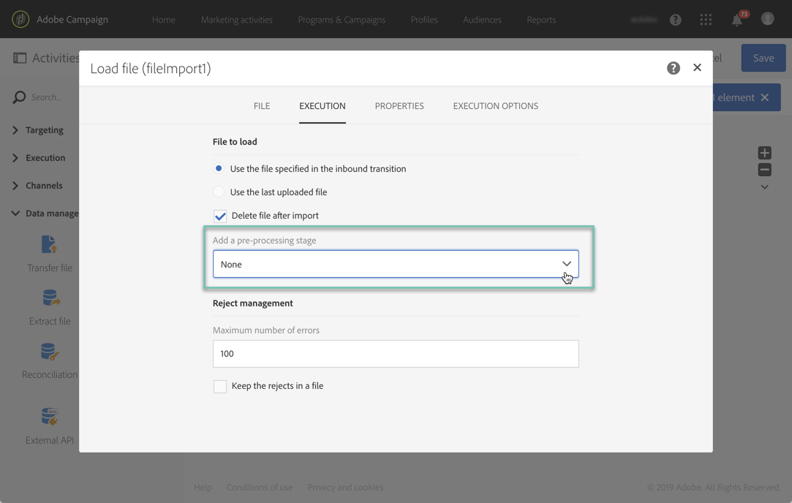
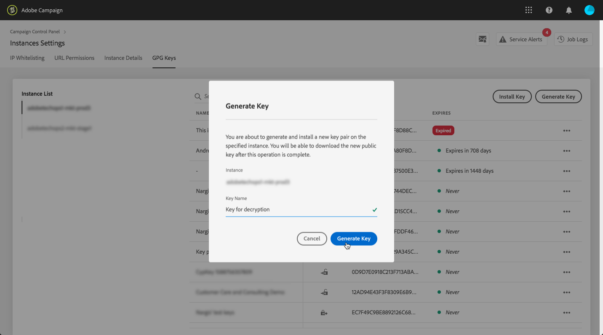
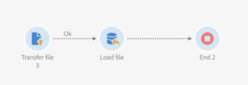
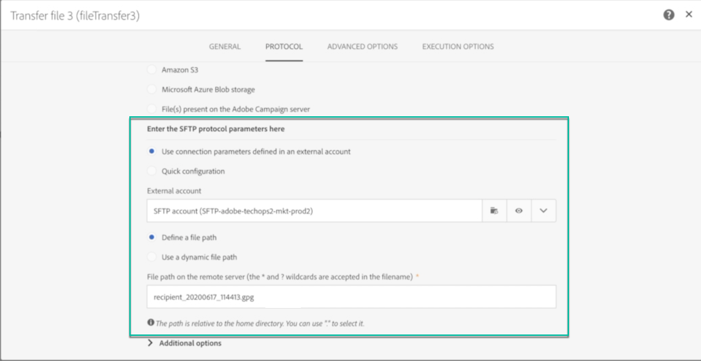
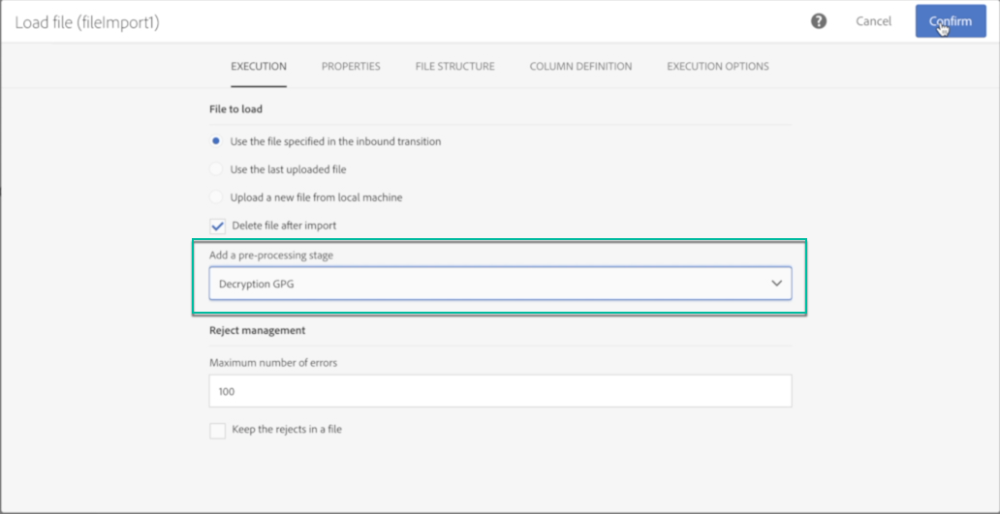
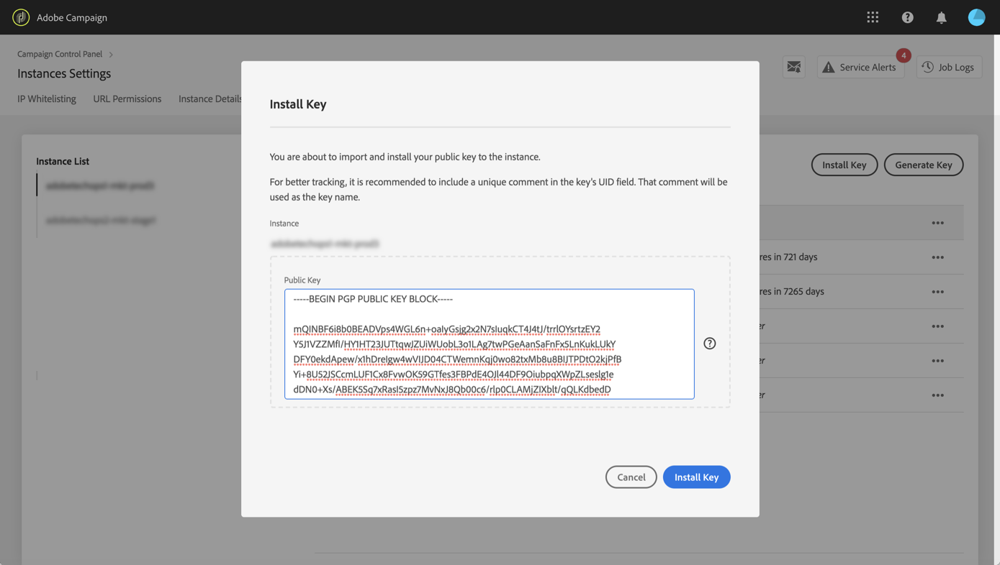
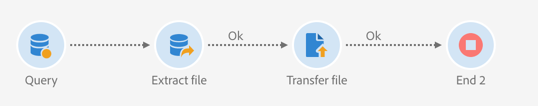
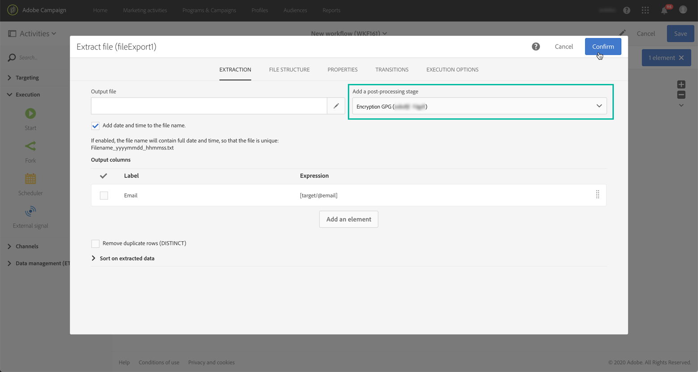
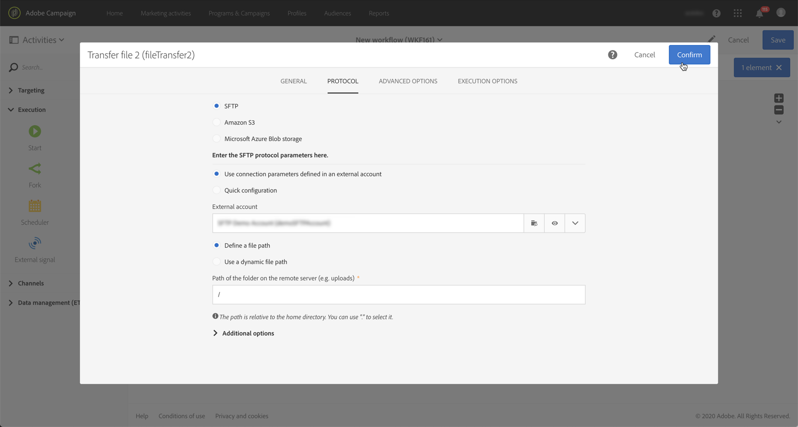

# 暗号化されたデータの管理 {#managing-encrypted-data}

## 前処理段階について {#about-preprocessing-stages}

場合によっては、Campaign サーバーを読み込むデータを暗号化する必要があります（PII データが含まれている場合など）。

送信データを暗号化したり、受信データを復号したりするには、[Campaign コントロールパネル](https://experienceleague.adobe.com/docs/control-panel/using/instances-settings/gpg-keys-management.html?lang=ja)を使用してGPG キーを管理する必要があります。

>[!NOTE]
>
>コントロールパネルは、AWS でホストされるすべてのお客様が利用できます（自分のマーケティングインスタンスをオンプレミスでホストするお客様を除く）。

Campaign コントロールパネルを使用する資格がない場合は、Adobe カスタマーケアに連絡して、必要な暗号化/復号化コマンドをインスタンスに提供する必要があります。 これを行うには、以下を示すリクエストを送信します。

* Campaign インターフェイスに表示される&#x200B;**label**&#x200B;は、コマンドを使用します。 例えば、「ファイルを暗号化」のように指定します。
* インスタンスにインストールする&#x200B;**コマンド**。

リクエストが処理されると、暗号化/復号化コマンドは、**[!UICONTROL Load file]**&#x200B;および&#x200B;**[!UICONTROL Extract file]** アクティビティの&#x200B;**[!UICONTROL Pre-processing stage]** フィールドで使用できるようになります。 読み込みまたは書き出すファイルを復号化または暗号化するために使用できます。

**関連トピック：**

* [ファイルを読み込み](../../automating/using/load-file.md)
* [ファイルを抽出](../../automating/using/extract-file.md)

## ユースケース：Campaign コントロールパネルで生成されたキーを使用して暗号化されたデータを読み込む {#use-case-gpg-decrypt}

このユースケースでは、Campaign コントロールパネルで生成されたキーを使用して、外部システムで暗号化されたデータをインポートするためのワークフローを構築します。

 [ビデオでこの機能を確認する](#video)

このユースケースを実行する手順は次のとおりです。

1. コントロールパネルを使用して、キーペア（公開鍵と秘密鍵）を生成します。 詳細な手順については、[コントロールパネルのドキュメント](https://experienceleague.adobe.com/docs/control-panel/using/instances-settings/gpg-keys-management.html?lang=ja#decrypting-data)を参照してください。

   * 公開鍵は外部システムと共有され、外部システムはこのキーを使用して Campaign に送信するデータを暗号化します。
   * 秘密鍵は、Campaignが受信する暗号化データの復号化に使用します。

   

1. 外部システムでは、Campaign コントロールパネルからダウンロードした公開鍵を使用して、Campaign Standardに読み込むデータを暗号化します。

1. Campaign Standardでは、暗号化されたデータを読み込み、Campaign コントロールパネル経由でインストールされた秘密鍵を使用して復号化するワークフローを構築します。 これを行うには、次のようにワークフローを構築します。

   

   * **[!UICONTROL Transfer file]** アクティビティ：外部ソースからCampaignにファイルを転送します。 この例では、SFTP サーバーからファイルを転送します。
   * **[!UICONTROL Load file]** アクティビティ：ファイルからCampaign コントロールパネルにデータを読み込み、データベースで生成された秘密鍵を使用してデータを復号します。

1. **[!UICONTROL Transfer file]** アクティビティを開き、必要に応じて設定します。 アクティビティの設定方法に関するグローバルな概念については、[こちら](../../automating/using/load-file.md)を参照してください。

   「**[!UICONTROL Protocol]**」タブで、転送するsftp サーバーと暗号化された.gpg ファイルに関する詳細を指定します。

   

1. **[!UICONTROL Load file]** アクティビティを開き、必要に応じて設定します。 アクティビティの設定方法に関するグローバルな概念については、[こちら](../../automating/using/load-file.md)を参照してください。

   受信データを復号化するために、アクティビティに前処理ステージを追加します。 これを行うには、リストから&#x200B;**[!UICONTROL Decryption GPG]** オプションを選択します。

   >[!NOTE]
   >
   >データの復号に使用する秘密鍵を指定する必要はありません。 秘密鍵はCampaign コントロールパネルに保存され、ファイルの復号に使用する鍵が自動的に検出されます。

   

1. 「**[!UICONTROL OK]**」をクリックして、アクティビティ設定を確認します。

1. これで、ワークフローを開始できます。

## ユースケース：Campaign コントロールパネルにインストールされたキーを使用したデータの暗号化とエクスポート {#use-case-gpg-encrypt}

このユースケースでは、Campaign コントロールパネルにインストールされたキーを使用してデータを暗号化およびエクスポートするためのワークフローを構築します。

 [ビデオでこの機能を確認する](#video)

このユースケースを実行する手順は次のとおりです。

1. GPG ユーティリティを使用して GPG キーペア（公開鍵／秘密鍵）を生成し、公開キーを コントロールパネルにインストールします。 詳細な手順については、[コントロールパネルのドキュメント](https://experienceleague.adobe.com/docs/control-panel/using/instances-settings/gpg-keys-management.html?lang=ja#encrypting-data)を参照してください。

   

1. Campaign Standardでは、Campaign コントロールパネルを介してインストールされた秘密鍵を使用して、データを書き出し、暗号化するワークフローを構築します。 これを行うには、次のようにワークフローを構築します。

   

   * **[!UICONTROL Query]** アクティビティ：この例では、エクスポートするデータベースのデータをターゲットとするクエリを実行します。
   * **[!UICONTROL Extract file]** アクティビティ：データを暗号化してファイルに抽出します。
   * **[!UICONTROL Transfer file]** アクティビティ：暗号化されたデータを含むファイルをSFTP サーバーに転送します。

1. データベースから目的のデータをターゲットするように&#x200B;**[!UICONTROL Query]** アクティビティを設定します。 詳しくは、[この節](../../automating/using/query.md)を参照してください。

1. **[!UICONTROL Extract file]** アクティビティを開き、必要に応じて設定します（出力ファイル、列、形式など）。 アクティビティの設定方法に関するグローバルな概念については、[こちら](../../automating/using/extract-file.md)を参照してください。

   抽出するデータを暗号化するために、アクティビティに前処理ステージを追加します。 これを行うには、データの暗号化に使用する暗号化GPG キーを選択します。

   

   >[!NOTE]
   >
   >括弧内の値は、GPG暗号化ツールを使用してキーペアを生成するときに定義した&#x200B;**コメント**&#x200B;です。 正しい一致するキーを選択してください。そうしないと、受信者はファイルを復号できません。

1. **[!UICONTROL Transfer file]** アクティビティを開き、ファイルを送信するSFTP サーバーを指定します。 アクティビティの設定方法に関するグローバルな概念については、[こちら](../../automating/using/transfer-file.md)を参照してください。

   

1. これで、ワークフローを開始できます。 ワークフローを実行すると、クエリで選択されたターゲットデータが、暗号化された .gpg ファイルにエクスポートされ、SFTP サーバーに転送されます。

## チュートリアルビデオ {#video}

このビデオでは、GPG キーを使用してデータを復号化する方法を紹介します。

>[!VIDEO](https://video.tv.adobe.com/v/35753?quality=12)

このビデオでは、GPG キーを使用してデータを暗号化する方法を説明します。

>[!VIDEO](https://video.tv.adobe.com/v/36380?quality=12)

その他のCampaign Standardのハウツー動画は[こちら](https://experienceleague.adobe.com/docs/campaign-standard-learn/tutorials/overview.html?lang=ja)でご覧いただけます。
