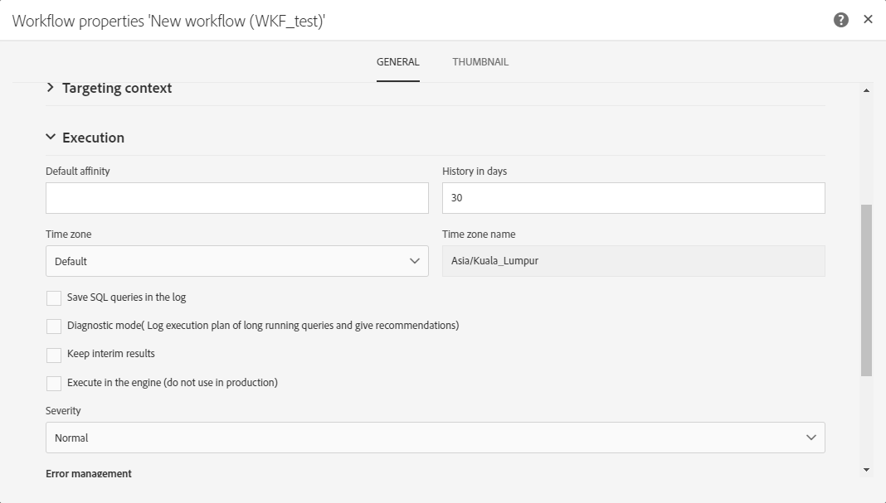
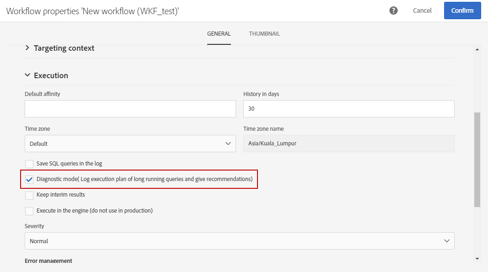
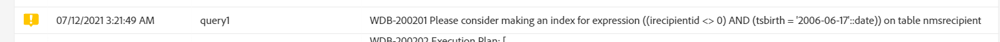
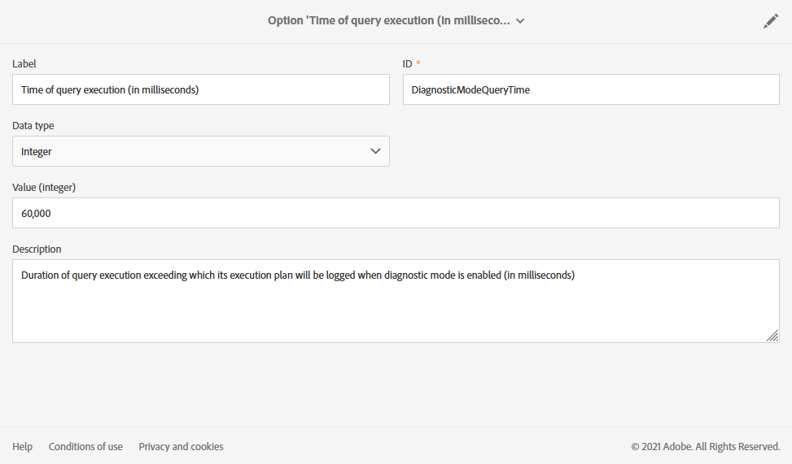
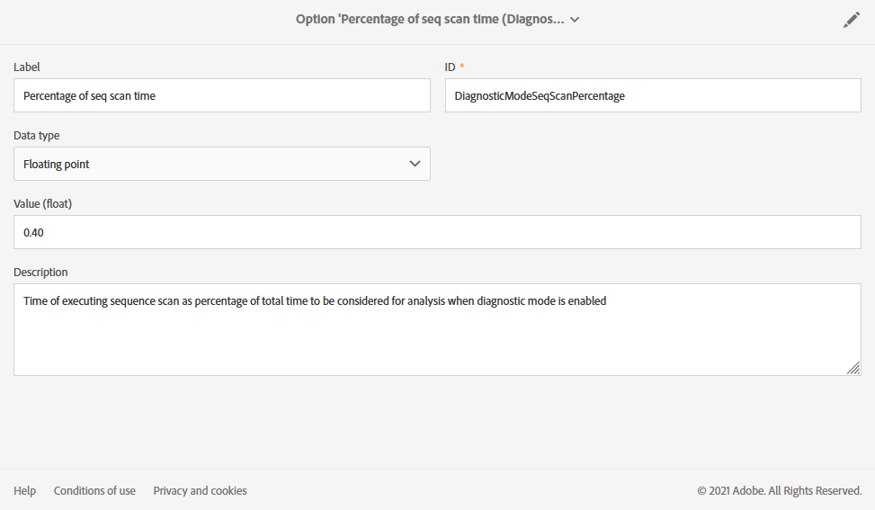

# 実行オプションの管理 {#managing-execution-options}

ワークフローの実行オプションを変更するには、 ボタンを使用してワークフロープロパティにアクセスし、**[!UICONTROL Execution]** セクションを選択します。

選択できるオプションは次のとおりです。

* **[!UICONTROL Default affinity]**：このフィールドを使用すると、ワークフローまたはワークフローアクティビティを特定のコンピューターで強制的に実行できます。

* **[!UICONTROL History in days]**：履歴を消去する必要がある日数を指定します。 履歴には、ワークフローに関連する要素（ログ、タスク、イベント（ワークフロー操作にリンクされたテクニカルオブジェクト）、および&#x200B;**[!UICONTROL Transfer file]** アクティビティによってダウンロードされたファイルが含まれます。 標準のワークフローテンプレートのデフォルト値は 30 日です。

  履歴のパージは、デフォルトで毎日実行されるデータベースクリーンアップ技術ワークフローによって実行されます（[技術ワークフローのリスト ](../../administration/using/technical-workflows.md)を参照）。

  >[!IMPORTANT]
  >
  >**[!UICONTROL History in days]** フィールドが空白のままの場合、その値は「1」と見なされます。つまり、履歴は1日後に消去されます。

* **[!UICONTROL Save SQL queries in the log]**: ワークフローのSQL クエリをログに保存できます。

* **[!UICONTROL Diagnostic mode (Log execution plan of long running queries and give recommendations)]**：実行計画全体をログに記録する場合は、このオプションをオンにします。 デフォルトでは無効になっています。

  このオプションについて詳しくは、この[ セクション ](#diagnostic-mode)を参照してください。

* **[!UICONTROL Keep interim results]**：トランジションの詳細を表示する場合は、このオプションをオンにします。

  >[!CAUTION]
  >
  >このオプションは、多くのディスク領域を消費しますが、ワークフローの作成と適切な設定および動作の確保に役立つように設計されています。 実稼働インスタンスでは、このチェックボックスをオフのままにします。

* **[!UICONTROL Execute in the engine (do not use in production)]**：開発環境テストのために、ワークフローをローカルで実行できます。

* **[!UICONTROL Severity]**: Adobe Campaign インスタンスでワークフローを実行するための優先度レベルを指定できます。 このフィールドは、Adobe チームがモニタリング目的でのみ使用します。

**[!UICONTROL Error management]** セクションには、エラーが発生した場合のワークフローの動作を管理するための追加オプションが用意されています。 これらのオプションについて詳しくは、[ エラー管理](../../automating/using/monitoring-workflow-execution.md#error-management) セクションを参照してください。

## 診断モード {#diagnostic-mode}

>[!CAUTION]
>
>このオプションはワークフローのパフォーマンスに大きな影響を与える可能性があるため、控えめに使用する必要があります。

有効にすると、クエリが1分以上かかる場合、ワークフロープロパティの&#x200B;**[!UICONTROL Execution]** セクションの&#x200B;**[!UICONTROL Diagnostic mode (Log execution plan of long running queries and give recommendations)]** オプションによって実行プラン全体がログに記録されます。

このオプションを有効にしてワークフローを起動した後、クエリが1分以上かかる場合、実行プランがログに記録されます。 その後、EXPLAIN ANALYZEを使用して実行プランを取得できます。

詳しくは、[PostgreSQL ドキュメント ](https://www.postgresql.org/docs/9.4/using-explain.html)を参照してください。

このクエリにシーケンス スキャンがある場合、**[!UICONTROL Diagnostic mode]**&#x200B;は、フィルター式の助けを借りてインデックスを作成するための推奨事項も提供します。

>[!NOTE]
>
> これらの推奨事項は、参照目的でのみ使用でき、ユースケースに応じて慎重に使用する必要があります。

トリガーの推奨事項を実行するには、次の2つの条件を満たす必要があります。

* シーケンススキャンは、クエリの40%以上の時間がかかります。

* シーケンススキャン後の結果の行は、テーブルに存在する全行の1 %未満です。

詳細メニューから、**[!UICONTROL Administration]** > **[!UICONTROL Application settings]** > **[!UICONTROL Options]**&#x200B;を選択してオプションを管理できます。

* **[!UICONTROL Time of query execution (in milliseconds)(DiagnosticModeQueryTime)]**: **[!UICONTROL Value]** フィールドから、クエリ実行の新しい時間を設定できます。 クエリの実行がこの値を超えると、実行プランがログに記録されます。

  

* **[!UICONTROL Percentage of seq scan time (DiagnosticModeSeqScanPercentage)]**: **[!UICONTROL Value]** フィールドから、シーケンス スキャンがレコメンデーションを生成するために必要なクエリ時間の割合を変更できます。

  
