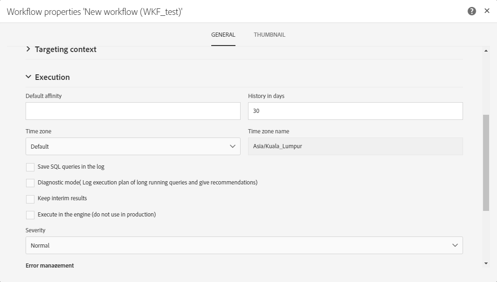

# 実行オプションの管理 {#managing-execution-options}

ワークフローの実行オプションを変更するには、ボタンを使用してワークフローのプロパティにアクセスし、**[!UICONTROL Execution]**&#x200B;セクションを選択します。

選択できるオプションは次のとおりです。

* **[!UICONTROL Default affinity]**:このフィールドを使用すると、特定のマシン上でワークフローまたはワークフローアクティビティを強制的に実行できます。

* **[!UICONTROL History in days]**:履歴を削除する必要がある日数を指定します。履歴には、ワークフローに関連する要素が含まれます。ログ、タスク、イベント（ワークフロー操作にリンクされた技術オブジェクト）、および&#x200B;**[!UICONTROL Transfer file]**&#x200B;アクティビティによってダウンロードされたファイル。 デフォルト値は、あらかじめ用意されたワークフローテンプレートの30日です。

   履歴の削除は、Database cleanup technical workflowが実行します。これは、デフォルトで毎日実行されます([テクニカルワークフローのリスト](../../administration/using/technical-workflows.md)を参照)。

   >[!IMPORTANT]
   >
   >**[!UICONTROL History in days]**&#x200B;フィールドを空白のままにすると、その値は「1」と見なされ、1日後に履歴が削除されます。

* **[!UICONTROL Save SQL queries in the log]**:ワークフローのSQLクエリをログに保存できます。

* **[!UICONTROL Keep interim results]**:トランジションの詳細を表示できるようにするには、このオプションを選択します。

   >[!CAUTION]
   >
   >このオプションは、多くのディスク領域を消費しますが、ワークフローの作成と適切な設定および動作の確保に役立つように設計されています。実稼働インスタンスでは、このチェックボックスをオフのままにします。

* **[!UICONTROL Execute in the engine (do not use in production)]**:開発環境のテスト用に、ワークフローをローカルで実行できます。

* **[!UICONTROL Severity]**:Adobe Campaignインスタンスでワークフローを実行する際の優先度を指定できます。このフィールドは、監視の目的でのみAdobeチームが使用します。

**[!UICONTROL Error management]**&#x200B;セクションには、エラー時のワークフローの動作を管理するための追加のオプションが用意されています。 これらのオプションの詳細については、[エラー管理](../../automating/using/monitoring-workflow-execution.md#error-management)の節を参照してください。
