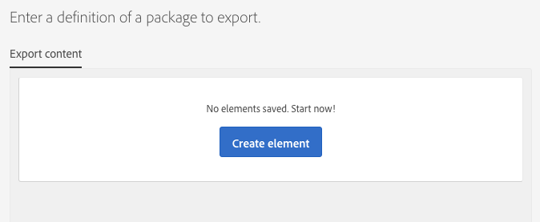
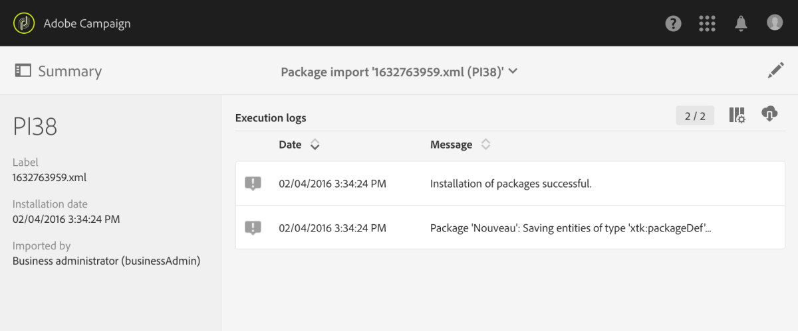

# パッケージの管理{#managing-packages}

管理者は、構造化 XML ファイルを使用して、複数の Adobe Campaign インスタンス間でリソースを交換するパッケージを定義できます。これには設定パラメーターまたはデータを使用できます。

これは、サーバー間でデータを転送する場合や、インスタンスの設定を複製する場合に役立ちます。

パッケージは、**[!UICONTROL Administration]**／**[!UICONTROL Deployment]**／**[!UICONTROL Package exports]** または **[!UICONTROL Package imports]** メニューから入手できます。この 2 つのメニューは同じように機能します。

各リストの要素は、デフォルトでは、変更またはインストールの日付に従って新しい順に表示されます。

要素の内容を表示および変更するには、その要素のラベルをクリックします。[パッケージのエクスポート](#exporting-a-package)および[パッケージのインポート](#importing-a-package)の節を参照してください。

## パッケージのエクスポート {#package-exports}

### 標準パッケージ {#standard-packages}

**[!UICONTROL Platform]** と **[!UICONTROL Administration]** は 2 つともビルトインのパッケージで、それぞれには、エクスポートするリソースの定義済みリストが含まれています。これらは読み取り専用モードで開くことができ、適切な用途はエクスポートのみです。

>[!IMPORTANT]
>
>エクスポートされるリソースにデフォルトの ID が含まれている場合、パッケージのエクスポートは許可されません。したがって、エクスポート可能なリソースの ID は、Adobe Campaign Standard で標準として提供されているテンプレートとは異なる名前に変更する必要があります。例えば、テストプロファイルをエクスポートするには、「SDM」または「sdm」を含む ID は使用しないでください。
>
>デフォルトの ID を使用しているパッケージをエクスポートしようとすると、次のようなエラーが表示されます。「&#39;Brands (branding)&#39; エンティティタイプにはデフォルトの ID（&#39;BRD1&#39;）が使用されているため、パッケージのインポート時に競合が発生する可能性があります。この名前を変更し、操作を繰り返します。」

パッケージのエクスポート手順については、[パッケージのエクスポート](#exporting-a-package)の節で説明します。

* **[!UICONTROL Platform]** パッケージは、技術的な設定時に追加されたすべてのリソース（カスタムリソース、カスタムリソースセット、トリガー、および **[!UICONTROL System]** タイプのアプリケーションオプション）を再グループ化します。
* **[!UICONTROL Administration]** パッケージは、ビジネス設定時に追加されたすべてのオブジェクト（キャンペーンテンプレート、コンテンツテンプレート、配信テンプレート、ランディングページテンプレート、プログラムテンプレートおよびワークフローテンプレートなど）を再グループ化します。

  また、これにはコンテンツブロック、ターゲットマッピング、外部アカウント、組織単位、**[!UICONTROL User]** タイプのアプリケーションオプション、役割、タイポロジ、タイポロジルール、ユーザーの各オブジェクトも含まれます。

>[!NOTE]
>
>この 2 つのパッケージの内容は変更できません。一方、これらのパッケージには常に最新のデータが含まれています。[独自のパッケージを作成](#creating-a-package)して、特定の要素をエクスポートできます。

### パッケージの作成 {#creating-a-package}

特定のデータセットをエクスポートする必要がある場合は、パッケージを作成する必要があります。

パッケージを作成するには、管理者権限が必要です。

1. **[!UICONTROL Administration]**／**[!UICONTROL Deployment]**／**[!UICONTROL Package exports]** で、パッケージコンテンツのリストにある「**[!UICONTROL Create]**」ボタンをクリックします。

   要素がただちに作成されます。作成をキャンセルするには、リストに戻って、該当するボックスをオンにして削除します。

1. パッケージコンテンツ画面で、名前と ID を指定します。
1. 説明を追加し、アクセス可能なユーザーを特定のユーザーに制限する場合は、「**[!UICONTROL Edit properties]**」ボタンをクリックします。

   

1. 「**[!UICONTROL Export content]**」タブの「**[!UICONTROL Create element]**」ボタンを使用して、エクスポートするリソースを選択します。

   

1. リソースはアルファベット順に表示されます。また、名前を基準にフィルタリングできます。技術名は角括弧で囲まれて表示されます。リストから要素を選択し、確認します。

   

1. リソース名が「**[!UICONTROL Export content]**」タブに表示されます。リソースを変更するには、該当するボックスをオンにし、「**[!UICONTROL Show detail of the element selected]**」ボタンを使用します。

   

1. クエリエディターを使用すると、エクスポートする要素をフィルタリングできます。詳しくは、[クエリの編集](../../automating/using/editing-queries.md#creating-queries)の節を参照してください。

   

   >[!NOTE]
   >
   >リソース 1 件あたり最大 5000 個のオブジェクトをエクスポートできます。

1. エクスポートするすべてのリソースを指定したら、選択内容を保存します。

パッケージが作成され、エクスポートの準備ができました。

### パッケージのエクスポート {#exporting-a-package}

パッケージをエクスポートすると、リソースの特定の状態を保存できます。これは別のインスタンスで再インポートすることができ、また後から同じインスタンスに再インポートすることもできます。

>[!CAUTION]
>
>エクスポートされたリソースにデフォルトのままの ID が含まれている場合、パッケージのエクスポートはできません。したがって、エクスポート可能なリソースの ID は、Adobe Campaign Standard で標準として提供されているテンプレートとは異なる名前に変更する必要があります。例えば、テストプロファイルをエクスポートするには、「SDM」または「sdm」を含む ID は使用しないでください。

1. **[!UICONTROL Administration]**／**[!UICONTROL Deployment]**／**[!UICONTROL Package exports]** で、詳細を確認するパッケージを選択します。
1. 必要なデータがパッケージに含まれていることを確認します。
1. 「**[!UICONTROL Start export]**」ボタンをクリックします。

エクスポートされたファイルは、使用しているブラウザーのダウンロードフォルダーに保存されます。この名前は自動的に「package_xxx.xml」という名前になります。この場合、「xxx」はパッケージ ID を表します。

操作が完了すると、複数のセクションが表示されます。

* **[!UICONTROL Export status]**：このセクションは、操作が正しく実行されたかどうかを表します。

  

* 「**[!UICONTROL Log]**」タブで、各種のエクスポート手順を確認できます。これには、以前のすべてのエクスポートのステータスが含まれます。

  

>[!NOTE]
>
>既にエクスポートされているパッケージコンテンツリストから要素を選択する場合、「**[!UICONTROL Log]**」タブと「**[!UICONTROL Last export]**」タブを引き続き使用できます。

## パッケージインポート {#package-imports}

### システムの更新 {#system-updates}

上記のパッケージインポートリストには、アドビが実行するアップデートにリンクされた自動インポートが含まれます。

「**[!UICONTROL Execution logs]**」タブには、すべてのインポート手順が格納されています。サイドパネルに一般情報が表示されます。

>[!NOTE]
>
>これらの要素は読み取り専用モードでアクセスできます。

### パッケージのインポート {#importing-a-package}

管理者は、Adobe Campaign インスタンスで以前に実行されたエクスポートから作成されたパッケージを手動でインポートすることができます。詳しくは、[パッケージのエクスポート](#package-exports)の節を参照してください。

手動でのパッケージのインポートは、次の 2 つの手順でおこないます。まず、ファイルをアップロードし、次にその内容をインポートします。

1. **[!UICONTROL Administration]**／**[!UICONTROL Deployment]**／**[!UICONTROL Package imports]** で、パッケージインポートリストの「**[!UICONTROL Create]**」ボタンをクリックします。

   要素がただちに作成されます。作成をキャンセルするには、リストに戻って、該当するボックスをオンにして削除します。

1. 新しいインポートの名前と ID を指定します。
1. アップロードするファイルをドラッグ＆ドロップするか、「**[!UICONTROL Select from folder]**」リンクをクリックして選択します。

   インポートするファイルは、XML または ZIP（XML ファイルを含む）形式である必要があります。

   

   >[!NOTE]
   >
   >アップロードしたドキュメントを置き換えるには、まずファイル名の右にある X アイコンを使用してファイルを削除し、その後操作を繰り返します。

1. ファイルがアップロードされたら、「**[!UICONTROL Start import]**」ボタンを使用してその内容をデータベースにインポートします。

   

操作が完了すると、複数のセクションが表示されます。

* **[!UICONTROL Import status]**：このセクションは、操作が正しく実行されたかどうかを表します。
* 「**[!UICONTROL Execution logs]**」タブで、各種のインポート手順を確認できます。これは、エラーを表示する場合に特に重要な作業です。

  

パッケージをインポートすると、同じ要素から再度インポートすることはできません。変更できるのは、ラベルと ID だけです。

同じパッケージを再度インポートするには、パッケージインポートリストに戻り、要素を作成してから、選択したファイルを再度アップロードする必要があります。
